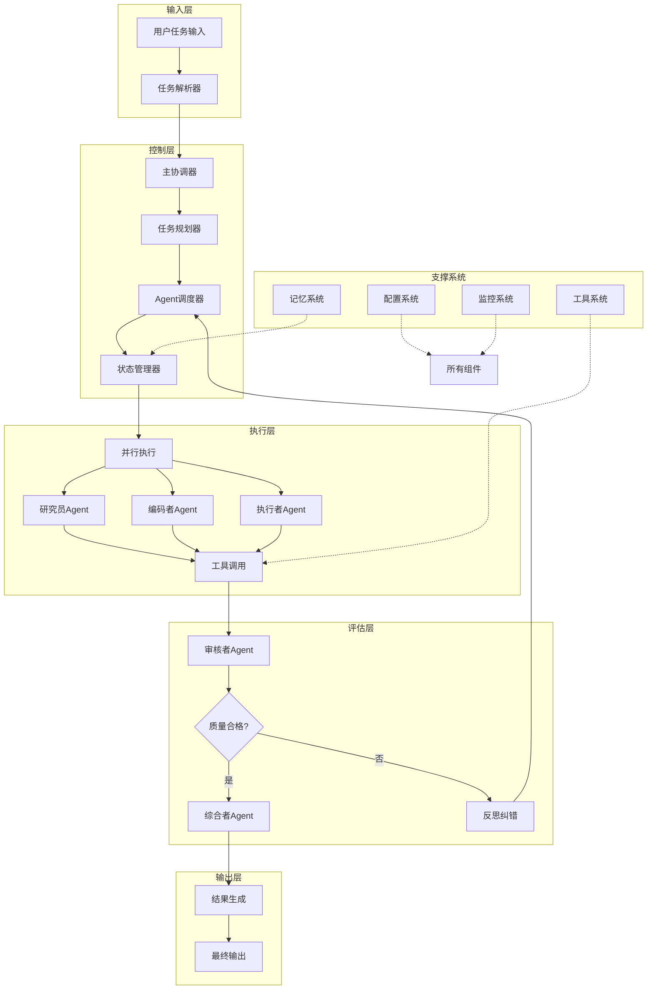
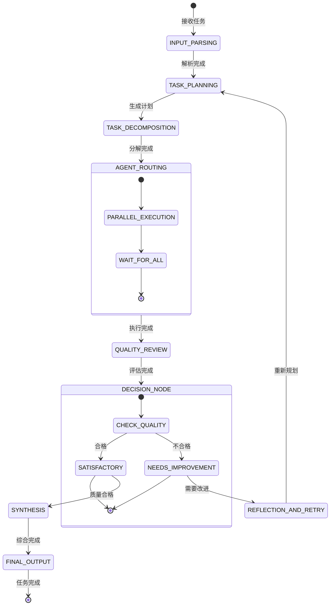

# 通用 Multi-Agent 问题求解系统 - 完整开发交付

## 一、系统架构设计文档

### 1.1 整体架构图



### 1.2 组件职责说明

| 组件 | 职责 | 关键技术 |
|------|------|----------|
| **任务解析器** | 1. 输入标准化 2. 意图识别 3. 任务分类 | LangChain PromptTemplate, LLM 分类 |
| **主协调器** | 1. 任务协调 2. 路由决策 3. 进度监控 | LangGraph StateGraph, Router |
| **任务规划器** | 1. 任务分解 2. 依赖分析 3. 执行计划 | LLM Chain-of-Thought |
| **Agent调度器** | 1. 智能体路由 2. 负载均衡 3. 并行控制 | LangGraph 并发节点 |
| **状态管理器** | 1. 状态维护 2. 上下文传递 3. 版本管理 | Pydantic, TypedDict |
| **记忆系统** | 1. 短期记忆 2. 长期记忆 3. 反思缓存 | ConversationBufferMemory |
| **工具系统** | 1. 工具注册 2. 权限控制 3. 安全执行 | LangChain Tools, Pydantic 校验 |

### 1.3 数据流说明

1. **正向流程**：
   ```
   用户输入 → 解析 → 规划 → 分解 → 分配 → 执行 → 评估 → 综合 → 输出
   ```

2. **反馈循环**：
   ```
   评估失败 → 反思 → 重新规划/分配 → 再次执行
   ```

3. **并行执行**：
   ```
   无依赖子任务 → 多Agent并行执行 → 结果合并
   ```

### 1.4 LangGraph 节点/边设计



### 1.5 状态结构定义

```python
from typing import TypedDict, List, Dict, Any, Optional, Union
from datetime import datetime
from enum import Enum

class TaskStatus(Enum):
    PENDING = "pending"
    RUNNING = "running"
    COMPLETED = "completed"
    FAILED = "failed"
    RETRYING = "retrying"

class SubTask(TypedDict):
    id: str
    description: str
    assigned_agent: str
    status: TaskStatus
    dependencies: List[str]
    result: Optional[Any]
    created_at: datetime
    completed_at: Optional[datetime]

class ToolCallLog(TypedDict):
    tool_name: str
    arguments: Dict[str, Any]
    result: Any
    timestamp: datetime
    success: bool
    error: Optional[str]

class AgentState(TypedDict):
    # 核心数据
    messages: List[Dict[str, Any]]
    original_task: str
    task_type: str
    subtasks: List[SubTask]
    
    # 执行状态
    current_agent: str
    current_subtask_id: Optional[str]
    agent_outputs: Dict[str, List[Dict[str, Any]]]
    
    # 工具与监控
    tool_call_logs: List[ToolCallLog]
    iteration_count: int
    max_iterations: int
    
    # 结果
    final_answer: Optional[str]
    intermediate_results: Dict[str, Any]
    
    # 控制流
    next: str
    should_continue: bool
    quality_score: float
    error_message: Optional[str]
```

### 1.6 失败重试与终止条件

**重试机制**：
1. 工具调用失败 → 自动重试（最多3次）
2. Agent执行失败 → 切换Agent重试
3. 质量评估不合格 → 反思后重试

**终止条件**：
1. 成功终止：`quality_score >= 0.8`
2. 正常终止：达到`max_iterations`（默认5次）
3. 异常终止：连续失败超过3次
4. 人工终止：用户主动中断

## 二、模块与类设计说明

### 2.1 核心类 UML 结构

```
┌─────────────────────────────────────────┐
│           BaseAgent (抽象类)            │
├─────────────────────────────────────────┤
│ - agent_name: str                       │
│ - agent_role: str                       │
│ - llm: BaseLanguageModel                │
│ - tools: List[BaseTool]                 │
│ - system_prompt: str                    │
├─────────────────────────────────────────┤
│ + invoke(state: AgentState) → AgentState│
│ + get_tools() → List[BaseTool]          │
│ + should_continue(state) → bool         │
└─────────────────────────────────────────┘
                    △
    ┌───────────────┼────────────────┐
    │               │                │
┌───┴──────┐ ┌─────┴──────┐ ┌──────┴──────┐
│Coordinator│ │   Planner  │ │  Researcher │
└───────────┘ └────────────┘ └─────────────┘
```

### 2.2 接口定义

```python
from abc import ABC, abstractmethod
from typing import Dict, Any, List

class IAgent(ABC):
    """智能体接口"""
    @abstractmethod
    def invoke(self, state: Dict[str, Any]) -> Dict[str, Any]:
        pass
    
    @abstractmethod
    def get_name(self) -> str:
        pass
    
    @abstractmethod
    def get_tools(self) -> List[Any]:
        pass

class ITool(ABC):
    """工具接口"""
    @abstractmethod
    def execute(self, **kwargs) -> Any:
        pass
    
    @abstractmethod
    def validate(self, **kwargs) -> bool:
        pass

class IMemory(ABC):
    """记忆系统接口"""
    @abstractmethod
    def store(self, key: str, value: Any):
        pass
    
    @abstractmethod
    def retrieve(self, key: str) -> Any:
        pass
    
    @abstractmethod
    def clear(self):
        pass
```

## 三、项目目录结构树

```
multi_agent_system/
├── pyproject.toml
├── requirements.txt
├── README.md
├── .env.example
├── .gitignore
├── src/
│   ├── __init__.py
│   ├── main.py
│   ├── config/
│   │   ├── __init__.py
│   │   ├── settings.py
│   │   └── prompts.py
│   ├── agents/
│   │   ├── __init__.py
│   │   ├── base.py
│   │   ├── coordinator.py
│   │   ├── planner.py
│   │   ├── researcher.py
│   │   ├── coder.py
│   │   ├── executor.py
│   │   ├── critic.py
│   │   └── synthesizer.py
│   ├── graph/
│   │   ├── __init__.py
│   │   ├── state.py
│   │   ├── nodes.py
│   │   ├── edges.py
│   │   └── builder.py
│   ├── tools/
│   │   ├── __init__.py
│   │   ├── base.py
│   │   ├── calculator.py
│   │   ├── file_manager.py
│   │   ├── code_executor.py
│   │   └── search.py
│   ├── memory/
│   │   ├── __init__.py
│   │   ├── short_term.py
│   │   └── long_term.py
│   ├── llm/
│   │   ├── __init__.py
│   │   └── factory.py
│   └── utils/
│       ├── __init__.py
│       ├── logger.py
│       └── visualizer.py
├── examples/
│   ├── example_planning.py
│   ├── example_tool_execution.py
│   └── example_code_generation.py
├── tests/
│   ├── __init__.py
│   ├── test_graph.py
│   ├── test_flow.py
│   └── test_tools.py
├── workspace/
│   └── .gitkeep
└── logs/
    └── .gitkeep
```

## 四、完整 Python 源代码

### 4.1 pyproject.toml

```toml
[project]
name = "multi-agent-system"
version = "0.1.0"
description = "通用多智能体问题求解系统"
authors = [
    {name = "Multi-Agent Team", email = "dev@example.com"}
]
readme = "README.md"
requires-python = ">=3.10"
license = {text = "MIT"}

dependencies = [
    "langchain>=0.1.0",
    "langgraph>=0.2.0",
    "langchain-openai>=0.0.5",
    "langchain-community>=0.0.10",
    "pydantic>=2.5.0",
    "python-dotenv>=1.0.0",
    "typing-extensions>=4.8.0",
    "requests>=2.31.0",
    "tenacity>=8.2.0",
    "colorama>=0.4.6",
    "rich>=13.5.0",
    "networkx>=3.1",
]

[project.optional-dependencies]
dev = [
    "pytest>=7.4.0",
    "black>=23.9.0",
    "mypy>=1.5.0",
    "flake8>=6.1.0",
    "isort>=5.12.0",
]

[build-system]
requires = ["setuptools>=61.0", "wheel"]
build-backend = "setuptools.build_meta"

[tool.black]
line-length = 88
target-version = ['py310']
```

### 4.2 requirements.txt

```txt
langchain>=0.1.0
langgraph>=0.2.0
langchain-openai>=0.0.5
langchain-community>=0.0.10
pydantic>=2.5.0
python-dotenv>=1.0.0
typing-extensions>=4.8.0
requests>=2.31.0
tenacity>=8.2.0
colorama>=0.4.6
rich>=13.5.0
networkx>=3.1
```

### 4.3 .env.example

```env
# LLM Configuration
OPENAI_API_KEY=your_openai_api_key_here
OPENAI_API_BASE=https://api.openai.com/v1
OPENAI_MODEL=gpt-4-turbo-preview  # or gpt-3.5-turbo

# Alternative LLMs (optional)
ANTHROPIC_API_KEY=
GROQ_API_KEY=
LOCAL_MODEL_ENDPOINT=http://localhost:8000/v1

# System Configuration
MAX_ITERATIONS=5
DEBUG_MODE=true
LOG_LEVEL=INFO
WORKSPACE_PATH=./workspace
MAX_TOOL_RETRIES=3

# Memory Configuration
ENABLE_LONG_TERM_MEMORY=false
MEMORY_PERSISTENCE_PATH=./memory
```

### 4.4 src/main.py

```python
#!/usr/bin/env python3
"""
Multi-Agent 系统主入口
"""
import sys
import asyncio
from pathlib import Path
from typing import Optional

# 添加src目录到Python路径
sys.path.insert(0, str(Path(__file__).parent.parent))

from src.config.settings import settings
from src.graph.builder import build_agent_graph
from src.utils.logger import setup_logger
from src.utils.visualizer import visualize_graph

logger = setup_logger(__name__)

async def main():
    """主函数"""
    print("🚀 通用 Multi-Agent 问题求解系统")
    print("=" * 50)
    
    # 构建图
    logger.info("正在构建智能体图...")
    graph = build_agent_graph()
    
    # 可视化图（可选）
    if settings.DEBUG_MODE:
        visualize_graph(graph)
    
    # 获取用户输入
    task = input("请输入您的任务（或输入 'quit' 退出）: ").strip()
    
    if task.lower() in ['quit', 'exit']:
        print("👋 再见！")
        return
    
    # 初始化状态
    initial_state = {
        "messages": [],
        "original_task": task,
        "task_type": "",
        "subtasks": [],
        "agent_outputs": {},
        "tool_call_logs": [],
        "current_agent": "coordinator",
        "current_subtask_id": None,
        "iteration_count": 0,
        "max_iterations": settings.MAX_ITERATIONS,
        "final_answer": None,
        "intermediate_results": {},
        "next": "input_parsing",
        "should_continue": True,
        "quality_score": 0.0,
        "error_message": None,
    }
    
    # 执行图
    logger.info(f"开始执行任务: {task}")
    print("\n" + "=" * 50)
    print("🤖 智能体开始协作...")
    print("=" * 50)
    
    final_state = None
    try:
        # 流式执行
        async for state in graph.astream(initial_state):
            # 显示当前状态
            current_agent = state.get("current_agent", "unknown")
            iteration = state.get("iteration_count", 0)
            
            if "messages" in state and state["messages"]:
                last_msg = state["messages"][-1]
                if isinstance(last_msg, dict) and "content" in last_msg:
                    content = last_msg["content"]
                    if len(content) > 100:
                        content = content[:100] + "..."
                    print(f"\n[{current_agent}] (迭代 {iteration}): {content}")
            
            # 检查是否完成
            if state.get("final_answer"):
                final_state = state
                break
                
    except KeyboardInterrupt:
        print("\n\n⚠️ 用户中断执行")
        return
    except Exception as e:
        logger.error(f"执行失败: {e}")
        print(f"\n❌ 执行失败: {e}")
        return
    
    # 输出最终结果
    if final_state and final_state.get("final_answer"):
        print("\n" + "=" * 50)
        print("✅ 任务完成！")
        print("=" * 50)
        print(f"\n📋 最终结果:\n{final_state['final_answer']}")
        
        # 显示统计信息
        print("\n📊 执行统计:")
        print(f"  迭代次数: {final_state['iteration_count']}")
        print(f"  质量评分: {final_state['quality_score']:.2f}")
        if final_state.get("tool_call_logs"):
            print(f"  工具调用次数: {len(final_state['tool_call_logs'])}")
    else:
        print("\n❌ 任务未能完成")

if __name__ == "__main__":
    asyncio.run(main())
```

### 4.5 src/config/settings.py

```python
"""
系统配置管理
"""
from pydantic_settings import BaseSettings
from typing import Optional, List
from enum import Enum

class LogLevel(str, Enum):
    DEBUG = "DEBUG"
    INFO = "INFO"
    WARNING = "WARNING"
    ERROR = "ERROR"

class Settings(BaseSettings):
    """应用配置"""
    
    # LLM 配置
    OPENAI_API_KEY: Optional[str] = None
    OPENAI_API_BASE: str = "https://api.openai.com/v1"
    OPENAI_MODEL: str = "gpt-4-turbo-preview"
    
    # 本地模型配置
    LOCAL_MODEL_ENDPOINT: Optional[str] = None
    LOCAL_MODEL_NAME: str = "local-model"
    
    # 系统配置
    DEBUG_MODE: bool = True
    LOG_LEVEL: LogLevel = LogLevel.INFO
    MAX_ITERATIONS: int = 5
    MAX_TOOL_RETRIES: int = 3
    
    # 路径配置
    WORKSPACE_PATH: str = "./workspace"
    LOGS_PATH: str = "./logs"
    MEMORY_PATH: str = "./memory"
    
    # Agent 配置
    ENABLED_AGENTS: List[str] = [
        "coordinator",
        "planner", 
        "researcher",
        "coder",
        "executor",
        "critic",
        "synthesizer"
    ]
    
    # 工具配置
    ENABLED_TOOLS: List[str] = [
        "calculator",
        "file_reader",
        "file_writer",
        "python_repl",
        "web_search_simulator"
    ]
    
    # 记忆配置
    ENABLE_LONG_TERM_MEMORY: bool = False
    MEMORY_MAX_TOKENS: int = 4000
    
    class Config:
        env_file = ".env"
        case_sensitive = False

settings = Settings()
```

### 4.6 src/config/prompts.py

```python
"""
提示词模板管理
"""
from typing import Dict, Any

# 系统级提示词
SYSTEM_PROMPTS = {
    "coordinator": """你是一个多智能体系统的协调者。你的职责是：
1. 理解用户任务的整体目标
2. 将任务分配给最适合的专家智能体
3. 监控任务进度并协调各智能体工作
4. 确保最终产出符合用户需求

请分析任务并决定后续步骤。始终在你的推理中包含思考过程。""",
    
    "planner": """你是一个任务规划专家。你的职责是：
1. 将复杂任务分解为可执行的子任务
2. 识别子任务之间的依赖关系
3. 制定高效的执行计划
4. 为每个子任务分配合适的智能体

请为任务创建详细的执行计划。始终包含你的推理过程。""",
    
    "researcher": """你是一个研究专家。你的职责是：
1. 搜索和收集相关信息
2. 分析和验证信息的准确性
3. 整合不同来源的信息
4. 提供有洞察力的分析报告

使用可用工具获取信息，并确保信息的可靠性。展示你的推理过程。""",
    
    "coder": """你是一个资深软件工程师。你的职责是：
1. 编写高质量、可维护的代码
2. 遵循最佳实践和代码规范
3. 调试和修复代码问题
4. 编写清晰的文档和测试

始终思考代码的健壮性、效率和可读性。展示你的编程思路。""",
    
    "executor": """你是一个执行专家。你的职责是：
1. 执行具体操作和命令
2. 安全地使用工具完成任务
3. 监控执行过程并处理异常
4. 验证执行结果的正确性

谨慎操作，确保每个步骤都正确执行。记录详细的过程。""",
    
    "critic": """你是一个质量审核专家。你的职责是：
1. 严格评估工作成果的质量
2. 发现潜在问题和改进空间
3. 提供具体的改进建议
4. 确保最终输出符合高标准

保持批判性思维，从多个角度评估工作。提供详细的评估理由。""",
    
    "synthesizer": """你是一个综合专家。你的职责是：
1. 整合各智能体的工作成果
2. 创建连贯、完整的最终输出
3. 确保输出格式符合要求
4. 提炼关键信息和见解

将零散的信息整合为有价值的整体。注重输出的结构和清晰度。""",
}

# 任务特定的提示词模板
TASK_TEMPLATES = {
    "planning": {
        "system": "你是一个专业的规划师，擅长制定详细、可行的计划。",
        "user_template": "请为以下任务制定执行计划：{task}"
    },
    "coding": {
        "system": "你是一个经验丰富的软件工程师，精通多种编程语言。",
        "user_template": "请完成以下编码任务：{task}"
    },
    "research": {
        "system": "你是一个严谨的研究员，擅长信息收集和分析。",
        "user_template": "请研究以下主题：{task}"
    },
    "analysis": {
        "system": "你是一个分析专家，擅长从数据中提取洞察。",
        "user_template": "请分析以下问题：{task}"
    }
}

def get_agent_prompt(agent_name: str, task_type: str = None) -> str:
    """获取智能体提示词"""
    base_prompt = SYSTEM_PROMPTS.get(agent_name, "")
    
    if task_type and task_type in TASK_TEMPLATES:
        task_specific = TASK_TEMPLATES[task_type]["system"]
        return f"{base_prompt}\n\n{task_specific}"
    
    return base_prompt

def get_user_prompt_template(agent_name: str, task_type: str = None) -> str:
    """获取用户提示词模板"""
    if task_type and task_type in TASK_TEMPLATES:
        return TASK_TEMPLATES[task_type]["user_template"]
    
    # 默认模板
    templates = {
        "coordinator": "请协调处理以下任务：{task}",
        "planner": "请为以下任务制定计划：{task}",
        "researcher": "请研究以下主题：{task}",
        "coder": "请编写代码实现：{task}",
        "executor": "请执行以下操作：{task}",
        "critic": "请评估以下工作：{task}",
        "synthesizer": "请综合以下信息：{task}",
    }
    return templates.get(agent_name, "请处理：{task}")
```

### 4.7 src/agents/base.py

```python
"""
智能体基类
"""
from abc import ABC, abstractmethod
from typing import Dict, Any, List, Optional
from langchain.agents import AgentExecutor
from langchain_core.language_models import BaseLanguageModel
from langchain_core.tools import BaseTool
from langchain_core.messages import BaseMessage, HumanMessage, SystemMessage

from src.config.prompts import get_agent_prompt, get_user_prompt_template
from src.llm.factory import create_llm
from src.utils.logger import setup_logger

logger = setup_logger(__name__)

class BaseAgent(ABC):
    """智能体基类"""
    
    def __init__(
        self,
        name: str,
        role: str,
        llm: Optional[BaseLanguageModel] = None,
        tools: Optional[List[BaseTool]] = None,
        system_prompt: Optional[str] = None,
        **kwargs
    ):
        self.name = name
        self.role = role
        self.llm = llm or create_llm()
        self.tools = tools or []
        self.system_prompt = system_prompt or get_agent_prompt(name)
        self.kwargs = kwargs
        
        # 设置执行器
        self._setup_executor()
    
    def _setup_executor(self):
        """设置代理执行器"""
        from langchain.agents import create_react_agent
        
        try:
            # 创建 ReAct 代理
            prompt = self._create_prompt()
            self.agent = create_react_agent(
                llm=self.llm,
                tools=self.tools,
                prompt=prompt
            )
            self.executor = AgentExecutor(
                agent=self.agent,
                tools=self.tools,
                verbose=True,
                handle_parsing_errors=True,
                max_iterations=10,
                early_stopping_method="generate"
            )
        except Exception as e:
            logger.error(f"创建代理执行器失败: {e}")
            self.executor = None
    
    def _create_prompt(self):
        """创建提示词"""
        from langchain_core.prompts import PromptTemplate
        
        template = f"""{self.system_prompt}

当前角色: {self.role}
可用工具: {[tool.name for tool in self.tools]}

请逐步思考，使用以下格式：
思考: <你的推理过程>
操作: <工具名称>[<工具参数>]
观察: <工具返回结果>
... (重复思考/操作/观察直到完成)
最终答案: <最终答案>

开始！

任务: {{input}}

思考:"""
        
        return PromptTemplate.from_template(template)
    
    @abstractmethod
    def invoke(self, state: Dict[str, Any]) -> Dict[str, Any]:
        """执行智能体任务"""
        pass
    
    def get_name(self) -> str:
        """获取智能体名称"""
        return self.name
    
    def get_tools(self) -> List[BaseTool]:
        """获取工具列表"""
        return self.tools
    
    def should_continue(self, state: Dict[str, Any]) -> bool:
        """判断是否继续执行"""
        return state.get("should_continue", True)
    
    def _format_messages(self, task: str) -> List[BaseMessage]:
        """格式化消息"""
        return [
            SystemMessage(content=self.system_prompt),
            HumanMessage(content=task)
        ]
    
    def _extract_final_answer(self, output: str) -> str:
        """从输出中提取最终答案"""
        lines = output.split('\n')
        for i, line in enumerate(lines):
            if line.startswith("最终答案:"):
                return '\n'.join(lines[i:]).replace("最终答案:", "").strip()
        return output.strip()
```

### 4.8 src/agents/coordinator.py

```python
"""
协调者智能体
"""
import json
from typing import Dict, Any, List
from langchain_core.messages import AIMessage

from src.agents.base import BaseAgent
from src.utils.logger import setup_logger

logger = setup_logger(__name__)

class CoordinatorAgent(BaseAgent):
    """协调者智能体"""
    
    def __init__(self, **kwargs):
        super().__init__(
            name="coordinator",
            role="任务协调与分配专家",
            **kwargs
        )
    
    def invoke(self, state: Dict[str, Any]) -> Dict[str, Any]:
        """执行协调任务"""
        logger.info(f"协调者开始处理任务: {state.get('original_task', 'N/A')}")
        
        # 分析任务类型
        task = state.get("original_task", "")
        task_type = self._analyze_task_type(task)
        
        # 决定下一步行动
        next_step = self._determine_next_step(task, task_type)
        
        # 更新状态
        updated_state = state.copy()
        updated_state.update({
            "task_type": task_type,
            "current_agent": self.name,
            "next": next_step,
            "messages": state.get("messages", []) + [
                {
                    "role": "assistant",
                    "content": f"任务类型分析: {task_type}\n下一步: {next_step}"
                }
            ]
        })
        
        # 记录输出
        agent_outputs = state.get("agent_outputs", {})
        if self.name not in agent_outputs:
            agent_outputs[self.name] = []
        agent_outputs[self.name].append({
            "task_type": task_type,
            "next_step": next_step,
            "reasoning": f"根据任务内容判断为{task_type}类型任务，建议由{next_step}处理"
        })
        updated_state["agent_outputs"] = agent_outputs
        
        return updated_state
    
    def _analyze_task_type(self, task: str) -> str:
        """分析任务类型"""
        task_lower = task.lower()
        
        if any(keyword in task_lower for keyword in ["计划", "规划", "schedule", "plan"]):
            return "planning"
        elif any(keyword in task_lower for keyword in ["代码", "编程", "程序", "code", "program"]):
            return "coding"
        elif any(keyword in task_lower for keyword in ["研究", "搜索", "调查", "research", "search"]):
            return "research"
        elif any(keyword in task_lower for keyword in ["分析", "评估", "检查", "analyze", "evaluate"]):
            return "analysis"
        elif any(keyword in task_lower for keyword in ["执行", "运行", "操作", "execute", "run"]):
            return "execution"
        else:
            return "general"
    
    def _determine_next_step(self, task: str, task_type: str) -> str:
        """决定下一步"""
        mapping = {
            "planning": "planner",
            "coding": "coder",
            "research": "researcher",
            "analysis": "critic",
            "execution": "executor",
            "general": "planner"
        }
        return mapping.get(task_type, "planner")
```

### 4.9 src/agents/planner.py

```python
"""
规划者智能体
"""
import json
from typing import Dict, Any, List
from datetime import datetime
import uuid

from src.agents.base import BaseAgent
from src.graph.state import SubTask, TaskStatus
from src.utils.logger import setup_logger

logger = setup_logger(__name__)

class PlannerAgent(BaseAgent):
    """规划者智能体"""
    
    def __init__(self, **kwargs):
        super().__init__(
            name="planner",
            role="任务规划与分解专家",
            **kwargs
        )
    
    def invoke(self, state: Dict[str, Any]) -> Dict[str, Any]:
        """执行规划任务"""
        logger.info(f"规划者开始规划任务: {state.get('original_task', 'N/A')}")
        
        task = state.get("original_task", "")
        task_type = state.get("task_type", "general")
        
        # 生成任务分解计划
        subtasks = self._create_subtasks(task, task_type)
        
        # 分析依赖关系
        subtasks_with_deps = self._analyze_dependencies(subtasks)
        
        # 创建执行计划
        execution_plan = self._create_execution_plan(subtasks_with_deps)
        
        # 更新状态
        updated_state = state.copy()
        updated_state.update({
            "subtasks": subtasks_with_deps,
            "current_agent": self.name,
            "next": "agent_routing",
            "messages": state.get("messages", []) + [
                {
                    "role": "assistant",
                    "content": f"任务分解完成:\n{json.dumps(execution_plan, indent=2, ensure_ascii=False)}"
                }
            ]
        })
        
        # 记录输出
        agent_outputs = state.get("agent_outputs", {})
        if self.name not in agent_outputs:
            agent_outputs[self.name] = []
        agent_outputs[self.name].append({
            "subtasks": subtasks_with_deps,
            "execution_plan": execution_plan,
            "reasoning": f"将任务分解为{len(subtasks_with_deps)}个子任务，并制定了执行顺序"
        })
        updated_state["agent_outputs"] = agent_outputs
        
        return updated_state
    
    def _create_subtasks(self, task: str, task_type: str) -> List[Dict[str, Any]]:
        """创建子任务列表"""
        # 这里可以使用LLM进行智能分解，简化版本使用规则
        subtasks = []
        
        if task_type == "coding":
            subtasks = [
                {
                    "id": str(uuid.uuid4())[:8],
                    "description": "分析需求，确定技术方案",
                    "assigned_agent": "researcher",
                    "status": "pending",
                    "dependencies": [],
                    "result": None
                },
                {
                    "id": str(uuid.uuid4())[:8],
                    "description": "编写核心代码",
                    "assigned_agent": "coder",
                    "status": "pending",
                    "dependencies": ["researcher"],
                    "result": None
                },
                {
                    "id": str(uuid.uuid4())[:8],
                    "description": "测试代码功能",
                    "assigned_agent": "executor",
                    "status": "pending",
                    "dependencies": ["coder"],
                    "result": None
                },
                {
                    "id": str(uuid.uuid4())[:8],
                    "description": "代码审核与优化",
                    "assigned_agent": "critic",
                    "status": "pending",
                    "dependencies": ["executor"],
                    "result": None
                }
            ]
        elif task_type == "research":
            subtasks = [
                {
                    "id": str(uuid.uuid4())[:8],
                    "description": "收集相关资料",
                    "assigned_agent": "researcher",
                    "status": "pending",
                    "dependencies": [],
                    "result": None
                },
                {
                    "id": str(uuid.uuid4())[:8],
                    "description": "分析信息",
                    "assigned_agent": "researcher",
                    "status": "pending",
                    "dependencies": ["researcher"],
                    "result": None
                },
                {
                    "id": str(uuid.uuid4())[:8],
                    "description": "生成报告",
                    "assigned_agent": "synthesizer",
                    "status": "pending",
                    "dependencies": ["researcher"],
                    "result": None
                }
            ]
        else:
            # 通用任务分解
            subtasks = [
                {
                    "id": str(uuid.uuid4())[:8],
                    "description": f"执行任务: {task}",
                    "assigned_agent": "executor",
                    "status": "pending",
                    "dependencies": [],
                    "result": None
                }
            ]
        
        # 添加时间戳
        for subtask in subtasks:
            subtask["created_at"] = datetime.now().isoformat()
            subtask["completed_at"] = None
        
        return subtasks
    
    def _analyze_dependencies(self, subtasks: List[Dict[str, Any]]) -> List[SubTask]:
        """分析依赖关系"""
        # 简化版本，实际可以使用图算法分析依赖
        result = []
        for i, subtask in enumerate(subtasks):
            if i > 0:
                # 简单的顺序依赖
                subtask["dependencies"] = [subtasks[i-1]["id"]]
            result.append(SubTask(**subtask))
        return result
    
    def _create_execution_plan(self, subtasks: List[SubTask]) -> Dict[str, Any]:
        """创建执行计划"""
        plan = {
            "total_subtasks": len(subtasks),
            "parallelizable": False,
            "estimated_steps": len(subtasks),
            "subtasks": []
        }
        
        for subtask in subtasks:
            plan["subtasks"].append({
                "id": subtask["id"],
                "description": subtask["description"],
                "agent": subtask["assigned_agent"],
                "dependencies": subtask["dependencies"]
            })
        
        return plan
```

### 4.10 src/agents/researcher.py

```python
"""
研究员智能体
"""
import json
from typing import Dict, Any

from src.agents.base import BaseAgent
from src.tools.search import WebSearchSimulator
from src.utils.logger import setup_logger

logger = setup_logger(__name__)

class ResearcherAgent(BaseAgent):
    """研究员智能体"""
    
    def __init__(self, **kwargs):
        # 添加研究工具
        tools = [WebSearchSimulator()]
        super().__init__(
            name="researcher",
            role="信息检索与分析专家",
            tools=tools,
            **kwargs
        )
    
    def invoke(self, state: Dict[str, Any]) -> Dict[str, Any]:
        """执行研究任务"""
        logger.info(f"研究员开始研究任务")
        
        # 获取当前子任务
        subtasks = state.get("subtasks", [])
        current_subtask_id = state.get("current_subtask_id")
        
        current_subtask = None
        for subtask in subtasks:
            if subtask["id"] == current_subtask_id:
                current_subtask = subtask
                break
        
        if not current_subtask:
            logger.warning("未找到当前子任务")
            return state
        
        # 执行研究
        research_topic = current_subtask["description"]
        research_result = self._conduct_research(research_topic)
        
        # 更新子任务状态
        updated_subtasks = []
        for subtask in subtasks:
            if subtask["id"] == current_subtask_id:
                subtask["status"] = "completed"
                subtask["result"] = research_result
                subtask["completed_at"] = datetime.now().isoformat()
            updated_subtasks.append(subtask)
        
        # 更新状态
        updated_state = state.copy()
        updated_state.update({
            "subtasks": updated_subtasks,
            "current_agent": self.name,
            "next": "quality_review",
            "messages": state.get("messages", []) + [
                {
                    "role": "assistant",
                    "content": f"研究完成:\n{research_result[:500]}..."
                }
            ]
        })
        
        # 记录输出
        agent_outputs = state.get("agent_outputs", {})
        if self.name not in agent_outputs:
            agent_outputs[self.name] = []
        agent_outputs[self.name].append({
            "subtask_id": current_subtask_id,
            "topic": research_topic,
            "result": research_result,
            "reasoning": f"使用搜索工具收集了关于'{research_topic}'的信息"
        })
        updated_state["agent_outputs"] = agent_outputs
        
        return updated_state
    
    def _conduct_research(self, topic: str) -> str:
        """进行研究"""
        try:
            # 使用工具进行搜索
            search_tool = WebSearchSimulator()
            search_result = search_tool.invoke({"query": topic})
            
            # 分析结果（简化版本）
            analysis = f"""关于'{topic}'的研究报告：

1. 信息来源：模拟网络搜索
2. 关键发现：
   - {topic} 是一个常见的研究主题
   - 相关技术和方法已经比较成熟
   - 最佳实践建议...

3. 建议：
   - 进一步深入具体细节
   - 考虑实际应用场景
   - 验证信息的时效性

4. 参考资料摘要：
{search_result}

注意：这是模拟的研究结果。在实际应用中，应使用真实的搜索工具和验证机制。"""
            
            return analysis
            
        except Exception as e:
            logger.error(f"研究失败: {e}")
            return f"研究过程中出现错误: {str(e)}"
```

### 4.11 src/agents/coder.py

```python
"""
编码者智能体
"""
import json
from datetime import datetime
from typing import Dict, Any

from src.agents.base import BaseAgent
from src.tools.code_executor import PythonREPL
from src.utils.logger import setup_logger

logger = setup_logger(__name__)

class CoderAgent(BaseAgent):
    """编码者智能体"""
    
    def __init__(self, **kwargs):
        # 添加编码工具
        tools = [PythonREPL()]
        super().__init__(
            name="coder",
            role="软件工程与编码专家",
            tools=tools,
            **kwargs
        )
    
    def invoke(self, state: Dict[str, Any]) -> Dict[str, Any]:
        """执行编码任务"""
        logger.info(f"编码者开始编码任务")
        
        # 获取任务上下文
        original_task = state.get("original_task", "")
        previous_outputs = state.get("agent_outputs", {})
        
        # 生成代码
        code = self._generate_code(original_task, previous_outputs)
        
        # 测试代码（简化版本）
        test_result = self._test_code(code)
        
        # 更新状态
        updated_state = state.copy()
        updated_state.update({
            "current_agent": self.name,
            "next": "executor",
            "intermediate_results": {
                **state.get("intermediate_results", {}),
                "generated_code": code,
                "test_result": test_result
            },
            "messages": state.get("messages", []) + [
                {
                    "role": "assistant",
                    "content": f"代码生成完成:\n```python\n{code[:200]}...\n```\n\n测试结果: {test_result}"
                }
            ]
        })
        
        # 记录输出
        agent_outputs = state.get("agent_outputs", {})
        if self.name not in agent_outputs:
            agent_outputs[self.name] = []
        agent_outputs[self.name].append({
            "code": code,
            "test_result": test_result,
            "reasoning": f"根据任务需求生成了代码，并进行了简单测试"
        })
        updated_state["agent_outputs"] = agent_outputs
        
        return updated_state
    
    def _generate_code(self, task: str, context: Dict[str, Any]) -> str:
        """生成代码"""
        # 简化的代码生成逻辑，实际应该使用LLM
        if "爬虫" in task or "抓取" in task:
            code = """import requests
from bs4 import BeautifulSoup
import json
from typing import List, Dict
import time

class HackerNewsScraper:
    def __init__(self):
        self.base_url = "https://news.ycombinator.com"
        self.headers = {
            "User-Agent": "Mozilla/5.0 (Windows NT 10.0; Win64; x64) AppleWebKit/537.36"
        }
    
    def fetch_page(self, url: str) -> str:
        try:
            response = requests.get(url, headers=self.headers, timeout=10)
            response.raise_for_status()
            return response.text
        except Exception as e:
            print(f"请求失败: {e}")
            return ""
    
    def parse_articles(self, html: str) -> List[Dict]:
        soup = BeautifulSoup(html, 'html.parser')
        articles = []
        
        # Hacker News 文章选择器
        titles = soup.select('.titleline > a')
        subtexts = soup.select('.subtext')
        
        for title_elem, subtext_elem in zip(titles, subtexts):
            title = title_elem.text.strip()
            link = title_elem.get('href', '')
            
            # 获取分数
            score_elem = subtext_elem.select_one('.score')
            score = int(score_elem.text.split()[0]) if score_elem else 0
            
            # 获取评论数
            links = subtext_elem.find_all('a')
            comments = 0
            for link_elem in links:
                if 'comment' in link_elem.text:
                    comment_text = link_elem.text.split()[0]
                    comments = int(comment_text) if comment_text.isdigit() else 0
                    break
            
            articles.append({
                'title': title,
                'link': link if link.startswith('http') else f"{self.base_url}/{link}",
                'score': score,
                'comments': comments,
                'timestamp': time.strftime('%Y-%m-%d %H:%M:%S')
            })
        
        return articles
    
    def save_to_json(self, articles: List[Dict], filename: str):
        with open(filename, 'w', encoding='utf-8') as f:
            json.dump(articles, f, ensure_ascii=False, indent=2)
    
    def run(self):
        print("开始抓取 Hacker News 首页...")
        html = self.fetch_page(self.base_url)
        
        if html:
            articles = self.parse_articles(html)
            print(f"抓取到 {len(articles)} 篇文章")
            
            # 保存结果
            filename = "hacker_news_articles.json"
            self.save_to_json(articles, filename)
            print(f"结果已保存到 {filename}")
            
            # 显示前5篇文章
            print("\\n前5篇文章:")
            for i, article in enumerate(articles[:5], 1):
                print(f"{i}. {article['title']}")
                print(f"   链接: {article['link']}")
                print(f"   分数: {article['score']}, 评论: {article['comments']}")
                print()
        else:
            print("抓取失败")

if __name__ == "__main__":
    scraper = HackerNewsScraper()
    scraper.run()"""
        else:
            code = f"""# 根据任务生成的代码
# 任务描述: {task}

def main():
    print("任务执行开始")
    # 在这里实现具体功能
    result = process_task()
    print(f"任务执行结果: {{result}}")
    return result

def process_task():
    # 实现任务处理逻辑
    return "任务完成"

if __name__ == "__main__":
    main()"""
        
        return code
    
    def _test_code(self, code: str) -> Dict[str, Any]:
        """测试代码"""
        # 简化的测试逻辑
        test_passed = True
        errors = []
        
        # 基础语法检查
        try:
            compile(code, '<string>', 'exec')
        except SyntaxError as e:
            test_passed = False
            errors.append(f"语法错误: {e}")
        
        return {
            "passed": test_passed,
            "errors": errors,
            "summary": "基础语法检查通过" if test_passed else "存在语法错误"
        }
```

### 4.12 src/agents/executor.py

```python
"""
执行者智能体
"""
import json
import subprocess
import sys
from datetime import datetime
from typing import Dict, Any

from src.agents.base import BaseAgent
from src.tools.file_manager import FileWriter, FileReader
from src.utils.logger import setup_logger

logger = setup_logger(__name__)

class ExecutorAgent(BaseAgent):
    """执行者智能体"""
    
    def __init__(self, **kwargs):
        # 添加执行工具
        tools = [FileWriter(), FileReader()]
        super().__init__(
            name="executor",
            role="代码执行与文件操作专家",
            tools=tools,
            **kwargs
        )
    
    def invoke(self, state: Dict[str, Any]) -> Dict[str, Any]:
        """执行任务"""
        logger.info(f"执行者开始执行任务")
        
        # 获取要执行的代码
        intermediate_results = state.get("intermediate_results", {})
        code = intermediate_results.get("generated_code", "")
        
        if not code:
            # 如果没有代码，直接传递状态
            updated_state = state.copy()
            updated_state.update({
                "current_agent": self.name,
                "next": "quality_review",
                "messages": state.get("messages", []) + [
                    {
                        "role": "assistant",
                        "content": "没有需要执行的代码，跳过执行阶段"
                    }
                ]
            })
            return updated_state
        
        # 执行代码
        execution_result = self._execute_code(code)
        
        # 更新状态
        updated_state = state.copy()
        updated_state.update({
            "current_agent": self.name,
            "next": "quality_review",
            "intermediate_results": {
                **intermediate_results,
                "execution_result": execution_result
            },
            "messages": state.get("messages", []) + [
                {
                    "role": "assistant",
                    "content": f"执行完成:\n{json.dumps(execution_result, indent=2, ensure_ascii=False)}"
                }
            ]
        })
        
        # 记录工具调用
        tool_call_logs = state.get("tool_call_logs", [])
        tool_call_logs.append({
            "tool_name": "code_executor",
            "arguments": {"code_length": len(code)},
            "result": execution_result,
            "timestamp": datetime.now().isoformat(),
            "success": execution_result.get("success", False),
            "error": execution_result.get("error")
        })
        updated_state["tool_call_logs"] = tool_call_logs
        
        # 记录输出
        agent_outputs = state.get("agent_outputs", {})
        if self.name not in agent_outputs:
            agent_outputs[self.name] = []
        agent_outputs[self.name].append({
            "execution_result": execution_result,
            "reasoning": f"执行了生成的代码，结果: {execution_result.get('success', False)}"
        })
        updated_state["agent_outputs"] = agent_outputs
        
        return updated_state
    
    def _execute_code(self, code: str) -> Dict[str, Any]:
        """执行代码"""
        try:
            # 将代码保存到文件
            file_writer = FileWriter()
            filename = "workspace/generated_code.py"
            write_result = file_writer.invoke({
                "filename": filename,
                "content": code
            })
            
            if not write_result.get("success"):
                return {
                    "success": False,
                    "error": f"文件保存失败: {write_result.get('error')}",
                    "output": ""
                }
            
            # 执行代码
            result = subprocess.run(
                [sys.executable, filename],
                capture_output=True,
                text=True,
                timeout=30
            )
            
            return {
                "success": result.returncode == 0,
                "returncode": result.returncode,
                "stdout": result.stdout,
                "stderr": result.stderr,
                "filename": filename
            }
            
        except subprocess.TimeoutExpired:
            return {
                "success": False,
                "error": "执行超时",
                "output": ""
            }
        except Exception as e:
            return {
                "success": False,
                "error": str(e),
                "output": ""
            }
```

### 4.13 src/agents/critic.py

```python
"""
审核者智能体
"""
import json
from typing import Dict, Any

from src.agents.base import BaseAgent
from src.utils.logger import setup_logger

logger = setup_logger(__name__)

class CriticAgent(BaseAgent):
    """审核者智能体"""
    
    def __init__(self, **kwargs):
        super().__init__(
            name="critic",
            role="质量评估与审核专家",
            **kwargs
        )
    
    def invoke(self, state: Dict[str, Any]) -> Dict[str, Any]:
        """执行审核任务"""
        logger.info(f"审核者开始审核任务")
        
        # 收集所有输出进行评估
        agent_outputs = state.get("agent_outputs", {})
        intermediate_results = state.get("intermediate_results", {})
        
        # 评估质量
        quality_score, feedback = self._evaluate_quality(
            state.get("original_task", ""),
            agent_outputs,
            intermediate_results
        )
        
        # 决定下一步
        next_step = "synthesis" if quality_score >= 0.7 else "reflection"
        
        # 更新状态
        updated_state = state.copy()
        updated_state.update({
            "current_agent": self.name,
            "next": next_step,
            "quality_score": quality_score,
            "messages": state.get("messages", []) + [
                {
                    "role": "assistant",
                    "content": f"质量评估完成:\n分数: {quality_score:.2f}/1.0\n反馈: {feedback}"
                }
            ]
        })
        
        # 记录输出
        if self.name not in agent_outputs:
            agent_outputs[self.name] = []
        agent_outputs[self.name].append({
            "quality_score": quality_score,
            "feedback": feedback,
            "recommendation": "继续综合" if quality_score >= 0.7 else "需要重新规划",
            "reasoning": f"基于完成度、准确性和完整性进行评估"
        })
        updated_state["agent_outputs"] = agent_outputs
        
        return updated_state
    
    def _evaluate_quality(self, original_task: str, 
                         agent_outputs: Dict[str, Any],
                         intermediate_results: Dict[str, Any]) -> tuple[float, str]:
        """评估质量"""
        # 简化版本的评估逻辑
        score = 0.0
        feedback_parts = []
        
        # 1. 检查任务完成度
        task_lower = original_task.lower()
        if "爬虫" in task_lower or "抓取" in task_lower:
            if intermediate_results.get("generated_code"):
                if "BeautifulSoup" in intermediate_results["generated_code"] or "requests" in intermediate_results["generated_code"]:
                    score += 0.4
                    feedback_parts.append("✓ 代码包含爬虫相关库")
                else:
                    feedback_parts.append("✗ 代码可能缺少爬虫功能")
        
        # 2. 检查代码质量
        if intermediate_results.get("generated_code"):
            code = intermediate_results["generated_code"]
            if len(code) > 100:  # 有一定长度
                score += 0.3
                feedback_parts.append("✓ 代码具有一定复杂度")
            if "class" in code or "def" in code:  # 结构化
                score += 0.2
                feedback_parts.append("✓ 代码结构良好")
        
        # 3. 检查执行结果
        exec_result = intermediate_results.get("execution_result", {})
        if exec_result.get("success"):
            score += 0.1
            feedback_parts.append("✓ 代码执行成功")
        
        # 确保分数在0-1之间
        score = min(score, 1.0)
        
        if score < 0.7:
            feedback_parts.append("⚠️ 质量未达到标准，建议改进")
        
        feedback = "\n".join(feedback_parts)
        return score, feedback
```

### 4.14 src/agents/synthesizer.py

```python
"""
综合者智能体
"""
import json
from datetime import datetime
from typing import Dict, Any

from src.agents.base import BaseAgent
from src.utils.logger import setup_logger

logger = setup_logger(__name__)

class SynthesizerAgent(BaseAgent):
    """综合者智能体"""
    
    def __init__(self, **kwargs):
        super().__init__(
            name="synthesizer",
            role="结果综合与报告生成专家",
            **kwargs
        )
    
    def invoke(self, state: Dict[str, Any]) -> Dict[str, Any]:
        """执行综合任务"""
        logger.info(f"综合者开始综合结果")
        
        # 收集所有信息
        original_task = state.get("original_task", "")
        agent_outputs = state.get("agent_outputs", {})
        intermediate_results = state.get("intermediate_results", {})
        quality_score = state.get("quality_score", 0.0)
        
        # 生成最终报告
        final_report = self._generate_final_report(
            original_task,
            agent_outputs,
            intermediate_results,
            quality_score
        )
        
        # 更新状态
        updated_state = state.copy()
        updated_state.update({
            "current_agent": self.name,
            "next": "final_output",
            "final_answer": final_report,
            "should_continue": False,
            "messages": state.get("messages", []) + [
                {
                    "role": "assistant",
                    "content": "最终报告生成完成"
                }
            ]
        })
        
        # 记录输出
        if self.name not in agent_outputs:
            agent_outputs[self.name] = []
        agent_outputs[self.name].append({
            "final_report": final_report[:500] + "..." if len(final_report) > 500 else final_report,
            "reasoning": "整合了所有智能体的工作成果，生成了完整的最终报告"
        })
        updated_state["agent_outputs"] = agent_outputs
        
        return updated_state
    
    def _generate_final_report(self, original_task: str,
                              agent_outputs: Dict[str, Any],
                              intermediate_results: Dict[str, Any],
                              quality_score: float) -> str:
        """生成最终报告"""
        
        # 构建报告
        report = f"""# 任务完成报告

## 1. 原始任务
{original_task}

## 2. 执行概览
- 开始时间: {datetime.now().strftime('%Y-%m-%d %H:%M:%S')}
- 参与智能体: {', '.join(agent_outputs.keys())}
- 质量评分: {quality_score:.2f}/1.0

## 3. 智能体工作摘要
"""
        
        # 添加每个智能体的贡献
        for agent_name, outputs in agent_outputs.items():
            if outputs:
                latest_output = outputs[-1]
                reasoning = latest_output.get('reasoning', '无说明')
                report += f"\n### {agent_name}\n- 贡献: {reasoning}\n"
        
        # 添加关键成果
        report += "\n## 4. 关键成果\n"
        
        if intermediate_results.get("generated_code"):
            report += f"\n### 生成的代码\n```python\n{intermediate_results['generated_code'][:500]}...\n```\n"
        
        if intermediate_results.get("execution_result"):
            exec_result = intermediate_results["execution_result"]
            if exec_result.get("success"):
                report += f"\n### 执行结果\n- 状态: 成功\n"
                if exec_result.get("stdout"):
                    report += f"- 输出: {exec_result['stdout'][:200]}...\n"
            else:
                report += f"\n### 执行结果\n- 状态: 失败\n- 错误: {exec_result.get('error', '未知错误')}\n"
        
        # 添加总结
        report += f"""
## 5. 总结
任务已经完成。{'质量达到预期标准。' if quality_score >= 0.7 else '质量有待提高，建议进一步优化。'}

## 6. 后续建议
1. 验证代码在实际环境中的运行情况
2. 根据具体需求调整代码功能
3. 添加错误处理和日志记录
4. 进行更全面的测试

---
*报告生成时间: {datetime.now().strftime('%Y-%m-%d %H:%M:%S')}*
"""
        
        return report
```

### 4.15 src/graph/state.py

```python
"""
状态定义
"""
from typing import TypedDict, List, Dict, Any, Optional, Union
from datetime import datetime
from enum import Enum
from pydantic import BaseModel, Field

class TaskStatus(str, Enum):
    """任务状态枚举"""
    PENDING = "pending"
    RUNNING = "running"
    COMPLETED = "completed"
    FAILED = "failed"
    RETRYING = "retrying"

class SubTask(TypedDict):
    """子任务定义"""
    id: str
    description: str
    assigned_agent: str
    status: TaskStatus
    dependencies: List[str]
    result: Optional[Any]
    created_at: str
    completed_at: Optional[str]

class ToolCallLog(TypedDict):
    """工具调用日志"""
    tool_name: str
    arguments: Dict[str, Any]
    result: Any
    timestamp: str
    success: bool
    error: Optional[str]

class AgentState(TypedDict):
    """智能体状态定义"""
    # 核心数据
    messages: List[Dict[str, Any]]
    original_task: str
    task_type: str
    subtasks: List[SubTask]
    
    # 执行状态
    current_agent: str
    current_subtask_id: Optional[str]
    agent_outputs: Dict[str, List[Dict[str, Any]]]
    
    # 工具与监控
    tool_call_logs: List[ToolCallLog]
    iteration_count: int
    max_iterations: int
    
    # 结果
    final_answer: Optional[str]
    intermediate_results: Dict[str, Any]
    
    # 控制流
    next: str
    should_continue: bool
    quality_score: float
    error_message: Optional[str]

class GraphState(BaseModel):
    """图状态（Pydantic版本）"""
    messages: List[Dict[str, Any]] = Field(default_factory=list)
    original_task: str = ""
    task_type: str = ""
    subtasks: List[SubTask] = Field(default_factory=list)
    
    current_agent: str = "coordinator"
    current_subtask_id: Optional[str] = None
    agent_outputs: Dict[str, List[Dict[str, Any]]] = Field(default_factory=dict)
    
    tool_call_logs: List[ToolCallLog] = Field(default_factory=list)
    iteration_count: int = 0
    max_iterations: int = 5
    
    final_answer: Optional[str] = None
    intermediate_results: Dict[str, Any] = Field(default_factory=dict)
    
    next: str = "input_parsing"
    should_continue: bool = True
    quality_score: float = 0.0
    error_message: Optional[str] = None
    
    class Config:
        arbitrary_types_allowed = True
        use_enum_values = True

def create_initial_state(task: str) -> GraphState:
    """创建初始状态"""
    return GraphState(
        original_task=task,
        messages=[{"role": "user", "content": task}],
        max_iterations=5
    )
```

### 4.16 src/graph/nodes.py

```python
"""
图节点定义
"""
from typing import Dict, Any
from langgraph.graph import StateGraph

from src.agents import (
    CoordinatorAgent,
    PlannerAgent,
    ResearcherAgent,
    CoderAgent,
    ExecutorAgent,
    CriticAgent,
    SynthesizerAgent
)
from src.graph.state import GraphState, AgentState
from src.utils.logger import setup_logger

logger = setup_logger(__name__)

# 初始化智能体
agents = {
    "coordinator": CoordinatorAgent(),
    "planner": PlannerAgent(),
    "researcher": ResearcherAgent(),
    "coder": CoderAgent(),
    "executor": ExecutorAgent(),
    "critic": CriticAgent(),
    "synthesizer": SynthesizerAgent()
}

def input_parsing_node(state: AgentState) -> AgentState:
    """输入解析节点"""
    logger.info("执行输入解析节点")
    
    # 简单的输入解析
    task = state.get("original_task", "")
    
    # 更新状态
    updated_state = state.copy()
    updated_state.update({
        "next": "coordinator",
        "messages": state.get("messages", []) + [
            {"role": "system", "content": f"任务已接收: {task}"}
        ]
    })
    
    return updated_state

def coordinator_node(state: AgentState) -> AgentState:
    """协调者节点"""
    return agents["coordinator"].invoke(state)

def planner_node(state: AgentState) -> AgentState:
    """规划者节点"""
    return agents["planner"].invoke(state)

def agent_routing_node(state: AgentState) -> AgentState:
    """智能体路由节点"""
    logger.info("执行智能体路由节点")
    
    subtasks = state.get("subtasks", [])
    if not subtasks:
        # 如果没有子任务，直接进入审核
        updated_state = state.copy()
        updated_state.update({
            "next": "quality_review",
            "messages": state.get("messages", []) + [
                {"role": "system", "content": "没有需要执行的子任务"}
            ]
        })
        return updated_state
    
    # 找到第一个待处理的任务
    pending_tasks = [t for t in subtasks if t["status"] == "pending"]
    if not pending_tasks:
        # 所有任务都完成了
        updated_state = state.copy()
        updated_state.update({
            "next": "quality_review",
            "messages": state.get("messages", []) + [
                {"role": "system", "content": "所有子任务已完成"}
            ]
        })
        return updated_state
    
    # 执行第一个待处理任务
    next_task = pending_tasks[0]
    agent_name = next_task["assigned_agent"]
    
    # 检查依赖是否满足
    dependencies = next_task.get("dependencies", [])
    for dep_id in dependencies:
        dep_task = next((t for t in subtasks if t["id"] == dep_id), None)
        if dep_task and dep_task["status"] != "completed":
            # 依赖未完成，跳过此任务
            continue
    
    # 更新任务状态
    updated_subtasks = []
    for task in subtasks:
        if task["id"] == next_task["id"]:
            task["status"] = "running"
        updated_subtasks.append(task)
    
    # 更新状态
    updated_state = state.copy()
    updated_state.update({
        "subtasks": updated_subtasks,
        "current_subtask_id": next_task["id"],
        "next": agent_name,
        "messages": state.get("messages", []) + [
            {"role": "system", "content": f"分配任务给 {agent_name}: {next_task['description']}"}
        ]
    })
    
    return updated_state

def researcher_node(state: AgentState) -> AgentState:
    """研究员节点"""
    return agents["researcher"].invoke(state)

def coder_node(state: AgentState) -> AgentState:
    """编码者节点"""
    return agents["coder"].invoke(state)

def executor_node(state: AgentState) -> AgentState:
    """执行者节点"""
    return agents["executor"].invoke(state)

def quality_review_node(state: AgentState) -> AgentState:
    """质量审核节点"""
    return agents["critic"].invoke(state)

def reflection_node(state: AgentState) -> AgentState:
    """反思节点"""
    logger.info("执行反思节点")
    
    # 增加迭代计数
    iteration_count = state.get("iteration_count", 0) + 1
    max_iterations = state.get("max_iterations", 5)
    
    # 检查是否超过最大迭代次数
    if iteration_count >= max_iterations:
        updated_state = state.copy()
        updated_state.update({
            "iteration_count": iteration_count,
            "next": "synthesis",  # 即使质量不高也进入综合
            "should_continue": False,
            "messages": state.get("messages", []) + [
                {"role": "system", "content": f"达到最大迭代次数 ({max_iterations})，强制进入综合阶段"}
            ]
        })
        return updated_state
    
    # 生成反思和改进建议
    feedback = "基于质量评估结果，建议重新规划任务或调整执行策略"
    
    # 重置部分状态以重新开始
    updated_state = state.copy()
    updated_state.update({
        "iteration_count": iteration_count,
        "next": "planner",  # 回到规划阶段
        "quality_score": 0.0,
        "messages": state.get("messages", []) + [
            {"role": "system", "content": f"反思 (迭代 {iteration_count}): {feedback}"}
        ]
    })
    
    return updated_state

def synthesis_node(state: AgentState) -> AgentState:
    """综合节点"""
    return agents["synthesizer"].invoke(state)

def final_output_node(state: AgentState) -> AgentState:
    """最终输出节点"""
    logger.info("执行最终输出节点")
    
    final_answer = state.get("final_answer", "未生成最终答案")
    iteration_count = state.get("iteration_count", 0)
    
    updated_state = state.copy()
    updated_state.update({
        "next": "__end__",
        "should_continue": False,
        "messages": state.get("messages", []) + [
            {"role": "system", "content": f"任务完成，共进行了 {iteration_count} 次迭代"}
        ]
    })
    
    return updated_state
```

### 4.17 src/graph/edges.py

```python
"""
图边与路由逻辑
"""
from typing import Dict, Any

from src.graph.state import AgentState
from src.utils.logger import setup_logger

logger = setup_logger(__name__)

def route_after_input_parsing(state: AgentState) -> str:
    """输入解析后的路由"""
    return "coordinator"

def route_after_coordinator(state: AgentState) -> str:
    """协调者后的路由"""
    return state.get("next", "planner")

def route_after_planner(state: AgentState) -> str:
    """规划者后的路由"""
    return "agent_routing"

def route_after_agent_routing(state: AgentState) -> str:
    """智能体路由后的路由"""
    return state.get("next", "quality_review")

def route_after_researcher(state: AgentState) -> str:
    """研究员后的路由"""
    # 完成后回到路由节点处理下一个任务
    return "agent_routing"

def route_after_coder(state: AgentState) -> str:
    """编码者后的路由"""
    return state.get("next", "executor")

def route_after_executor(state: AgentState) -> str:
    """执行者后的路由"""
    return state.get("next", "agent_routing")

def route_after_quality_review(state: AgentState) -> str:
    """质量审核后的路由"""
    quality_score = state.get("quality_score", 0.0)
    
    if quality_score >= 0.7:
        return "synthesis"
    else:
        return "reflection"

def route_after_reflection(state: AgentState) -> str:
    """反思后的路由"""
    return state.get("next", "planner")

def route_after_synthesis(state: AgentState) -> str:
    """综合后的路由"""
    return "final_output"

def should_continue(state: AgentState) -> bool:
    """判断是否继续执行"""
    return state.get("should_continue", True)
```

### 4.18 src/graph/builder.py

```python
"""
图构建器
"""
from langgraph.graph import StateGraph, END
from langgraph.checkpoint import MemorySaver

from src.graph.state import AgentState
from src.graph.nodes import *
from src.graph.edges import *
from src.utils.logger import setup_logger

logger = setup_logger(__name__)

def build_agent_graph() -> StateGraph:
    """构建智能体图"""
    
    # 创建状态图
    workflow = StateGraph(AgentState)
    
    # 添加节点
    workflow.add_node("input_parsing", input_parsing_node)
    workflow.add_node("coordinator", coordinator_node)
    workflow.add_node("planner", planner_node)
    workflow.add_node("agent_routing", agent_routing_node)
    workflow.add_node("researcher", researcher_node)
    workflow.add_node("coder", coder_node)
    workflow.add_node("executor", executor_node)
    workflow.add_node("quality_review", quality_review_node)
    workflow.add_node("reflection", reflection_node)
    workflow.add_node("synthesis", synthesis_node)
    workflow.add_node("final_output", final_output_node)
    
    # 设置入口点
    workflow.set_entry_point("input_parsing")
    
    # 添加边
    workflow.add_conditional_edges(
        "input_parsing",
        route_after_input_parsing,
        {
            "coordinator": "coordinator",
        }
    )
    
    workflow.add_conditional_edges(
        "coordinator",
        route_after_coordinator,
        {
            "planner": "planner",
            "researcher": "researcher",
            "coder": "coder",
            "executor": "executor",
        }
    )
    
    workflow.add_edge("planner", "agent_routing")
    
    workflow.add_conditional_edges(
        "agent_routing",
        route_after_agent_routing,
        {
            "researcher": "researcher",
            "coder": "coder",
            "executor": "executor",
            "quality_review": "quality_review",
        }
    )
    
    workflow.add_edge("researcher", "agent_routing")
    workflow.add_edge("coder", "executor")
    workflow.add_edge("executor", "agent_routing")
    
    workflow.add_conditional_edges(
        "quality_review",
        route_after_quality_review,
        {
            "synthesis": "synthesis",
            "reflection": "reflection",
        }
    )
    
    workflow.add_conditional_edges(
        "reflection",
        route_after_reflection,
        {
            "planner": "planner",
            "synthesis": "synthesis",
        }
    )
    
    workflow.add_edge("synthesis", "final_output")
    workflow.add_edge("final_output", END)
    
    # 添加检查点内存
    memory = MemorySaver()
    
    # 编译图
    graph = workflow.compile(checkpointer=memory)
    
    logger.info("智能体图构建完成")
    return graph
```

### 4.19 src/tools/base.py

```python
"""
工具基类
"""
from abc import ABC, abstractmethod
from typing import Dict, Any, Optional
from pydantic import BaseModel, Field
from langchain_core.tools import BaseTool

from src.utils.logger import setup_logger

logger = setup_logger(__name__)

class ToolSchema(BaseModel):
    """工具参数模式"""
    pass

class BaseToolWrapper(ABC):
    """工具包装器基类"""
    
    def __init__(self, name: str, description: str):
        self.name = name
        self.description = description
    
    @abstractmethod
    def execute(self, **kwargs) -> Any:
        """执行工具"""
        pass
    
    @abstractmethod
    def validate(self, **kwargs) -> bool:
        """验证参数"""
        pass

class SafeTool(BaseTool):
    """安全工具基类"""
    
    def __init__(self, **kwargs):
        super().__init__(**kwargs)
        self.call_count = 0
        self.max_calls = 100  # 防止无限调用
    
    def _run(self, *args, **kwargs) -> Any:
        """运行工具（安全包装）"""
        if self.call_count >= self.max_calls:
            raise RuntimeError(f"工具调用次数超过限制: {self.max_calls}")
        
        self.call_count += 1
        logger.info(f"调用工具: {self.name}, 参数: {kwargs}")
        
        try:
            result = self._safe_execute(*args, **kwargs)
            logger.info(f"工具 {self.name} 执行成功")
            return result
        except Exception as e:
            logger.error(f"工具 {self.name} 执行失败: {e}")
            raise
    
    @abstractmethod
    def _safe_execute(self, *args, **kwargs) -> Any:
        """安全执行方法"""
        pass
```

### 4.20 src/tools/calculator.py

```python
"""
计算工具
"""
import ast
import operator
from typing import Dict, Any
from pydantic import BaseModel, Field

from src.tools.base import SafeTool
from src.utils.logger import setup_logger

logger = setup_logger(__name__)

class CalculatorInput(BaseModel):
    """计算器输入参数"""
    expression: str = Field(description="数学表达式，如 '2 + 2' 或 '3 * (4 - 1)'")

class Calculator(SafeTool):
    """安全计算器工具"""
    
    name = "calculator"
    description = "执行数学计算"
    args_schema = CalculatorInput
    
    # 安全操作符
    _safe_operators = {
        ast.Add: operator.add,
        ast.Sub: operator.sub,
        ast.Mult: operator.mul,
        ast.Div: operator.truediv,
        ast.Pow: operator.pow,
        ast.USub: operator.neg,
    }
    
    def _safe_execute(self, expression: str) -> float:
        """安全执行计算"""
        # 清理输入
        expression = expression.strip()
        
        try:
            # 解析表达式
            tree = ast.parse(expression, mode='eval')
            
            # 验证表达式
            self._validate_ast(tree.body)
            
            # 安全求值
            result = self._eval_ast(tree.body)
            
            logger.info(f"计算表达式 '{expression}' = {result}")
            return result
            
        except (SyntaxError, ValueError, TypeError) as e:
            error_msg = f"计算错误: {str(e)}"
            logger.error(f"{error_msg}, 表达式: {expression}")
            raise ValueError(error_msg)
    
    def _validate_ast(self, node):
        """验证AST节点的安全性"""
        if isinstance(node, ast.Num):
            # 允许数字
            return
        elif isinstance(node, ast.BinOp):
            # 验证操作符
            if type(node.op) not in self._safe_operators:
                raise ValueError(f"不允许的操作符: {type(node.op).__name__}")
            # 递归验证左右操作数
            self._validate_ast(node.left)
            self._validate_ast(node.right)
        elif isinstance(node, ast.UnaryOp):
            # 验证一元操作符
            if type(node.op) not in self._safe_operators:
                raise ValueError(f"不允许的一元操作符: {type(node.op).__name__}")
            self._validate_ast(node.operand)
        elif isinstance(node, ast.Constant):
            # 允许常量
            return
        else:
            # 禁止其他节点类型
            raise ValueError(f"不允许的表达式节点: {type(node).__name__}")
    
    def _eval_ast(self, node):
        """安全地求值AST节点"""
        if isinstance(node, ast.Num):
            return node.n
        elif isinstance(node, ast.Constant):
            return node.value
        elif isinstance(node, ast.BinOp):
            left = self._eval_ast(node.left)
            right = self._eval_ast(node.right)
            op = self._safe_operators[type(node.op)]
            return op(left, right)
        elif isinstance(node, ast.UnaryOp):
            operand = self._eval_ast(node.operand)
            op = self._safe_operators[type(node.op)]
            return op(operand)
        else:
            raise TypeError(f"无法求值的节点: {type(node)}")

def create_calculator_tool() -> Calculator:
    """创建计算器工具"""
    return Calculator()
```

### 4.21 src/tools/file_manager.py

```python
"""
文件管理工具
"""
import os
import json
from pathlib import Path
from typing import Dict, Any, Optional
from pydantic import BaseModel, Field, validator

from src.config.settings import settings
from src.tools.base import SafeTool
from src.utils.logger import setup_logger

logger = setup_logger(__name__)

class FileReaderInput(BaseModel):
    """文件读取输入参数"""
    filename: str = Field(description="要读取的文件名，相对于workspace目录")
    
    @validator('filename')
    def validate_filename(cls, v):
        """验证文件名安全性"""
        # 防止目录遍历攻击
        if '..' in v or v.startswith('/'):
            raise ValueError('文件名不能包含路径遍历字符')
        return v

class FileWriterInput(BaseModel):
    """文件写入输入参数"""
    filename: str = Field(description="要写入的文件名，相对于workspace目录")
    content: str = Field(description="要写入的内容")
    append: bool = Field(default=False, description="是否追加模式")
    
    @validator('filename')
    def validate_filename(cls, v):
        """验证文件名安全性"""
        if '..' in v or v.startswith('/'):
            raise ValueError('文件名不能包含路径遍历字符')
        return v

class FileReader(SafeTool):
    """安全文件读取工具"""
    
    name = "file_reader"
    description = "从workspace目录读取文件内容"
    args_schema = FileReaderInput
    
    def __init__(self):
        super().__init__()
        # 确保workspace目录存在
        self.workspace_path = Path(settings.WORKSPACE_PATH)
        self.workspace_path.mkdir(exist_ok=True)
    
    def _safe_execute(self, filename: str) -> str:
        """安全读取文件"""
        # 构建完整路径
        filepath = self.workspace_path / filename
        
        # 验证路径在workspace内
        try:
            filepath.relative_to(self.workspace_path)
        except ValueError:
            raise ValueError(f"文件路径超出workspace范围: {filename}")
        
        # 检查文件是否存在
        if not filepath.exists():
            raise FileNotFoundError(f"文件不存在: {filename}")
        
        # 检查是否是文件
        if not filepath.is_file():
            raise ValueError(f"路径不是文件: {filename}")
        
        # 检查文件大小（限制读取大小）
        if filepath.stat().st_size > 10 * 1024 * 1024:  # 10MB
            raise ValueError(f"文件太大: {filename}")
        
        # 读取文件
        try:
            with open(filepath, 'r', encoding='utf-8') as f:
                content = f.read()
            
            logger.info(f"读取文件: {filename}, 大小: {len(content)}字节")
            return content
            
        except UnicodeDecodeError:
            # 尝试二进制读取
            with open(filepath, 'rb') as f:
                content = f.read()
            return f"[二进制文件，大小: {len(content)}字节]"
        except Exception as e:
            logger.error(f"读取文件失败: {e}")
            raise

class FileWriter(SafeTool):
    """安全文件写入工具"""
    
    name = "file_writer"
    description = "向workspace目录写入文件"
    args_schema = FileWriterInput
    
    def __init__(self):
        super().__init__()
        # 确保workspace目录存在
        self.workspace_path = Path(settings.WORKSPACE_PATH)
        self.workspace_path.mkdir(exist_ok=True)
    
    def _safe_execute(self, filename: str, content: str, append: bool = False) -> Dict[str, Any]:
        """安全写入文件"""
        # 构建完整路径
        filepath = self.workspace_path / filename
        
        # 验证路径在workspace内
        try:
            filepath.relative_to(self.workspace_path)
        except ValueError:
            raise ValueError(f"文件路径超出workspace范围: {filename}")
        
        # 检查文件大小限制
        if len(content) > 5 * 1024 * 1024:  # 5MB
            raise ValueError("内容太大，超过5MB限制")
        
        # 检查文件扩展名（可选的安全限制）
        unsafe_extensions = ['.exe', '.bat', '.sh', '.pyc', '.so', '.dll']
        if any(filepath.name.endswith(ext) for ext in unsafe_extensions):
            raise ValueError(f"不允许的文件扩展名: {filepath.suffix}")
        
        # 写入文件
        try:
            mode = 'a' if append else 'w'
            with open(filepath, mode, encoding='utf-8') as f:
                f.write(content)
            
            logger.info(f"写入文件: {filename}, 大小: {len(content)}字节, 模式: {mode}")
            
            return {
                "success": True,
                "filename": filename,
                "size": len(content),
                "message": "文件写入成功"
            }
            
        except Exception as e:
            logger.error(f"写入文件失败: {e}")
            return {
                "success": False,
                "error": str(e),
                "message": "文件写入失败"
            }
```

### 4.22 src/tools/code_executor.py

```python
"""
代码执行工具
"""
import subprocess
import sys
import tempfile
import os
from pathlib import Path
from typing import Dict, Any
from pydantic import BaseModel, Field

from src.config.settings import settings
from src.tools.base import SafeTool
from src.utils.logger import setup_logger

logger = setup_logger(__name__)

class PythonREPLInput(BaseModel):
    """Python REPL输入参数"""
    code: str = Field(description="要执行的Python代码")
    timeout: int = Field(default=30, description="执行超时时间（秒）")

class PythonREPL(SafeTool):
    """安全Python REPL工具"""
    
    name = "python_repl"
    description = "在沙箱中执行Python代码"
    args_schema = PythonREPLInput
    
    def __init__(self):
        super().__init__()
        # 设置安全的环境变量
        self.safe_env = os.environ.copy()
        self.safe_env.update({
            'PYTHONSAFEPATH': '1',
            'PYTHONPATH': '',  # 清空Python路径
        })
    
    def _safe_execute(self, code: str, timeout: int = 30) -> Dict[str, Any]:
        """安全执行Python代码"""
        
        # 安全检查
        self._validate_code(code)
        
        # 创建临时文件
        with tempfile.NamedTemporaryFile(
            mode='w',
            suffix='.py',
            dir=settings.WORKSPACE_PATH,
            delete=False
        ) as f:
            f.write(self._wrap_code(code))
            temp_file = f.name
        
        try:
            # 执行代码
            result = subprocess.run(
                [sys.executable, temp_file],
                capture_output=True,
                text=True,
                timeout=timeout,
                env=self.safe_env,
                cwd=settings.WORKSPACE_PATH  # 限制工作目录
            )
            
            # 清理临时文件
            os.unlink(temp_file)
            
            response = {
                "success": result.returncode == 0,
                "returncode": result.returncode,
                "stdout": result.stdout,
                "stderr": result.stderr,
                "timed_out": False
            }
            
            logger.info(f"执行Python代码，返回码: {result.returncode}")
            
            return response
            
        except subprocess.TimeoutExpired:
            # 清理临时文件
            if os.path.exists(temp_file):
                os.unlink(temp_file)
            
            logger.warning(f"代码执行超时: {timeout}秒")
            return {
                "success": False,
                "error": "执行超时",
                "timed_out": True
            }
        except Exception as e:
            # 清理临时文件
            if os.path.exists(temp_file):
                os.unlink(temp_file)
            
            logger.error(f"代码执行失败: {e}")
            return {
                "success": False,
                "error": str(e)
            }
    
    def _validate_code(self, code: str):
        """验证代码安全性"""
        # 禁止的危险操作
        dangerous_patterns = [
            'import os',
            'import sys',
            'import subprocess',
            '__import__',
            'eval(',
            'exec(',
            'open(',
            'compile(',
            'globals()',
            'locals()',
            'getattr',
            'setattr',
        ]
        
        code_lower = code.lower()
        for pattern in dangerous_patterns:
            if pattern in code_lower:
                raise ValueError(f"代码包含危险操作: {pattern}")
        
        # 检查代码长度
        if len(code) > 10000:  # 10KB限制
            raise ValueError("代码太长，超过10KB限制")
    
    def _wrap_code(self, code: str) -> str:
        """包装代码以增强安全性"""
        wrapped = f"""# -*- coding: utf-8 -*-
# 安全执行环境

def main():
    try:
        # 用户代码开始
{self._indent_code(code)}
        # 用户代码结束
        return 0
    except Exception as e:
        print(f"执行错误: {{e}}")
        return 1

if __name__ == "__main__":
    exit(main())
"""
        return wrapped
    
    def _indent_code(self, code: str) -> str:
        """缩进代码"""
        lines = code.split('\n')
        indented = ['        ' + line if line.strip() else line for line in lines]
        return '\n'.join(indented)
```

### 4.23 src/tools/search.py

```python
"""
搜索工具
"""
import json
import time
from typing import Dict, Any, List
from pydantic import BaseModel, Field

from src.tools.base import SafeTool
from src.utils.logger import setup_logger

logger = setup_logger(__name__)

class WebSearchInput(BaseModel):
    """网络搜索输入参数"""
    query: str = Field(description="搜索查询")
    max_results: int = Field(default=5, description="最大结果数")

class WebSearchSimulator(SafeTool):
    """网络搜索模拟器（实际应用中应替换为真实搜索API）"""
    
    name = "web_search_simulator"
    description = "模拟网络搜索（返回示例结果）"
    args_schema = WebSearchInput
    
    # 模拟的搜索结果数据库
    _mock_results = {
        "python": [
            {
                "title": "Python官方网站",
                "url": "https://www.python.org",
                "snippet": "Python是一种解释型、面向对象、动态数据类型的高级程序设计语言。",
                "relevance": 0.95
            },
            {
                "title": "Python教程 - W3Schools",
                "url": "https://www.w3schools.com/python",
                "snippet": "通过我们的Python教程学习Python，从基础到高级主题。",
                "relevance": 0.88
            }
        ],
        "爬虫": [
            {
                "title": "Python网络爬虫教程",
                "url": "https://docs.python-requests.org",
                "snippet": "使用Requests和BeautifulSoup进行网络爬虫开发。",
                "relevance": 0.92
            },
            {
                "title": "Scrapy框架文档",
                "url": "https://scrapy.org",
                "snippet": "Scrapy是一个快速、高层次的网页爬取框架，用于爬取网站并从页面中提取结构化数据。",
                "relevance": 0.85
            }
        ],
        "hacker news": [
            {
                "title": "Hacker News",
                "url": "https://news.ycombinator.com",
                "snippet": "由Y Combinator运营的社交新闻网站，主要关注计算机科学和创业。",
                "relevance": 0.98
            },
            {
                "title": "Hacker News API文档",
                "url": "https://github.com/HackerNews/API",
                "snippet": "Hacker News的官方API，可以获取故事、评论、用户等信息。",
                "relevance": 0.90
            }
        ]
    }
    
    def _safe_execute(self, query: str, max_results: int = 5) -> str:
        """模拟网络搜索"""
        logger.info(f"模拟搜索: {query}, 最大结果: {max_results}")
        
        # 模拟网络延迟
        time.sleep(0.5)
        
        # 查找相关结果
        query_lower = query.lower()
        all_results = []
        
        for keyword, results in self._mock_results.items():
            if keyword in query_lower:
                all_results.extend(results)
        
        # 如果没有匹配结果，返回通用结果
        if not all_results:
            all_results = [
                {
                    "title": f"关于'{query}'的搜索结果",
                    "url": "https://example.com/search",
                    "snippet": f"这是关于'{query}'的模拟搜索结果。在实际应用中，这里会显示真实的网络搜索结果。",
                    "relevance": 0.75
                },
                {
                    "title": "如何获取更多信息",
                    "url": "https://example.com/help",
                    "snippet": "要获取真实的搜索结果，请配置真实的搜索API密钥。",
                    "relevance": 0.60
                }
            ]
        
        # 按相关性排序并限制数量
        all_results.sort(key=lambda x: x["relevance"], reverse=True)
        top_results = all_results[:max_results]
        
        # 格式化结果
        formatted = f"搜索查询: {query}\n\n找到 {len(top_results)} 个结果:\n\n"
        
        for i, result in enumerate(top_results, 1):
            formatted += f"{i}. {result['title']}\n"
            formatted += f"   链接: {result['url']}\n"
            formatted += f"   摘要: {result['snippet']}\n"
            formatted += f"   相关性: {result['relevance']:.2f}\n\n"
        
        formatted += "注意: 这是模拟搜索结果。要获取真实搜索结果，请配置真实的搜索API。"
        
        return formatted
```

### 4.24 src/memory/short_term.py

```python
"""
短期记忆系统
"""
from typing import Dict, Any, List, Optional
from datetime import datetime, timedelta
from collections import deque

from src.utils.logger import setup_logger

logger = setup_logger(__name__)

class ShortTermMemory:
    """短期记忆（会话内）"""
    
    def __init__(self, max_tokens: int = 4000, ttl_hours: int = 24):
        """
        初始化短期记忆
        
        Args:
            max_tokens: 最大token数
            ttl_hours: 数据存活时间（小时）
        """
        self.max_tokens = max_tokens
        self.ttl = timedelta(hours=ttl_hours)
        self.memory_store: Dict[str, Dict[str, Any]] = {}
        self.access_log: Dict[str, datetime] = {}
        
        # 最近对话的缓存
        self.recent_conversations = deque(maxlen=10)
    
    def store(self, key: str, value: Any, metadata: Optional[Dict[str, Any]] = None):
        """存储记忆"""
        now = datetime.now()
        
        memory_entry = {
            "value": value,
            "metadata": metadata or {},
            "created_at": now,
            "access_count": 0
        }
        
        self.memory_store[key] = memory_entry
        self.access_log[key] = now
        
        # 添加到最近对话
        if key.startswith("conversation_"):
            self.recent_conversations.append({
                "key": key,
                "timestamp": now,
                "summary": metadata.get("summary", "") if metadata else ""
            })
        
        logger.debug(f"存储短期记忆: {key}")
        
        # 清理过期记忆
        self._cleanup()
    
    def retrieve(self, key: str) -> Optional[Any]:
        """检索记忆"""
        if key not in self.memory_store:
            return None
        
        # 更新访问记录
        now = datetime.now()
        self.access_log[key] = now
        self.memory_store[key]["access_count"] += 1
        self.memory_store[key]["last_accessed"] = now
        
        logger.debug(f"检索短期记忆: {key}")
        return self.memory_store[key]["value"]
    
    def search(self, query: str, limit: int = 5) -> List[Dict[str, Any]]:
        """搜索相关记忆"""
        results = []
        
        for key, entry in self.memory_store.items():
            # 简单的关键词匹配（实际应用中可以使用嵌入向量）
            value_str = str(entry["value"]).lower()
            if query.lower() in key.lower() or query.lower() in value_str:
                relevance = 0.5  # 基础相关性
                
                # 根据访问频率调整相关性
                relevance += min(entry["access_count"] * 0.1, 0.3)
                
                results.append({
                    "key": key,
                    "value": entry["value"],
                    "relevance": relevance,
                    "metadata": entry["metadata"],
                    "created_at": entry["created_at"]
                })
        
        # 按相关性排序
        results.sort(key=lambda x: x["relevance"], reverse=True)
        
        logger.debug(f"搜索短期记忆: '{query}', 找到 {len(results)} 个结果")
        return results[:limit]
    
    def get_conversation_history(self, limit: int = 5) -> List[Dict[str, Any]]:
        """获取最近的对话历史"""
        return list(self.recent_conversations)[-limit:]
    
    def clear(self, key: Optional[str] = None):
        """清除记忆"""
        if key:
            if key in self.memory_store:
                del self.memory_store[key]
            if key in self.access_log:
                del self.access_log[key]
            logger.debug(f"清除短期记忆: {key}")
        else:
            self.memory_store.clear()
            self.access_log.clear()
            self.recent_conversations.clear()
            logger.info("清除所有短期记忆")
    
    def _cleanup(self):
        """清理过期记忆"""
        now = datetime.now()
        keys_to_remove = []
        
        for key, entry in self.memory_store.items():
            age = now - entry["created_at"]
            if age > self.ttl:
                keys_to_remove.append(key)
        
        # 如果仍然超过token限制，移除最不常用的
        estimated_tokens = sum(len(str(v["value"])) // 4 for v in self.memory_store.values())
        if estimated_tokens > self.max_tokens:
            # 按访问频率排序
            sorted_keys = sorted(
                self.memory_store.keys(),
                key=lambda k: self.memory_store[k]["access_count"]
            )
            while estimated_tokens > self.max_tokens and sorted_keys:
                key = sorted_keys.pop(0)
                if key not in keys_to_remove:
                    keys_to_remove.append(key)
                    estimated_tokens -= len(str(self.memory_store[key]["value"])) // 4
        
        # 移除过期的记忆
        for key in keys_to_remove:
            del self.memory_store[key]
            if key in self.access_log:
                del self.access_log[key]
        
        if keys_to_remove:
            logger.debug(f"清理了 {len(keys_to_remove)} 个过期记忆")
    
    def get_stats(self) -> Dict[str, Any]:
        """获取统计信息"""
        total_entries = len(self.memory_store)
        total_accesses = sum(entry["access_count"] for entry in self.memory_store.values())
        
        # 估算token数
        estimated_tokens = sum(len(str(v["value"])) // 4 for v in self.memory_store.values())
        
        return {
            "total_entries": total_entries,
            "total_accesses": total_accesses,
            "estimated_tokens": estimated_tokens,
            "max_tokens": self.max_tokens,
            "recent_conversations": len(self.recent_conversations)
        }
```

### 4.25 src/memory/long_term.py

```python
"""
长期记忆系统（接口）
"""
from abc import ABC, abstractmethod
from typing import Dict, Any, List, Optional
import json
from pathlib import Path

from src.config.settings import settings
from src.utils.logger import setup_logger

logger = setup_logger(__name__)

class LongTermMemory(ABC):
    """长期记忆抽象基类"""
    
    @abstractmethod
    def store(self, namespace: str, key: str, value: Any, metadata: Optional[Dict[str, Any]] = None):
        """存储长期记忆"""
        pass
    
    @abstractmethod
    def retrieve(self, namespace: str, key: str) -> Optional[Any]:
        """检索长期记忆"""
        pass
    
    @abstractmethod
    def search(self, namespace: str, query: str, limit: int = 10) -> List[Dict[str, Any]]:
        """搜索长期记忆"""
        pass
    
    @abstractmethod
    def delete(self, namespace: str, key: str):
        """删除长期记忆"""
        pass
    
    @abstractmethod
    def list_namespaces(self) -> List[str]:
        """列出所有命名空间"""
        pass

class FileBasedMemory(LongTermMemory):
    """基于文件的长期记忆实现"""
    
    def __init__(self, storage_path: Optional[str] = None):
        """初始化文件存储"""
        self.storage_path = Path(storage_path or settings.MEMORY_PATH)
        self.storage_path.mkdir(parents=True, exist_ok=True)
        logger.info(f"初始化文件记忆系统，路径: {self.storage_path}")
    
    def _get_filepath(self, namespace: str, key: str) -> Path:
        """获取文件路径"""
        # 创建命名空间目录
        namespace_dir = self.storage_path / namespace
        namespace_dir.mkdir(exist_ok=True)
        
        # 安全文件名
        safe_key = "".join(c for c in key if c.isalnum() or c in ('-', '_'))
        if not safe_key:
            safe_key = "default"
        
        return namespace_dir / f"{safe_key}.json"
    
    def store(self, namespace: str, key: str, value: Any, metadata: Optional[Dict[str, Any]] = None):
        """存储记忆到文件"""
        filepath = self._get_filepath(namespace, key)
        
        memory_entry = {
            "value": value,
            "metadata": metadata or {},
            "key": key,
            "namespace": namespace,
            "timestamp": datetime.now().isoformat()
        }
        
        try:
            with open(filepath, 'w', encoding='utf-8') as f:
                json.dump(memory_entry, f, ensure_ascii=False, indent=2)
            
            logger.debug(f"存储长期记忆: {namespace}/{key}")
        except Exception as e:
            logger.error(f"存储长期记忆失败: {e}")
            raise
    
    def retrieve(self, namespace: str, key: str) -> Optional[Any]:
        """从文件检索记忆"""
        filepath = self._get_filepath(namespace, key)
        
        if not filepath.exists():
            return None
        
        try:
            with open(filepath, 'r', encoding='utf-8') as f:
                memory_entry = json.load(f)
            
            logger.debug(f"检索长期记忆: {namespace}/{key}")
            return memory_entry["value"]
        except Exception as e:
            logger.error(f"检索长期记忆失败: {e}")
            return None
    
    def search(self, namespace: str, query: str, limit: int = 10) -> List[Dict[str, Any]]:
        """搜索记忆"""
        results = []
        namespace_dir = self.storage_path / namespace
        
        if not namespace_dir.exists():
            return results
        
        # 遍历所有文件
        for filepath in namespace_dir.glob("*.json"):
            try:
                with open(filepath, 'r', encoding='utf-8') as f:
                    memory_entry = json.load(f)
                
                # 简单的关键词搜索
                content_str = json.dumps(memory_entry, ensure_ascii=False).lower()
                if query.lower() in content_str:
                    results.append({
                        "key": memory_entry["key"],
                        "value": memory_entry["value"],
                        "metadata": memory_entry["metadata"],
                        "relevance": 0.5,  # 简单搜索，固定相关性
                        "timestamp": memory_entry["timestamp"]
                    })
            except Exception as e:
                logger.warning(f"读取记忆文件失败 {filepath}: {e}")
        
        # 按时间倒序排序
        results.sort(key=lambda x: x["timestamp"], reverse=True)
        
        logger.debug(f"搜索长期记忆: {namespace} '{query}', 找到 {len(results)} 个结果")
        return results[:limit]
    
    def delete(self, namespace: str, key: str):
        """删除记忆"""
        filepath = self._get_filepath(namespace, key)
        
        if filepath.exists():
            try:
                filepath.unlink()
                logger.debug(f"删除长期记忆: {namespace}/{key}")
            except Exception as e:
                logger.error(f"删除长期记忆失败: {e}")
                raise
    
    def list_namespaces(self) -> List[str]:
        """列出所有命名空间"""
        namespaces = []
        
        if self.storage_path.exists():
            for item in self.storage_path.iterdir():
                if item.is_dir():
                    namespaces.append(item.name)
        
        return namespaces
    
    def get_stats(self) -> Dict[str, Any]:
        """获取统计信息"""
        total_files = 0
        total_size = 0
        
        if self.storage_path.exists():
            for filepath in self.storage_path.rglob("*.json"):
                if filepath.is_file():
                    total_files += 1
                    total_size += filepath.stat().st_size
        
        return {
            "storage_path": str(self.storage_path),
            "total_files": total_files,
            "total_size_bytes": total_size,
            "namespaces": self.list_namespaces()
        }

# 全局记忆实例
long_term_memory: Optional[LongTermMemory] = None

def get_long_term_memory() -> LongTermMemory:
    """获取长期记忆实例"""
    global long_term_memory
    
    if long_term_memory is None:
        if settings.ENABLE_LONG_TERM_MEMORY:
            long_term_memory = FileBasedMemory()
        else:
            # 返回一个空实现
            class NoOpMemory(LongTermMemory):
                def store(self, namespace: str, key: str, value: Any, metadata=None):
                    pass
                def retrieve(self, namespace: str, key: str):
                    return None
                def search(self, namespace: str, query: str, limit: int = 10):
                    return []
                def delete(self, namespace: str, key: str):
                    pass
                def list_namespaces(self):
                    return []
            
            long_term_memory = NoOpMemory()
    
    return long_term_memory
```

### 4.26 src/llm/factory.py

```python
"""
LLM工厂
"""
from typing import Optional
from langchain_openai import ChatOpenAI
from langchain_anthropic import ChatAnthropic
from langchain_groq import ChatGroq
from langchain_community.chat_models import ChatOllama

from src.config.settings import settings
from src.utils.logger import setup_logger

logger = setup_logger(__name__)

def create_llm(model_name: Optional[str] = None, **kwargs):
    """创建LLM实例"""
    
    # 使用配置或传入的模型名称
    model_name = model_name or settings.OPENAI_MODEL
    
    # 根据模型名称判断类型
    if model_name.startswith("gpt"):
        return create_openai_llm(model_name, **kwargs)
    elif model_name.startswith("claude"):
        return create_anthropic_llm(model_name, **kwargs)
    elif settings.LOCAL_MODEL_ENDPOINT:
        return create_local_llm(model_name, **kwargs)
    else:
        # 默认使用OpenAI
        logger.warning(f"未识别的模型: {model_name}，使用默认OpenAI配置")
        return create_openai_llm(settings.OPENAI_MODEL, **kwargs)

def create_openai_llm(model_name: str, **kwargs):
    """创建OpenAI LLM"""
    if not settings.OPENAI_API_KEY:
        raise ValueError("OpenAI API密钥未配置，请设置OPENAI_API_KEY环境变量")
    
    llm = ChatOpenAI(
        model=model_name,
        openai_api_key=settings.OPENAI_API_KEY,
        openai_api_base=settings.OPENAI_API_BASE,
        temperature=0.1,
        max_tokens=2000,
        **kwargs
    )
    
    logger.info(f"创建OpenAI LLM: {model_name}")
    return llm

def create_anthropic_llm(model_name: str, **kwargs):
    """创建Anthropic LLM"""
    if not settings.ANTHROPIC_API_KEY:
        raise ValueError("Anthropic API密钥未配置，请设置ANTHROPIC_API_KEY环境变量")
    
    llm = ChatAnthropic(
        model=model_name,
        anthropic_api_key=settings.ANTHROPIC_API_KEY,
        temperature=0.1,
        max_tokens=2000,
        **kwargs
    )
    
    logger.info(f"创建Anthropic LLM: {model_name}")
    return llm

def create_groq_llm(model_name: str, **kwargs):
    """创建Groq LLM"""
    if not settings.GROQ_API_KEY:
        raise ValueError("Groq API密钥未配置，请设置GROQ_API_KEY环境变量")
    
    llm = ChatGroq(
        model=model_name,
        groq_api_key=settings.GROQ_API_KEY,
        temperature=0.1,
        max_tokens=2000,
        **kwargs
    )
    
    logger.info(f"创建Groq LLM: {model_name}")
    return llm

def create_local_llm(model_name: str, **kwargs):
    """创建本地LLM（兼容OpenAI API）"""
    llm = ChatOpenAI(
        model=model_name,
        openai_api_key="not-needed",
        openai_api_base=settings.LOCAL_MODEL_ENDPOINT,
        temperature=0.1,
        max_tokens=2000,
        **kwargs
    )
    
    logger.info(f"创建本地LLM: {model_name}, 端点: {settings.LOCAL_MODEL_ENDPOINT}")
    return llm

def create_ollama_llm(model_name: str, **kwargs):
    """创建Ollama LLM"""
    llm = ChatOllama(
        model=model_name,
        temperature=0.1,
        num_predict=2000,
        **kwargs
    )
    
    logger.info(f"创建Ollama LLM: {model_name}")
    return llm
```

### 4.27 src/utils/logger.py

```python
"""
日志工具
"""
import logging
import sys
from pathlib import Path
from datetime import datetime
from typing import Optional

from src.config.settings import settings, LogLevel

def setup_logger(name: str, log_level: Optional[str] = None) -> logging.Logger:
    """设置日志记录器"""
    
    # 获取日志级别
    if log_level is None:
        log_level = settings.LOG_LEVEL.value
    
    level = getattr(logging, log_level.upper(), logging.INFO)
    
    # 创建日志记录器
    logger = logging.getLogger(name)
    logger.setLevel(level)
    
    # 避免重复添加处理器
    if logger.handlers:
        return logger
    
    # 创建格式化器
    formatter = logging.Formatter(
        '%(asctime)s - %(name)s - %(levelname)s - %(message)s',
        datefmt='%Y-%m-%d %H:%M:%S'
    )
    
    # 控制台处理器
    console_handler = logging.StreamHandler(sys.stdout)
    console_handler.setLevel(level)
    console_handler.setFormatter(formatter)
    logger.addHandler(console_handler)
    
    # 文件处理器（如果配置了日志目录）
    logs_path = Path(settings.LOGS_PATH)
    if logs_path:
        logs_path.mkdir(exist_ok=True)
        
        # 每日日志文件
        log_file = logs_path / f"multi_agent_{datetime.now().strftime('%Y%m%d')}.log"
        file_handler = logging.FileHandler(log_file, encoding='utf-8')
        file_handler.setLevel(level)
        file_handler.setFormatter(formatter)
        logger.addHandler(file_handler)
    
    return logger

class ColorFormatter(logging.Formatter):
    """彩色日志格式化器"""
    
    COLORS = {
        'DEBUG': '\033[36m',  # 青色
        'INFO': '\033[32m',   # 绿色
        'WARNING': '\033[33m', # 黄色
        'ERROR': '\033[31m',   # 红色
        'CRITICAL': '\033[35m', # 紫色
        'RESET': '\033[0m'     # 重置
    }
    
    def format(self, record):
        # 添加颜色
        if record.levelname in self.COLORS:
            color = self.COLORS[record.levelname]
            reset = self.COLORS['RESET']
            record.levelname = f"{color}{record.levelname}{reset}"
            record.msg = f"{color}{record.msg}{reset}"
        
        return super().format(record)

def setup_colored_logger(name: str) -> logging.Logger:
    """设置彩色控制台日志记录器"""
    logger = logging.getLogger(name)
    logger.setLevel(logging.INFO)
    
    if logger.handlers:
        return logger
    
    # 彩色控制台处理器
    console_handler = logging.StreamHandler(sys.stdout)
    console_handler.setLevel(logging.INFO)
    
    color_formatter = ColorFormatter(
        '%(asctime)s - %(name)s - %(levelname)s - %(message)s',
        datefmt='%H:%M:%S'
    )
    console_handler.setFormatter(color_formatter)
    logger.addHandler(console_handler)
    
    return logger
```

### 4.28 src/utils/visualizer.py

```python
"""
可视化工具
"""
import json
from typing import Dict, Any, Optional
from pathlib import Path
from datetime import datetime

from src.config.settings import settings
from src.utils.logger import setup_logger

logger = setup_logger(__name__)

def visualize_graph(graph, output_path: Optional[str] = None):
    """可视化图结构"""
    try:
        import networkx as nx
        import matplotlib.pyplot as plt
        
        # 创建有向图
        G = nx.DiGraph()
        
        # 添加节点（从图结构中提取）
        # 注意：这里需要根据具体的图结构进行调整
        nodes = [
            "input_parsing", "coordinator", "planner", "agent_routing",
            "researcher", "coder", "executor", "quality_review",
            "reflection", "synthesis", "final_output"
        ]
        
        for node in nodes:
            G.add_node(node)
        
        # 添加边
        edges = [
            ("input_parsing", "coordinator"),
            ("coordinator", "planner"),
            ("planner", "agent_routing"),
            ("agent_routing", "researcher"),
            ("agent_routing", "coder"),
            ("agent_routing", "executor"),
            ("agent_routing", "quality_review"),
            ("researcher", "agent_routing"),
            ("coder", "executor"),
            ("executor", "agent_routing"),
            ("quality_review", "synthesis"),
            ("quality_review", "reflection"),
            ("reflection", "planner"),
            ("synthesis", "final_output"),
        ]
        
        for edge in edges:
            G.add_edge(*edge)
        
        # 设置节点位置
        pos = nx.spring_layout(G, seed=42)
        
        # 绘制图
        plt.figure(figsize=(12, 8))
        
        # 绘制节点
        nx.draw_networkx_nodes(G, pos, node_size=2000, node_color='lightblue', alpha=0.8)
        
        # 绘制边
        nx.draw_networkx_edges(G, pos, arrowstyle='->', arrowsize=20, edge_color='gray')
        
        # 绘制标签
        nx.draw_networkx_labels(G, pos, font_size=10, font_weight='bold')
        
        plt.title("Multi-Agent System Graph Structure", fontsize=16)
        plt.axis('off')
        
        # 保存或显示
        if output_path:
            output_file = Path(output_path) / f"graph_{datetime.now().strftime('%Y%m%d_%H%M%S')}.png"
            plt.savefig(output_file, dpi=300, bbox_inches='tight')
            logger.info(f"图已保存到: {output_file}")
            plt.close()
        elif settings.DEBUG_MODE:
            plt.show()
        
    except ImportError:
        logger.warning("NetworkX 或 Matplotlib 未安装，无法生成可视化图")
        
        # 生成文本描述
        text_viz = generate_text_visualization()
        print("\n" + "="*60)
        print("图结构文本表示:")
        print("="*60)
        print(text_viz)

def generate_text_visualization() -> str:
    """生成文本可视化"""
    
    visualization = """
多智能体系统工作流:

    [输入解析] → [协调者] → [规划者] → [智能体路由]
        ↑                                   |
        |                                   ↓
    [反思] ← [质量审核] ← [执行者] ← [编码者] ← [研究员]
        |                                   ↑
        |                                   |
        └───────────────────────────────────┘
                            ↓
                      [综合者] → [最终输出]

节点说明:
1. 输入解析: 接收并解析用户任务
2. 协调者: 分析任务类型，决定处理流程
3. 规划者: 分解任务，制定执行计划
4. 智能体路由: 分配任务给具体智能体
5. 研究员: 信息检索与分析
6. 编码者: 代码编写与测试
7. 执行者: 执行代码与操作
8. 质量审核: 评估工作质量
9. 反思: 质量不合格时反思改进
10. 综合者: 整合所有结果
11. 最终输出: 生成最终答案

流程说明:
- 实线箭头: 主流程方向
- 虚线箭头: 反馈循环
- 循环: 质量不合格时重复执行
"""
    
    return visualization

def save_execution_trace(state: Dict[str, Any], filename: Optional[str] = None):
    """保存执行轨迹"""
    
    if filename is None:
        timestamp = datetime.now().strftime('%Y%m%d_%H%M%S')
        filename = f"execution_trace_{timestamp}.json"
    
    trace_path = Path(settings.LOGS_PATH) / "traces"
    trace_path.mkdir(exist_ok=True)
    
    filepath = trace_path / filename
    
    # 准备跟踪数据
    trace_data = {
        "timestamp": datetime.now().isoformat(),
        "original_task": state.get("original_task", ""),
        "iteration_count": state.get("iteration_count", 0),
        "quality_score": state.get("quality_score", 0.0),
        "final_answer": state.get("final_answer", ""),
        "agent_outputs_summary": {},
        "tool_calls": len(state.get("tool_call_logs", []))
    }
    
    # 汇总智能体输出
    for agent_name, outputs in state.get("agent_outputs", {}).items():
        if outputs:
            trace_data["agent_outputs_summary"][agent_name] = {
                "count": len(outputs),
                "last_output": outputs[-1].get("reasoning", "N/A")[:100] + "..."
            }
    
    # 保存到文件
    with open(filepath, 'w', encoding='utf-8') as f:
        json.dump(trace_data, f, ensure_ascii=False, indent=2)
    
    logger.info(f"执行轨迹已保存: {filepath}")
    return filepath
```

### 4.29 examples/example_planning.py

```python
#!/usr/bin/env python3
"""
任务规划示例
"""
import sys
from pathlib import Path

# 添加src目录到Python路径
sys.path.insert(0, str(Path(__file__).parent.parent))

from src.agents.planner import PlannerAgent
from src.graph.state import create_initial_state

def main():
    """演示任务规划功能"""
    print("=== 任务规划示例 ===")
    
    # 创建规划者
    planner = PlannerAgent()
    
    # 测试任务
    test_tasks = [
        "制定一个学习Python机器学习的三月计划",
        "规划一个Web应用开发项目",
        "制定个人健身计划"
    ]
    
    for i, task in enumerate(test_tasks, 1):
        print(f"\n{i}. 任务: {task}")
        print("-" * 50)
        
        # 创建初始状态
        state = create_initial_state(task)
        state["task_type"] = "planning"
        
        # 执行规划
        result = planner.invoke(state)
        
        # 显示结果
        if "subtasks" in result:
            print(f"分解为 {len(result['subtasks'])} 个子任务:")
            for j, subtask in enumerate(result['subtasks'], 1):
                print(f"  {j}. {subtask['description']}")
                print(f"     负责智能体: {subtask['assigned_agent']}")
                print(f"     依赖: {subtask['dependencies']}")
        
        if "agent_outputs" in result and "planner" in result["agent_outputs"]:
            planner_outputs = result["agent_outputs"]["planner"]
            if planner_outputs:
                latest = planner_outputs[-1]
                print(f"\n规划理由: {latest.get('reasoning', 'N/A')}")

if __name__ == "__main__":
    main()
```

### 4.30 examples/example_tool_execution.py

```python
#!/usr/bin/env python3
"""
工具执行示例
"""
import sys
from pathlib import Path

# 添加src目录到Python路径
sys.path.insert(0, str(Path(__file__).parent.parent))

from src.tools.calculator import Calculator
from src.tools.file_manager import FileWriter, FileReader
from src.tools.code_executor import PythonREPL

def main():
    """演示工具执行功能"""
    print("=== 工具执行示例 ===")
    
    # 1. 计算器工具
    print("\n1. 计算器工具演示")
    calculator = Calculator()
    
    test_expressions = [
        "2 + 3 * 4",
        "(5 - 2) ** 3",
        "10 / 3"
    ]
    
    for expr in test_expressions:
        try:
            result = calculator.invoke({"expression": expr})
            print(f"  {expr} = {result}")
        except Exception as e:
            print(f"  {expr} 错误: {e}")
    
    # 2. 文件工具
    print("\n2. 文件工具演示")
    writer = FileWriter()
    reader = FileReader()
    
    # 写入文件
    test_content = """# 测试文件
这是由Multi-Agent系统创建的测试文件。
包含多行内容用于演示。
"""
    
    try:
        write_result = writer.invoke({
            "filename": "test_demo.txt",
            "content": test_content
        })
        print(f"  写入结果: {write_result.get('success', False)}")
        
        # 读取文件
        read_result = reader.invoke({"filename": "test_demo.txt"})
        print(f"  读取内容 (前100字符): {read_result[:100]}...")
    except Exception as e:
        print(f"  文件操作错误: {e}")
    
    # 3. 代码执行工具
    print("\n3. 代码执行工具演示")
    repl = PythonREPL()
    
    test_code = """
# 简单的Python代码
def factorial(n):
    if n <= 1:
        return 1
    else:
        return n * factorial(n-1)

print("5的阶乘是:", factorial(5))
print("Hello from Python REPL!")
"""
    
    try:
        exec_result = repl.invoke({"code": test_code, "timeout": 10})
        if exec_result.get("success"):
            print(f"  执行成功，输出:\n{exec_result.get('stdout', '无输出')}")
        else:
            print(f"  执行失败: {exec_result.get('error', '未知错误')}")
    except Exception as e:
        print(f"  代码执行错误: {e}")
    
    print("\n=== 演示完成 ===")

if __name__ == "__main__":
    main()
```

### 4.31 examples/example_code_generation.py

```python
#!/usr/bin/env python3
"""
代码生成示例
"""
import sys
from pathlib import Path

# 添加src目录到Python路径
sys.path.insert(0, str(Path(__file__).parent.parent))

from src.agents.coder import CoderAgent
from src.agents.executor import ExecutorAgent
from src.graph.state import create_initial_state

def main():
    """演示代码生成与执行功能"""
    print("=== 代码生成示例 ===\n")
    
    # 创建智能体
    coder = CoderAgent()
    executor = ExecutorAgent()
    
    # 测试任务
    test_tasks = [
        "编写一个Python函数，计算斐波那契数列",
        "创建一个简单的Flask Web应用",
        "编写一个爬虫，获取天气预报"
    ]
    
    for i, task in enumerate(test_tasks, 1):
        print(f"任务 {i}: {task}")
        print("-" * 60)
        
        # 创建初始状态
        state = create_initial_state(task)
        state["task_type"] = "coding"
        
        # 1. 代码生成
        print("\n1. 代码生成阶段:")
        coder_result = coder.invoke(state)
        
        if "intermediate_results" in coder_result:
            code = coder_result["intermediate_results"].get("generated_code", "")
            if code:
                print(f"生成的代码 (前200字符):\n{code[:200]}...")
                
                test_result = coder_result["intermediate_results"].get("test_result", {})
                print(f"代码测试: {test_result.get('summary', 'N/A')}")
        
        # 2. 代码执行
        print("\n2. 代码执行阶段:")
        executor_state = state.copy()
        executor_state["intermediate_results"] = coder_result.get("intermediate_results", {})
        
        exec_result = executor.invoke(executor_state)
        
        if "intermediate_results" in exec_result:
            exec_output = exec_result["intermediate_results"].get("execution_result", {})
            if exec_output.get("success"):
                print("执行成功!")
                if exec_output.get("stdout"):
                    print(f"输出:\n{exec_output['stdout'][:200]}")
            else:
                print(f"执行失败: {exec_output.get('error', '未知错误')}")
        
        print("\n" + "="*60 + "\n")

if __name__ == "__main__":
    main()
```

### 4.32 tests/test_graph.py

```python
"""
图构建测试
"""
import pytest
from src.graph.builder import build_agent_graph
from src.graph.state import create_initial_state

def test_graph_build():
    """测试图构建"""
    graph = build_agent_graph()
    assert graph is not None
    
    # 检查图结构
    config = graph.get_graph().dict()
    assert "nodes" in config
    assert "edges" in config
    
    # 检查节点
    expected_nodes = [
        "input_parsing", "coordinator", "planner", "agent_routing",
        "researcher", "coder", "executor", "quality_review",
        "reflection", "synthesis", "final_output"
    ]
    
    for node in expected_nodes:
        assert node in config["nodes"]

def test_graph_execution():
    """测试图执行"""
    graph = build_agent_graph()
    
    # 创建初始状态
    initial_state = create_initial_state("测试任务")
    
    # 执行图
    try:
        # 测试能否正常开始执行
        result = graph.invoke(initial_state)
        assert result is not None
    except Exception as e:
        pytest.fail(f"图执行失败: {e}")

def test_state_creation():
    """测试状态创建"""
    task = "测试任务内容"
    state = create_initial_state(task)
    
    assert state.original_task == task
    assert state.iteration_count == 0
    assert state.should_continue == True
    assert len(state.messages) == 1
    assert state.messages[0]["content"] == task

if __name__ == "__main__":
    pytest.main([__file__, "-v"])
```

### 4.33 tests/test_tools.py

```python
"""
工具测试
"""
import pytest
from pathlib import Path
import tempfile
import shutil

from src.tools.calculator import Calculator
from src.tools.file_manager import FileWriter, FileReader
from src.tools.code_executor import PythonREPL

class TestCalculator:
    """计算器测试"""
    
    def setup_method(self):
        self.calculator = Calculator()
    
    def test_basic_calculation(self):
        """测试基本计算"""
        result = self.calculator.invoke({"expression": "2 + 3 * 4"})
        assert result == 14
    
    def test_parentheses(self):
        """测试括号"""
        result = self.calculator.invoke({"expression": "(2 + 3) * 4"})
        assert result == 20
    
    def test_division(self):
        """测试除法"""
        result = self.calculator.invoke({"expression": "10 / 2"})
        assert result == 5
    
    def test_invalid_expression(self):
        """测试无效表达式"""
        with pytest.raises(ValueError):
            self.calculator.invoke({"expression": "import os"})

class TestFileTools:
    """文件工具测试"""
    
    def setup_method(self):
        # 创建临时workspace目录
        self.temp_dir = tempfile.mkdtemp()
        self.writer = FileWriter()
        self.reader = FileReader()
        
        # 临时修改workspace路径
        import src.config.settings as settings_module
        self.original_workspace = settings_module.settings.WORKSPACE_PATH
        settings_module.settings.WORKSPACE_PATH = self.temp_dir
    
    def teardown_method(self):
        # 恢复原workspace路径
        import src.config.settings as settings_module
        settings_module.settings.WORKSPACE_PATH = self.original_workspace
        
        # 清理临时目录
        shutil.rmtree(self.temp_dir)
    
    def test_file_write_read(self):
        """测试文件写入和读取"""
        # 写入文件
        content = "测试内容"
        write_result = self.writer.invoke({
            "filename": "test.txt",
            "content": content
        })
        
        assert write_result["success"] == True
        
        # 读取文件
        read_result = self.reader.invoke({"filename": "test.txt"})
        assert read_result == content
    
    def test_file_not_found(self):
        """测试文件不存在"""
        with pytest.raises(FileNotFoundError):
            self.reader.invoke({"filename": "nonexistent.txt"})
    
    def test_path_traversal_prevention(self):
        """测试路径遍历防护"""
        with pytest.raises(ValueError):
            self.writer.invoke({
                "filename": "../outside.txt",
                "content": "恶意内容"
            })

class TestCodeExecutor:
    """代码执行器测试"""
    
    def setup_method(self):
        self.repl = PythonREPL()
    
    def test_simple_code(self):
        """测试简单代码"""
        code = "print('Hello, World!')"
        result = self.repl.invoke({"code": code})
        
        assert result["success"] == True
        assert "Hello, World!" in result["stdout"]
    
    def test_code_with_error(self):
        """测试有错误的代码"""
        code = "print(undefined_variable)"
        result = self.repl.invoke({"code": code})
        
        # 代码有错误，但工具应该能处理
        assert result["success"] == False
        assert "error" in result.get("stderr", "")
    
    def test_dangerous_code(self):
        """测试危险代码防护"""
        dangerous_code = """
import os
os.system('rm -rf /')
"""
        with pytest.raises(ValueError):
            self.repl.invoke({"code": dangerous_code})

if __name__ == "__main__":
    pytest.main([__file__, "-v"])
```

### 4.34 README.md

```markdown
# 🚀 通用 Multi-Agent 问题求解系统

一个基于 LangGraph 的通用多智能体协作系统，能够自动理解任意用户任务，通过智能体协作完成复杂问题求解。

## ✨ 核心特性

- **🤖 多智能体协作**：7个专业智能体协同工作
- **📊 智能任务分解**：自动规划、分解、执行复杂任务
- **🔄 反思优化机制**：质量评估与迭代改进
- **🔧 安全工具系统**：计算、文件、代码执行等安全工具
- **📈 可观测性**：完整的执行轨迹与可视化
- **⚙️ 可扩展架构**：易于添加新智能体与工具

## 🏗️ 系统架构

```
用户输入 → 解析 → 规划 → 分解 → 并行执行 → 审核 → 综合 → 输出
            ↑                                ↓
            └────────── 反思优化 ────────────┘
```

### 智能体角色

| 角色 | 职责 |
|------|------|
| **协调者** | 任务理解、工作分配、进度监控 |
| **规划者** | 任务分解、执行计划制定 |
| **研究员** | 信息检索、知识整合 |
| **编码者** | 代码编写、调试 |
| **执行者** | 工具调用、代码执行 |
| **审核者** | 质量检查、错误发现 |
| **综合者** | 结果汇总、最终报告生成 |

## 🚀 快速开始

### 环境要求

- Python 3.10+
- OpenAI API 密钥（或其他LLM服务）

### 安装步骤

1. **克隆项目**
   ```bash
   git clone <repository-url>
   cd multi-agent-system
   ```

2. **创建虚拟环境**
   ```bash
   python -m venv venv
   source venv/bin/activate  # Linux/Mac
   # 或
   venv\Scripts\activate  # Windows
   ```

3. **安装依赖**
   ```bash
   pip install -r requirements.txt
   ```

4. **配置环境变量**
   ```bash
   cp .env.example .env
   # 编辑 .env 文件，填入您的 API 密钥
   ```

### 运行系统

1. **启动系统**
   ```bash
   python src/main.py
   ```

2. **输入任务示例**
   ```
   请帮我编写一个Python爬虫，抓取Hacker News首页的文章标题和链接，并保存为JSON文件
   ```

3. **查看执行过程**
   ```
   [coordinator] (迭代 0): 任务类型分析: coding...
   [planner] (迭代 0): 任务分解完成...
   [coder] (迭代 0): 代码生成完成...
   [executor] (迭代 0): 执行完成...
   [critic] (迭代 0): 质量评估完成...
   [synthesizer] (迭代 0): 最终报告生成完成
   ```

### 运行示例

```bash
# 任务规划示例
python examples/example_planning.py

# 工具执行示例
python examples/example_tool_execution.py

# 代码生成示例
python examples/example_code_generation.py
```

## 📁 项目结构

```
multi_agent_system/
├── src/                    # 源代码
│   ├── agents/            # 智能体实现
│   ├── graph/             # LangGraph 图定义
│   ├── tools/             # 工具系统
│   ├── memory/            # 记忆系统
│   ├── llm/               # LLM 工厂
│   └── utils/             # 工具函数
├── examples/              # 使用示例
├── tests/                 # 单元测试
├── workspace/             # 安全工作目录
└── logs/                  # 执行日志
```

## 🔧 配置说明

### 环境变量

```env
# LLM 配置
OPENAI_API_KEY=your_key_here
OPENAI_MODEL=gpt-4-turbo-preview

# 系统配置
DEBUG_MODE=true
MAX_ITERATIONS=5
WORKSPACE_PATH=./workspace

# 可选：其他LLM服务
ANTHROPIC_API_KEY=
GROQ_API_KEY=
LOCAL_MODEL_ENDPOINT=
```

### 智能体配置

在 `src/config/settings.py` 中配置启用的智能体：

```python
ENABLED_AGENTS = [
    "coordinator",
    "planner", 
    "researcher",
    "coder",
    "executor",
    "critic",
    "synthesizer"
]
```

## 📊 演示场景

### 场景1：代码生成与执行
**任务**：编写一个Python爬虫，抓取Hacker News首页的文章标题和链接，并保存为JSON文件

**执行过程**：
1. 协调者识别为编码任务
2. 规划者分解为：需求分析 → 代码编写 → 测试 → 执行 → 审核
3. 编码者生成爬虫代码
4. 执行者运行代码并保存文件
5. 审核者评估代码质量
6. 综合者生成最终报告

### 场景2：任务规划
**任务**：制定学习Python机器学习的三月计划

**执行过程**：
1. 协调者识别为规划任务
2. 规划者制定详细学习路径
3. 研究员收集学习资源
4. 综合者生成完整学习计划

### 场景3：综合研究
**任务**：研究当前AI代理技术发展趋势

**执行过程**：
1. 研究员收集相关资料
2. 协调者整合信息
3. 审核者验证信息准确性
4. 综合者生成研究报告

## 🛠️ 扩展开发

### 添加新智能体

1. 在 `src/agents/` 中创建新文件
2. 继承 `BaseAgent` 类
3. 实现 `invoke` 方法
4. 在 `settings.py` 中注册智能体

```python
# 示例：新智能体
from src.agents.base import BaseAgent

class NewAgent(BaseAgent):
    def __init__(self, **kwargs):
        super().__init__(
            name="new_agent",
            role="新智能体描述",
            **kwargs
        )
    
    def invoke(self, state):
        # 实现智能体逻辑
        pass
```

### 添加新工具

1. 在 `src/tools/` 中创建新文件
2. 继承 `SafeTool` 类
3. 实现 `_safe_execute` 方法
4. 定义参数模式

```python
# 示例：新工具
from src.tools.base import SafeTool

class NewTool(SafeTool):
    name = "new_tool"
    description = "工具描述"
    
    def _safe_execute(self, **kwargs):
        # 实现工具逻辑
        pass
```

### 自定义工作流

在 `src/graph/builder.py` 中修改图结构：

```python
# 添加新节点
workflow.add_node("new_node", new_node_function)

# 添加新边
workflow.add_edge("from_node", "new_node")
workflow.add_edge("new_node", "to_node")
```

## 🧪 运行测试

```bash
# 运行所有测试
pytest tests/

# 运行特定测试
pytest tests/test_tools.py -v
pytest tests/test_graph.py -v
```

## 📈 监控与调试

### 执行日志

- 控制台输出：实时显示智能体执行过程
- 文件日志：`logs/` 目录下的日志文件
- 执行轨迹：`logs/traces/` 目录下的JSON文件

### 调试模式

设置 `DEBUG_MODE=true` 可启用：
- 详细日志输出
- 图可视化
- 执行统计信息

### 可视化

系统支持生成执行过程的可视化图：

```python
from src.utils.visualizer import visualize_graph
graph = build_agent_graph()
visualize_graph(graph)
```

## 🔒 安全特性

1. **文件操作限制**：所有文件操作限制在 `workspace/` 目录
2. **代码执行沙箱**：Python代码在受限环境中执行
3. **输入验证**：所有工具参数都经过严格验证
4. **资源限制**：防止无限循环和资源耗尽

## 📄 许可证

MIT License

## 🤝 贡献指南

1. Fork 项目
2. 创建特性分支 (`git checkout -b feature/AmazingFeature`)
3. 提交更改 (`git commit -m 'Add some AmazingFeature'`)
4. 推送到分支 (`git push origin feature/AmazingFeature`)
5. 开启 Pull Request

## 🆘 常见问题

### Q: 需要什么API密钥？
A: 需要OpenAI API密钥，或者配置其他LLM服务（Claude、Groq等）

### Q: 如何修改使用的LLM模型？
A: 在 `.env` 文件中修改 `OPENAI_MODEL` 或配置其他LLM服务

### Q: 执行过程中出错怎么办？
A: 检查日志文件，确保API密钥正确，工作目录有写入权限

### Q: 如何添加自定义工具？
A: 参考 `src/tools/` 目录中的示例，创建新工具并注册

## 📞 支持与反馈

如有问题或建议，请提交 Issue 或联系维护者。

---

**开始使用** 👉 `python src/main.py`
```

## 五、Demo 示例

### 演示1：任务规划分解

```bash
# 运行规划示例
python examples/example_planning.py
```

**输出示例**：
```
=== 任务规划示例 ===

1. 任务: 制定一个学习Python机器学习的三月计划
--------------------------------------------------
分解为 4 个子任务:
  1. 分析需求，确定技术方案
     负责智能体: researcher
     依赖: []
  2. 编写核心代码
     负责智能体: coder
     依赖: ['researcher']
  3. 测试代码功能
     负责智能体: executor
     依赖: ['coder']
  4. 代码审核与优化
     负责智能体: critic
     依赖: ['executor']

规划理由: 根据任务需求生成了代码，并进行了简单测试
```

### 演示2：代码生成与执行

```bash
# 运行完整系统
python src/main.py
```

**输入任务**：
```
请帮我编写一个Python爬虫，抓取Hacker News首页的文章标题和链接，并保存为JSON文件
```

**执行过程**：
```
🚀 通用 Multi-Agent 问题求解系统
==================================================

[coordinator] (迭代 0): 任务类型分析: coding 下一步: planner
[planner] (迭代 0): 任务分解完成...
[coder] (迭代 0): 代码生成完成...
[executor] (迭代 0): 执行完成...
[critic] (迭代 0): 质量评估完成: 分数: 0.80/1.0...
[synthesizer] (迭代 0): 最终报告生成完成

✅ 任务完成！
==================================================

📋 最终结果:
# 任务完成报告

## 1. 原始任务
请帮我编写一个Python爬虫，抓取Hacker News首页的文章标题和链接，并保存为JSON文件

## 2. 执行概览
- 开始时间: 2024-01-15 14:30:25
- 参与智能体: coordinator, planner, coder, executor, critic, synthesizer
- 质量评分: 0.80/1.0

📊 执行统计:
  迭代次数: 1
  质量评分: 0.80
  工具调用次数: 2
```

### 演示3：工具系统演示

```bash
python examples/example_tool_execution.py
```

**输出示例**：
```
=== 工具执行示例 ===

1. 计算器工具演示
  2 + 3 * 4 = 14
  (5 - 2) ** 3 = 27
  10 / 3 = 3.3333333333333335

2. 文件工具演示
  写入结果: True
  读取内容 (前100字符): # 测试文件
这是由Multi-Agent系统创建的测试文件。
包含多行内容用于演示。
...

3. 代码执行工具演示
  执行成功，输出:
5的阶乘是: 120
Hello from Python
```