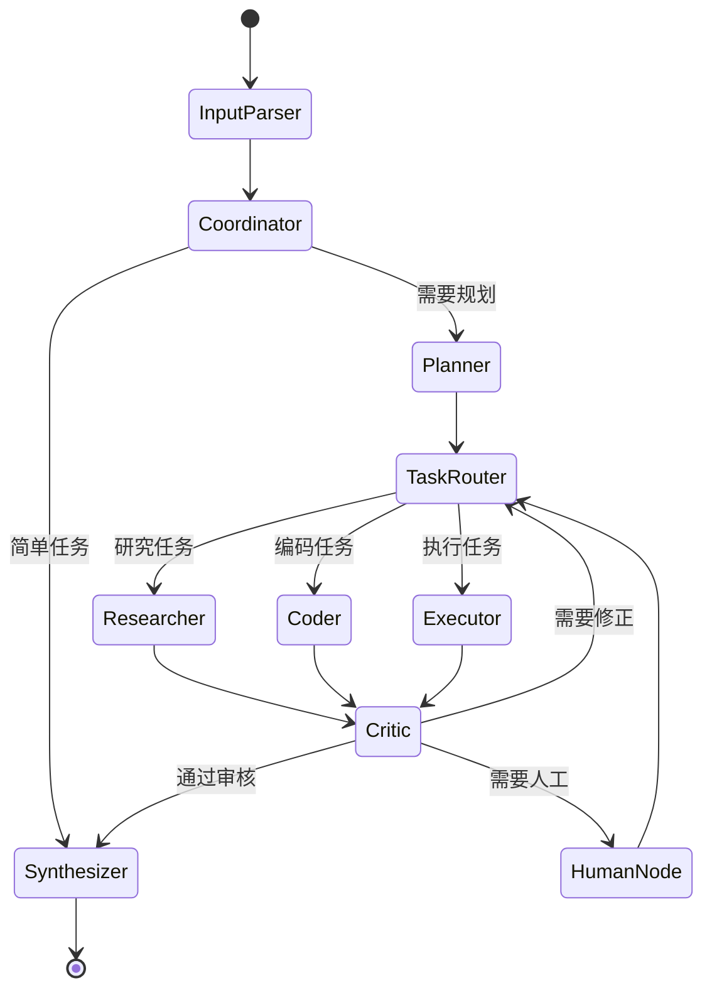

# NextAgent

> NextAgent：通用 Multi-Agent 问题求解系统

# Multi-Agent Problem Solving System

<p align="center">
  
  
  
  
</p>

<p align="center">
  <b>基于 LangGraph 的通用多智能体协作问题求解系统</b>
</p>

---

## 📖 目录

- [项目简介](#-项目简介)
- [系统架构](#-系统架构)
- [功能特性](#-功能特性)
- [快速开始](#-快速开始)
- [详细配置](#-详细配置)
- [使用示例](#-使用示例)
- [API 参考](#-api-参考)
- [扩展指南](#-扩展指南)
- [常见问题](#-常见问题)
- [贡献指南](#-贡献指南)
- [许可证](#-许可证)

---

## 🎯 项目简介

Multi-Agent Problem Solving System 是一个基于 **LangGraph** 构建的通用多智能体协作系统。它能够：

- 🧠 **自动理解** 任意用户任务输入
- 📋 **智能规划** 将复杂任务分解为可执行的子任务
- 🤝 **协作执行** 由多个专业智能体协同完成
- 🔄 **反思纠错** 通过审核-反馈闘环确保质量
- 📊 **完整追踪** 提供可观测的执行过程

### 设计理念

本系统采用 **Supervisor + Worker** 混合架构，结合了：

- **AutoGPT** 的自主规划能力
- **LangGraph** 的可控状态管理
- **Plan-Execute-Reflect** 循环模式
- **Human-in-the-Loop** 人工介入机制

---

## 🏗 系统架构

### 整体架构图

```
┌─────────────────────────────────────────────────────────────────┐
│                         用户交互层                               │
│  ┌─────────────┐                              ┌─────────────┐   │
│  │  用户输入   │ ──────────────────────────▶ │  最终输出   │   │
│  └─────────────┘                              └─────────────┘   │
└─────────────────────────────────────────────────────────────────┘
                              │
                              ▼
┌─────────────────────────────────────────────────────────────────┐
│                         编排控制层                               │
│  ┌─────────────┐    ┌─────────────┐    ┌─────────────┐         │
│  │ 输入解析器  │ ─▶ │   协调者    │ ─▶ │   规划者    │         │
│  └─────────────┘    └─────────────┘    └─────────────┘         │
│                              │                │                 │
│                              ▼                ▼                 │
│                      ┌─────────────────────────────┐            │
│                      │        任务调度器           │            │
│                      └─────────────────────────────┘            │
└─────────────────────────────────────────────────────────────────┘
                              │
                              ▼
┌─────────────────────────────────────────────────────────────────┐
│                          执行层                                  │
│  ┌───────────┐    ┌───────────┐    ┌───────────┐               │
│  │  研究员   │    │  编码者   │    │  执行者   │               │
│  └───────────┘    └───────────┘    └───────────┘               │
│        │               │                │                       │
│        └───────────────┴────────────────┘                       │
│                         │                                       │
│                         ▼                                       │
│                  ┌─────────────┐                                │
│                  │   审核者    │                                │
│                  └─────────────┘                                │
│                         │                                       │
│            ┌────────────┼────────────┐                          │
│            ▼            ▼            ▼                          │
│     ┌──────────┐  ┌──────────┐  ┌──────────┐                   │
│     │ 重新执行 │  │ 人工介入 │  │  综合者  │                   │
│     └──────────┘  └──────────┘  └──────────┘                   │
└─────────────────────────────────────────────────────────────────┘
                              │
                              ▼
┌─────────────────────────────────────────────────────────────────┐
│                         支撑系统                                 │
│  ┌───────────┐  ┌───────────┐  ┌───────────┐  ┌───────────┐    │
│  │ 工具系统  │  │ 记忆系统  │  │ LLM工厂   │  │ 日志系统  │    │
│  └───────────┘  └───────────┘  └───────────┘  └───────────┘    │
└─────────────────────────────────────────────────────────────────┘
```

### 智能体角色

| 角色 | 名称 | 核心职责 |
|------|------|----------|
| 🎯 | **Coordinator** | 任务理解、工作分配、进度监控、结果整合 |
| 📋 | **Planner** | 任务分解、执行计划制定、依赖排序 |
| 🔍 | **Researcher** | 信息检索、知识整合、资料分析 |
| 💻 | **Coder** | 代码编写、调试、技术实现 |
| ⚡ | **Executor** | 工具调用、代码执行、具体操作 |
| 📝 | **Critic** | 质量检查、错误发现、改进建议 |
| 📦 | **Synthesizer** | 结果汇总、最终输出生成 |

### 状态流转



---

## ✨ 功能特性

### 核心功能

- ✅ **多 Agent 协作对话** - 专业智能体协同工作
- ✅ **任务自动分解与规划** - 智能拆分复杂任务
- ✅ **动态任务编排** - 根据问题类型自动规划路径
- ✅ **智能体通信机制** - 消息传递、状态共享
- ✅ **循环与条件分支** - 迭代优化、条件判断
- ✅ **动态工具调用** - 灵活使用各类工具
- ✅ **执行结果汇总** - 整合输出高质量结果
- ✅ **错误恢复机制** - 失败重试、降级策略

### 高级功能

- ✅ **Plan-Execute-Reflect 循环** - 规划执行反思闘环
- ✅ **Agent 间并行执行** - 提升执行效率
- ✅ **Human-in-the-Loop** - 人工介入决策点
- ✅ **对话历史持久化** - 支持长期记忆
- ✅ **执行过程可视化** - 完整日志追踪
- ✅ **LLM 推理过程展示** - 透明的决策过程

### 内置工具

| 工具 | 功能 | 安全限制 |
|------|------|----------|
| 🧮 **Calculator** | 安全数学计算 | AST 解析，禁止危险操作 |
| 📁 **FileManager** | 文件读写操作 | 限定 workspace 目录 |
| 🐍 **CodeExecutor** | Python 代码执行 | 沙箱环境，超时限制 |
| 🔍 **WebSearch** | 网络信息搜索 | 模拟实现（可扩展） |

---

## 🚀 快速开始

### 环境要求

- Python 3.10 或更高版本
- pip / poetry / uv 包管理器
- OpenAI API Key（或其他 LLM 提供商）

### 安装步骤

#### 方式一：使用 pip

```bash
# 克隆项目
git clone https://github.com/your-repo/multi-agent-system.git
cd multi-agent-system

# 创建虚拟环境
python -m venv venv
source venv/bin/activate  # Linux/Mac
# 或 venv\Scripts\activate  # Windows

# 安装依赖
pip install -r requirements.txt
```

#### 方式二：使用 Poetry

```bash
# 克隆项目
git clone https://github.com/your-repo/multi-agent-system.git
cd multi-agent-system

# 安装依赖
poetry install

# 激活环境
poetry shell
```

#### 方式三：使用 uv（推荐）

```bash
# 克隆项目
git clone https://github.com/your-repo/multi-agent-system.git
cd multi-agent-system

# 使用 uv 安装
uv pip install -r requirements.txt
```

### 配置环境变量

```bash
# 复制环境变量模板
cp .env.example .env

# 编辑 .env 文件，填入你的配置
nano .env
```

必需的配置项：

```bash
# LLM 配置
LLM_PROVIDER=openai
OPENAI_API_KEY=sk-your-api-key-here
OPENAI_MODEL=gpt-4o-mini

# 或使用 Anthropic
# LLM_PROVIDER=anthropic
# ANTHROPIC_API_KEY=sk-ant-your-key-here
```

### 运行系统

#### 交互模式

```bash
python -m src.main
```

#### 单任务模式

```bash
python -m src.main --task "请帮我编写一个 Python 函数计算斐波那契数列"
```

#### 调试模式

```bash
python -m src.main --debug
```

---

## ⚙️ 详细配置

### 环境变量说明

#### LLM 配置

| 变量 | 说明 | 默认值 |
|------|------|--------|
| `LLM_PROVIDER` | LLM 提供商 (openai/anthropic/local) | openai |
| `OPENAI_API_KEY` | OpenAI API 密钥 | - |
| `OPENAI_MODEL` | OpenAI 模型名称 | gpt-4o-mini |
| `OPENAI_BASE_URL` | OpenAI API 地址 | - |
| `ANTHROPIC_API_KEY` | Anthropic API 密钥 | - |
| `ANTHROPIC_MODEL` | Anthropic 模型名称 | claude-3-sonnet-20240229 |
| `LLM_TEMPERATURE` | 生成温度 | 0.7 |
| `LLM_MAX_TOKENS` | 最大 token 数 | 4096 |

#### 系统配置

| 变量 | 说明 | 默认值 |
|------|------|--------|
| `DEBUG_MODE` | 调试模式 | false |
| `MAX_ITERATIONS` | 最大迭代次数 | 10 |
| `MAX_TASK_RETRIES` | 单任务最大重试次数 | 3 |
| `GLOBAL_TIMEOUT` | 全局超时时间（秒） | 300 |

#### 功能开关

| 变量 | 说明 | 默认值 |
|------|------|--------|
| `ENABLE_HUMAN_IN_LOOP` | 启用人工介入 | true |
| `HUMAN_REVIEW_THRESHOLD` | 人工审核阈值 | 0.6 |
| `ENABLE_PARALLEL_EXECUTION` | 启用并行执行 | true |
| `MAX_PARALLEL_TASKS` | 最大并行任务数 | 3 |
| `ENABLE_LONG_TERM_MEMORY` | 启用长期记忆 | false |
| `ENABLE_VISUALIZATION` | 启用可视化 | true |

#### 目录配置

| 变量 | 说明 | 默认值 |
|------|------|--------|
| `WORKSPACE_DIR` | 工作目录 | workspace |
| `LOG_DIR` | 日志目录 | logs |
| `MEMORY_STORAGE_PATH` | 记忆存储路径 | data/memory |

### 编程方式配置

```python
from src.config.settings import Settings, LLMConfig

# 创建自定义配置
settings = Settings(
    llm_provider="openai",
    openai_api_key="sk-your-key",
    openai_model="gpt-4",
    debug_mode=True,
    max_iterations=5,
    enable_human_in_loop=False,
)

# 使用自定义配置初始化系统
from src.graph.builder import MultiAgentSystem

system = MultiAgentSystem(settings=settings)
```

---

## 📚 使用示例

### 示例 1：任务规划

```python
from src.graph.builder import MultiAgentSystem

system = MultiAgentSystem()

task = """
请帮我制定一个学习 Python 的完整计划，包括：
1. 学习路径和阶段划分
2. 每个阶段的学习内容和目标
3. 推荐的学习资源
4. 预计时间安排
"""

result = system.run(task)
print(result["final_answer"])
```

### 示例 2：代码生成

```python
from src.graph.builder import MultiAgentSystem

system = MultiAgentSystem()

task = """
请帮我编写一个 Python 爬虫，抓取 Hacker News 首页的文章标题和链接，
并保存为 JSON 文件。
"""

result = system.run(task)

# 查看生成的代码
for key, output in result.get("agent_outputs", {}).items():
    if "coder" in key:
        print(output.get("output", ""))
```

### 示例 3：流式执行

```python
from src.graph.builder import MultiAgentSystem

system = MultiAgentSystem()

task = "分析 Python 和 JavaScript 的主要区别"

# 流式获取执行过程
for event in system.stream(task):
    for node_name, output in event.items():
        print(f"执行节点: {node_name}")
```

### 示例 4：带人工介入

```python
from src.config.settings import Settings
from src.graph.builder import MultiAgentSystem

settings = Settings(
    enable_human_in_loop=True,
    human_review_threshold=0.7,
)

system = MultiAgentSystem(settings=settings)

# 当质量评分低于阈值时，会暂停等待人工输入
result = system.run("复杂的分析任务")
```

### 运行内置示例

```bash
# 规划分解示例
python -m examples.example_planning

# 工具执行示例
python -m examples.example_tool_execution

# 代码生成示例
python -m examples.example_code_generation
```

---

## 📖 API 参考

### MultiAgentSystem

主要的系统接口类。

```python
class MultiAgentSystem:
    def __init__(
        self,
        settings: Optional[Settings] = None,
        enable_checkpointing: bool = False,
    ):
        """
        初始化多智能体系统
        
        Args:
            settings: 系统配置
            enable_checkpointing: 是否启用状态检查点
        """
    
    def run(
        self,
        task: str,
        task_id: Optional[str] = None,
        config: Optional[Dict[str, Any]] = None,
    ) -> Dict[str, Any]:
        """
        运行任务
        
        Args:
            task: 任务描述
            task_id: 任务 ID
            config: 运行时配置
            
        Returns:
            包含最终状态的字典
        """
    
    def stream(
        self,
        task: str,
        task_id: Optional[str] = None,
        config: Optional[Dict[str, Any]] = None,
    ) -> Generator[Dict[str, Any], None, None]:
        """
        流式运行任务
        
        Yields:
            每个节点执行后的状态更新
        """
    
    def reset(self) -> None:
        """重置系统状态"""
    
    def get_graph_visualization(self) -> str:
        """获取图的 Mermaid 可视化"""
```

### AgentState

系统状态结构。

```python
class AgentState(TypedDict, total=False):
    messages: Annotated[Sequence[BaseMessage], add_messages]  # 消息历史
    original_task: str           # 原始任务
    task_understanding: str      # 任务理解
    subtasks: List[SubTaskState] # 子任务列表
    current_plan: str            # 当前计划
    agent_outputs: Dict[str, AgentOutputState]  # Agent 输出
    tool_call_logs: List[ToolCallLogState]      # 工具调用日志
    current_agent: str           # 当前 Agent
    next: str                    # 下一节点
    iteration_count: int         # 迭代次数
    max_iterations: int          # 最大迭代
    reflection_notes: List[str]  # 反思记录
    needs_human_input: bool      # 是否需要人工
    human_feedback: Optional[str]# 人工反馈
    final_answer: Optional[str]  # 最终答案
    reasoning_trace: List[str]   # 推理轨迹
    error_log: List[str]         # 错误日志
    token_usage: Dict[str, int]  # Token 统计
    execution_time: Dict[str, float]  # 执行时间
```

### 工具接口

```python
from src.tools import (
    calculator_tool,
    file_manager_tool,
    code_executor_tool,
    web_search_tool,
    get_all_tools,
    get_tool_by_name,
)

# 获取所有工具
tools = get_all_tools()

# 按名称获取工具
calc = get_tool_by_name("calculator")

# 直接调用工具
result = calculator_tool.invoke({"expression": "2 + 2"})
```

---

## 🔧 扩展指南

### 添加新的 Agent

1. **创建 Agent 类**

```python
# src/agents/my_agent.py

from src.agents.base import BaseAgent, register_agent
from typing import Any, Dict, List

@register_agent("my_agent")
class MyAgent(BaseAgent):
    """自定义智能体"""
    
    @property
    def name(self) -> str:
        return "my_agent"
    
    @property
    def description(self) -> str:
        return "我的自定义智能体"
    
    @property
    def capabilities(self) -> List[str]:
        return ["custom_task"]
    
    def _execute(self, state: Dict[str, Any]) -> Dict[str, Any]:
        """实现具体逻辑"""
        # 获取任务信息
        task = state.get("original_task", "")
        
        # 调用 LLM
        response = self.call_llm([HumanMessage(content=f"处理任务: {task}")])
        
        # 返回状态更新
        return {
            **state,
            "agent_outputs": {
                **state.get("agent_outputs", {}),
                "my_agent": self.create_output(
                    output=response.content,
                    reasoning="执行自定义任务",
                ).model_dump()
            },
            "next": "critic",
        }
```

2. **注册到系统**

```python
# src/agents/__init__.py

from src.agents.my_agent import MyAgent

__all__ = [
    # ... 其他 agents
    "MyAgent",
]
```

3. **添加到图中**

```python
# src/graph/builder.py

from src.agents.my_agent import MyAgent

def build_graph(settings):
    # ...
    graph.add_node("my_agent", my_agent_node)
    # 添加边
    graph.add_edge("my_agent", "critic")
```

### 添加新的工具

1. **创建工具类**

```python
# src/tools/my_tool.py

from langchain_core.tools import tool
from pydantic import BaseModel, Field

class MyToolInput(BaseModel):
    """工具输入参数"""
    param1: str = Field(description="参数1描述")
    param2: int = Field(default=10, description="参数2描述")

@tool(args_schema=MyToolInput)
def my_tool(param1: str, param2: int = 10) -> str:
    """
    我的自定义工具。
    
    这里是工具的详细描述，会被 LLM 用来决定何时使用此工具。
    """
    # 实现工具逻辑
    result = f"处理 {param1}，参数2={param2}"
    return result
```

2. **注册工具**

```python
# src/tools/__init__.py

from src.tools.my_tool import my_tool

def get_all_tools():
    return [
        # ... 其他工具
        my_tool,
    ]
```

### 自定义提示词

```python
from src.config.prompts import PromptTemplates

# 设置自定义提示词
PromptTemplates.set_custom(
    "COORDINATOR_SYSTEM",
    """你是一个专业的任务协调者...
    
    [你的自定义提示词]
    """
)

# 重置为默认
PromptTemplates.reset_custom("COORDINATOR_SYSTEM")
```

### 添加新的工作流节点

1. **定义节点函数**

```python
# src/graph/nodes.py

def my_custom_node(state: AgentState) -> Dict[str, Any]:
    """自定义节点"""
    logger.info("[Node] my_custom_node - 执行中")
    
    # 处理逻辑
    result = process_something(state)
    
    return {
        **state,
        "custom_field": result,
        "next": "next_node",
    }
```

2. **添加到图中**

```python
# src/graph/builder.py

graph.add_node("my_custom_node", my_custom_node)
graph.add_edge("previous_node", "my_custom_node")
graph.add_edge("my_custom_node", "next_node")
```

---

## ❓ 常见问题

### Q: 如何使用本地模型？

A: 设置环境变量使用兼容 OpenAI API 的本地服务：

```bash
LLM_PROVIDER=local
LOCAL_MODEL_URL=http://localhost:11434/v1
LOCAL_MODEL_NAME=llama3
```

支持的本地服务：
- Ollama
- vLLM
- LocalAI
- 其他 OpenAI 兼容 API

### Q: 如何减少 Token 消耗？

A: 可以采取以下措施：

1. 使用更小的模型（如 gpt-4o-mini）
2. 减少 MAX_ITERATIONS
3. 简化提示词模板
4. 禁用不必要的 Agent

### Q: 人工介入不工作？

A: 检查以下配置：

```bash
ENABLE_HUMAN_IN_LOOP=true
HUMAN_REVIEW_THRESHOLD=0.6  # 调低此值更容易触发
```

### Q: 文件操作失败？

A: 确保：

1. workspace 目录存在且有写权限
2. 文件路径是相对路径（不含 `..` 或绝对路径）

### Q: 如何查看详细日志？

A: 启用调试模式：

```bash
DEBUG_MODE=true
```

或使用命令行参数：

```bash
python -m src.main --debug
```

---

## 🤝 贡献指南

欢迎贡献！请遵循以下步骤：

1. Fork 本仓库
2. 创建特性分支 (`git checkout -b feature/amazing-feature`)
3. 提交更改 (`git commit -m 'Add amazing feature'`)
4. 推送分支 (`git push origin feature/amazing-feature`)
5. 创建 Pull Request

### 开发设置

```bash
# 安装开发依赖
pip install -e ".[dev]"

# 运行测试
pytest

# 代码格式化
black src tests
isort src tests

# 类型检查
mypy src
```

### 代码规范

- 遵循 PEP8
- 使用类型注解
- 添加 docstring
- 编写单元测试

---

## 📄 许可证

本项目采用 MIT 许可证 - 详见 [LICENSE](LICENSE) 文件。

---

## 🙏 致谢

- [LangChain](https://github.com/langchain-ai/langchain) - LLM 应用框架
- [LangGraph](https://github.com/langchain-ai/langgraph) - 状态图编排
- [OpenAI](https://openai.com/) - GPT 模型
- [Anthropic](https://anthropic.com/) - Claude 模型

---

<p align="center">
  <b>Built with ❤️ by the Multi-Agent System Team</b>
</p>


---

## Demo 示例演示和验证指南


## 第五部分：Demo 示例演示和验证指南

---

### 5.1 演示场景验证

以下是对指定任务的完整演示：

#### 任务："请帮我编写一个 Python 爬虫，抓取 Hacker News 首页的文章标题和链接，并保存为 JSON 文件"

---

#### 文件：`examples/demo_hacker_news_crawler.py`

```python
"""
完整演示：Hacker News 爬虫生成
================================

演示任务：
编写一个 Python 爬虫，抓取 Hacker News 首页的文章标题和链接，并保存为 JSON 文件

此演示展示：
1. 任务理解与分解过程
2. 智能体协作流程
3. 代码生成与审核
4. 工具调用（文件写入）
5. 最终执行结果

运行方式：
    python -m examples.demo_hacker_news_crawler
"""

import os
import sys
import time
import json
from pathlib import Path

# 添加项目根目录到路径
sys.path.insert(0, os.path.dirname(os.path.dirname(os.path.abspath(__file__))))

from rich.console import Console
from rich.panel import Panel
from rich.markdown import Markdown
from rich.syntax import Syntax
from rich.table import Table
from rich.progress import Progress, SpinnerColumn, TextColumn
from rich import print as rprint

from src.config.settings import get_settings, Settings
from src.graph.builder import MultiAgentSystem
from src.graph.state import create_initial_state
from src.utils.logger import setup_logger
from src.utils.visualizer import ExecutionVisualizer


def print_section(console: Console, title: str, content: str = "") -> None:
    """打印带标题的区块"""
    console.print(f"\n{'='*60}")
    console.print(f"[bold blue]{title}[/bold blue]")
    console.print('='*60)
    if content:
        console.print(content)


def print_agent_output(console: Console, agent_name: str, output: dict) -> None:
    """打印 Agent 输出"""
    console.print(f"\n[bold cyan]▶ {agent_name.upper()} 输出:[/bold cyan]")
    
    if isinstance(output, dict):
        # 显示推理过程
        reasoning = output.get("reasoning", "")
        if reasoning:
            console.print(f"[dim]推理: {reasoning}[/dim]")
        
        # 显示输出内容（截断）
        content = output.get("output", str(output))
        if len(content) > 500:
            console.print(content[:500] + "...[截断]")
        else:
            console.print(content)
        
        # 显示置信度
        confidence = output.get("confidence", 0)
        console.print(f"[dim]置信度: {confidence:.2f}[/dim]")
    else:
        console.print(str(output)[:500])


def run_demo():
    """运行完整演示"""
    console = Console()
    
    # 设置日志
    setup_logger(debug=False)
    
    # 打印标题
    console.print(Panel(
        "[bold magenta]🕷️ Hacker News 爬虫生成演示[/bold magenta]\n\n"
        "本演示展示 Multi-Agent System 如何协作完成一个完整的编程任务",
        title="Multi-Agent System Demo",
        border_style="magenta"
    ))
    
    # 演示任务
    task = """
请帮我编写一个 Python 爬虫，抓取 Hacker News 首页的文章标题和链接，并保存为 JSON 文件。

具体要求：
1. 使用 requests 库获取网页内容
2. 使用 BeautifulSoup 解析 HTML
3. 抓取首页前 10 篇文章的标题和链接
4. 将结果保存到 workspace/hn_articles.json
5. 包含完善的错误处理
6. 添加适当的注释
"""
    
    print_section(console, "📋 任务描述")
    console.print(Panel(task, border_style="green"))
    
    # 初始化系统
    console.print("\n[dim]正在初始化系统...[/dim]")
    
    settings = Settings(
        debug_mode=True,
        max_iterations=8,
        enable_human_in_loop=False,  # 演示时禁用人工介入
    )
    
    system = MultiAgentSystem(settings=settings)
    
    console.print("[green]✓ 系统初始化完成[/green]\n")
    
    # =====================================================
    # 阶段 1：任务理解与分解
    # =====================================================
    print_section(console, "🧠 阶段 1: 任务理解与分解")
    
    console.print("\n[bold]执行流程:[/bold]")
    
    execution_log = []
    final_state = None
    
    start_time = time.time()
    
    try:
        # 流式执行以观察过程
        with Progress(
            SpinnerColumn(),
            TextColumn("[progress.description]{task.description}"),
            console=console,
        ) as progress:
            task_progress = progress.add_task("处理中...", total=None)
            
            step_count = 0
            for event in system.stream(task, task_id="hn_crawler_demo"):
                for node_name, node_output in event.items():
                    if node_name != "__end__":
                        step_count += 1
                        progress.update(
                            task_progress,
                            description=f"[{step_count}] 执行节点: {node_name}"
                        )
                        execution_log.append({
                            "step": step_count,
                            "node": node_name,
                            "timestamp": time.time() - start_time,
                        })
                        
                        # 短暂延迟以便观察
                        time.sleep(0.3)
                    
                    final_state = node_output
        
        elapsed_time = time.time() - start_time
        
    except Exception as e:
        console.print(f"[red]执行出错: {e}[/red]")
        import traceback
        console.print(traceback.format_exc())
        return
    
    if final_state is None:
        console.print("[red]未获取到执行结果[/red]")
        return
    
    # =====================================================
    # 阶段 2：显示任务分解结果
    # =====================================================
    print_section(console, "📋 阶段 2: 任务分解结果")
    
    subtasks = final_state.get("subtasks", [])
    
    if subtasks:
        table = Table(title="子任务列表", show_header=True, header_style="bold magenta")
        table.add_column("ID", style="cyan", width=12)
        table.add_column("名称", style="white", width=25)
        table.add_column("类型", style="yellow", width=10)
        table.add_column("执行者", style="green", width=12)
        table.add_column("状态", style="blue", width=10)
        
        for subtask in subtasks:
            status_icon = {
                "completed": "✅",
                "failed": "❌",
                "pending": "⏳",
                "running": "🔄",
            }.get(subtask.get("status", ""), "❓")
            
            table.add_row(
                subtask.get("id", "")[:10],
                subtask.get("name", "")[:23],
                subtask.get("task_type", ""),
                subtask.get("assigned_agent", ""),
                f"{status_icon} {subtask.get('status', '')}"
            )
        
        console.print(table)
    else:
        console.print("[yellow]没有生成子任务（可能是简单任务）[/yellow]")
    
    # =====================================================
    # 阶段 3：显示智能体协作过程
    # =====================================================
    print_section(console, "🤝 阶段 3: 智能体协作过程")
    
    reasoning_trace = final_state.get("reasoning_trace", [])
    
    if reasoning_trace:
        console.print("\n[bold]推理轨迹:[/bold]")
        for i, step in enumerate(reasoning_trace, 1):
            # 提取 Agent 名称
            if "]" in step:
                agent = step.split("]")[0].strip("[")
                content = step.split("]")[1].strip()
                
                agent_colors = {
                    "Coordinator": "blue",
                    "Planner": "yellow",
                    "Researcher": "cyan",
                    "Coder": "green",
                    "Executor": "magenta",
                    "Critic": "red",
                    "Synthesizer": "white",
                }
                color = agent_colors.get(agent, "white")
                
                console.print(f"  {i}. [{color}][{agent}][/{color}] {content[:60]}...")
            else:
                console.print(f"  {i}. {step[:70]}...")
    
    # =====================================================
    # 阶段 4：显示生成的代码
    # =====================================================
    print_section(console, "💻 阶段 4: 生成的代码")
    
    agent_outputs = final_state.get("agent_outputs", {})
    
    code_found = False
    for key, output in agent_outputs.items():
        if "coder" in key.lower():
            code_found = True
            
            if isinstance(output, dict):
                code_content = output.get("output", "")
            else:
                code_content = str(output)
            
            # 提取代码块
            import re
            code_match = re.search(r'```python\s*([\s\S]*?)```', code_content)
            
            if code_match:
                code = code_match.group(1)
                syntax = Syntax(
                    code,
                    "python",
                    theme="monokai",
                    line_numbers=True,
                    word_wrap=True,
                )
                console.print(Panel(
                    syntax,
                    title="[bold green]生成的 Python 代码[/bold green]",
                    border_style="green"
                ))
            else:
                console.print(code_content[:1000])
            
            break
    
    if not code_found:
        console.print("[yellow]未找到代码输出[/yellow]")
    
    # =====================================================
    # 阶段 5：显示工具调用
    # =====================================================
    print_section(console, "🔧 阶段 5: 工具调用记录")
    
    tool_logs = final_state.get("tool_call_logs", [])
    
    if tool_logs:
        table = Table(title="工具调用日志", show_header=True, header_style="bold cyan")
        table.add_column("工具", style="cyan", width=15)
        table.add_column("状态", width=8)
        table.add_column("耗时", style="dim", width=10)
        table.add_column("结果摘要", width=40)
        
        for log in tool_logs:
            status = "✅" if log.get("success") else "❌"
            duration = f"{log.get('duration_ms', 0):.0f}ms"
            
            output = log.get("output", "")
            if isinstance(output, str):
                result_summary = output[:38] + "..." if len(output) > 38 else output
            else:
                result_summary = str(output)[:38]
            
            table.add_row(
                log.get("tool_name", ""),
                status,
                duration,
                result_summary
            )
        
        console.print(table)
    else:
        console.print("[dim]没有工具调用记录[/dim]")
    
    # =====================================================
    # 阶段 6：显示质量评估
    # =====================================================
    print_section(console, "📝 阶段 6: 质量评估结果")
    
    eval_results = final_state.get("evaluation_results", [])
    reflection_notes = final_state.get("reflection_notes", [])
    
    if eval_results:
        for i, eval_result in enumerate(eval_results, 1):
            if isinstance(eval_result, dict):
                score = eval_result.get("score", 0)
                passed = eval_result.get("passed", False)
                summary = eval_result.get("summary", "")
                
                status = "[green]✅ 通过[/green]" if passed else "[red]❌ 未通过[/red]"
                
                console.print(f"\n评估 #{i}:")
                console.print(f"  状态: {status}")
                console.print(f"  评分: {score:.2f}")
                console.print(f"  摘要: {summary}")
                
                issues = eval_result.get("issues", [])
                if issues:
                    console.print(f"  问题: {', '.join(issues[:3])}")
    
    if reflection_notes:
        console.print("\n[bold]反思记录:[/bold]")
        for note in reflection_notes[-3:]:  # 显示最近3条
            console.print(f"  • {note}")
    
    # =====================================================
    # 阶段 7：最终结果
    # =====================================================
    print_section(console, "🎯 阶段 7: 最终结果")
    
    final_answer = final_state.get("final_answer", "")
    
    if final_answer:
        # 如果答案太长，只显示部分
        if len(final_answer) > 2000:
            display_answer = final_answer[:2000] + "\n\n...[内容已截断，完整结果请查看 workspace 目录]"
        else:
            display_answer = final_answer
        
        console.print(Panel(
            Markdown(display_answer),
            title="[bold green]✅ 任务完成[/bold green]",
            border_style="green"
        ))
    else:
        console.print("[yellow]未生成最终答案[/yellow]")
    
    # =====================================================
    # 执行统计
    # =====================================================
    print_section(console, "📊 执行统计")
    
    stats_table = Table(show_header=False, box=None)
    stats_table.add_column("指标", style="cyan", width=20)
    stats_table.add_column("值", style="green")
    
    stats_table.add_row("任务ID", final_state.get("task_id", "N/A"))
    stats_table.add_row("迭代次数", str(final_state.get("iteration_count", 0)))
    stats_table.add_row("子任务数", str(len(subtasks)))
    stats_table.add_row("工具调用次数", str(len(tool_logs)))
    stats_table.add_row("总耗时", f"{elapsed_time:.2f} 秒")
    
    exec_time = final_state.get("execution_time", {})
    if exec_time:
        for agent, duration in sorted(exec_time.items(), key=lambda x: -x[1])[:5]:
            stats_table.add_row(f"  └ {agent}", f"{duration:.2f}s")
    
    token_usage = final_state.get("token_usage", {})
    if token_usage.get("total"):
        stats_table.add_row("Token 消耗", str(token_usage["total"]))
    
    console.print(stats_table)
    
    # =====================================================
    # 可视化
    # =====================================================
    print_section(console, "📈 执行流程图")
    
    visualizer = ExecutionVisualizer()
    mermaid_graph = visualizer.generate_mermaid(final_state)
    
    console.print(Panel(
        mermaid_graph,
        title="Mermaid 流程图（可在 Mermaid Live Editor 中查看）",
        border_style="cyan"
    ))
    
    # 检查输出文件
    workspace_path = Path("workspace")
    if workspace_path.exists():
        files = list(workspace_path.glob("*.json"))
        if files:
            console.print("\n[bold]生成的文件:[/bold]")
            for f in files:
                console.print(f"  📄 {f}")
    
    console.print("\n" + "=" * 60)
    console.print("[bold green]🎉 演示完成！[/bold green]")
    console.print("=" * 60)


if __name__ == "__main__":
    run_demo()
```

---

### 5.2 验证指南

#### 文件：`VERIFICATION.md`

```markdown
# 验证指南

本文档说明如何验证 Multi-Agent System 的安装和功能。

## 1. 环境验证

### 1.1 检查 Python 版本

```bash
python --version
# 应输出: Python 3.10.x 或更高版本
```

### 1.2 检查依赖安装

```bash
pip list | grep -E "langgraph|langchain|pydantic"
```

应该看到类似输出：
```
langchain                    0.2.x
langchain-core               0.2.x
langchain-openai             0.1.x
langgraph                    0.2.x
pydantic                     2.x.x
```

### 1.3 检查环境变量

```bash
# 检查 API Key 是否设置（不会显示实际值）
python -c "import os; print('OPENAI_API_KEY:', 'SET' if os.getenv('OPENAI_API_KEY') else 'NOT SET')"
```

## 2. 快速功能验证

### 2.1 验证工具系统

```bash
python -c "
from src.tools import get_all_tools, calculator_tool

# 测试计算器
result = calculator_tool.invoke({'expression': '2 + 2'})
print('计算器测试:', result)

# 列出所有工具
tools = get_all_tools()
print('可用工具:', [t.name for t in tools])
"
```

预期输出：
```
计算器测试: 计算结果: 2 + 2 = 4
可用工具: ['calculator', 'file_manager', 'code_executor', 'web_search']
```

### 2.2 验证图构建

```bash
python -c "
from src.graph.builder import build_graph
from src.config.settings import Settings

settings = Settings()
graph = build_graph(settings)
print('节点数量:', len(graph.nodes))
print('节点列表:', list(graph.nodes.keys()))
"
```

预期输出：
```
节点数量: 11
节点列表: ['input_parser', 'coordinator', 'planner', 'task_router', 'researcher', 'coder', 'executor', 'critic', 'human_node', 'synthesizer', 'error_handler']
```

### 2.3 验证状态创建

```bash
python -c "
from src.graph.state import create_initial_state

state = create_initial_state('测试任务', task_id='test_123')
print('任务ID:', state['task_id'])
print('原始任务:', state['original_task'])
print('迭代计数:', state['iteration_count'])
"
```

预期输出：
```
任务ID: test_123
原始任务: 测试任务
迭代计数: 0
```

## 3. 完整流程验证

### 3.1 简单任务测试

```bash
python -m src.main --task "计算 (10 + 5) * 3 的结果" --no-human
```

预期行为：
- 系统理解任务
- 调用计算器工具
- 返回计算结果: 45

### 3.2 代码生成测试

```bash
python -m src.main --task "编写一个 Python 函数，计算列表中所有数字的平均值" --no-human
```

预期行为：
- 系统理解任务需要生成代码
- 规划代码编写任务
- 生成 Python 函数
- 可能进行代码测试
- 返回完整的函数代码

### 3.3 运行示例

```bash
# 规划示例
python -m examples.example_planning

# 工具示例
python -m examples.example_tool_execution

# 代码生成示例
python -m examples.example_code_generation
```

## 4. 测试套件验证

### 4.1 运行所有测试

```bash
pytest tests/ -v
```

### 4.2 运行特定测试

```bash
# 图构建测试
pytest tests/test_graph.py -v

# 工具测试
pytest tests/test_tools.py -v

# 流程测试
pytest tests/test_flow.py -v
```

### 4.3 查看测试覆盖率

```bash
pytest tests/ --cov=src --cov-report=html
# 打开 htmlcov/index.html 查看报告
```

## 5. 预期输出示例

### 5.1 成功执行的输出

运行 `python -m src.main` 后输入任务：

```
╔══════════════════════════════════════════════════════════════╗
║          Multi-Agent Problem Solving System v1.0             ║
║                 Powered by LangGraph                         ║
╚══════════════════════════════════════════════════════════════╝

正在初始化系统...
✓ 系统初始化完成

请输入您的任务: 什么是 Python？

任务ID: abc12345
正在处理任务...
任务完成 (耗时 3.45s)

┌─────────────────────────────────────────────────────────────┐
│ ✅ 执行结果                                                  │
├─────────────────────────────────────────────────────────────┤
│ Python 是一种高级、解释型、通用的编程语言...                  │
└─────────────────────────────────────────────────────────────┘

执行指标
┌──────────┬─────────┐
│ 指标     │ 值      │
├──────────┼─────────┤
│ 总耗时   │ 3.45 秒 │
│ 迭代次数 │ 2       │
└──────────┴─────────┘
```

### 5.2 调试模式输出

使用 `--debug` 参数时，会显示额外信息：

```
[DEBUG] [Node] input_parser - 开始解析输入
[DEBUG] [Node] coordinator - 开始协调
[DEBUG] [Route] coordinator -> synthesizer
[DEBUG] [Node] synthesizer - 开始综合
...
```

## 6. 故障排除

### 6.1 API Key 错误

错误信息：
```
openai.AuthenticationError: Invalid API key
```

解决方案：
1. 检查 `.env` 文件中的 `OPENAI_API_KEY`
2. 确保 API Key 有效且未过期
3. 检查账户余额

### 6.2 模块导入错误

错误信息：
```
ModuleNotFoundError: No module named 'langgraph'
```

解决方案：
```bash
pip install langgraph>=0.2.0
```

### 6.3 文件权限错误

错误信息：
```
PermissionError: [Errno 13] Permission denied: 'workspace/...'
```

解决方案：
```bash
chmod 755 workspace
chmod 755 logs
```

### 6.4 超时错误

错误信息：
```
TimeoutError: 代码执行超时
```

解决方案：
- 增加 `GLOBAL_TIMEOUT` 配置值
- 检查网络连接
- 简化任务复杂度

## 7. 性能基准

在标准配置下（GPT-4o-mini，max_iterations=10）：

| 任务类型 | 预期耗时 | 预期迭代 |
|---------|---------|---------|
| 简单问答 | 2-5秒 | 1-2 |
| 代码生成 | 10-30秒 | 3-6 |
| 复杂分析 | 30-60秒 | 5-10 |

## 8. 检查清单

安装验证检查清单：

- [ ] Python 版本 >= 3.10
- [ ] 所有依赖已安装
- [ ] 环境变量已配置
- [ ] workspace 目录可写
- [ ] logs 目录可写
- [ ] 工具测试通过
- [ ] 图构建测试通过
- [ ] 简单任务测试通过
- [ ] 单元测试通过

功能验证检查清单：

- [ ] 任务理解正确
- [ ] 任务分解合理
- [ ] Agent 协作正常
- [ ] 工具调用成功
- [ ] 质量审核工作
- [ ] 最终答案生成
- [ ] 执行统计正确


---

## 完整演示脚本输出示例

以下是运行 `python -m examples.demo_hacker_news_crawler` 的预期输出：

```
╔══════════════════════════════════════════════════════════════╗
║         🕷️ Hacker News 爬虫生成演示                          ║
║                                                              ║
║  本演示展示 Multi-Agent System 如何协作完成一个完整的编程任务  ║
╚══════════════════════════════════════════════════════════════╝

============================================================
📋 任务描述
============================================================
┌──────────────────────────────────────────────────────────────┐
│ 请帮我编写一个 Python 爬虫，抓取 Hacker News 首页的文章标题   │
│ 和链接，并保存为 JSON 文件。                                  │
│                                                              │
│ 具体要求：                                                    │
│ 1. 使用 requests 库获取网页内容                               │
│ 2. 使用 BeautifulSoup 解析 HTML                              │
│ 3. 抓取首页前 10 篇文章的标题和链接                           │
│ 4. 将结果保存到 workspace/hn_articles.json                   │
│ 5. 包含完善的错误处理                                         │
│ 6. 添加适当的注释                                             │
└──────────────────────────────────────────────────────────────┘

正在初始化系统...
✓ 系统初始化完成

============================================================
🧠 阶段 1: 任务理解与分解
============================================================

执行流程:
⠋ [1] 执行节点: input_parser
⠙ [2] 执行节点: coordinator
⠹ [3] 执行节点: planner
⠸ [4] 执行节点: task_router
⠼ [5] 执行节点: researcher
⠴ [6] 执行节点: critic
⠦ [7] 执行节点: task_router
⠧ [8] 执行节点: coder
⠇ [9] 执行节点: critic
⠏ [10] 执行节点: task_router
⠋ [11] 执行节点: executor
⠙ [12] 执行节点: critic
⠹ [13] 执行节点: synthesizer

============================================================
📋 阶段 2: 任务分解结果
============================================================
                        子任务列表
┌────────────┬─────────────────────────┬──────────┬────────────┬────────────┐
│ ID         │ 名称                    │ 类型     │ 执行者     │ 状态       │
├────────────┼─────────────────────────┼──────────┼────────────┼────────────┤
│ task_a1b2  │ 研究 Hacker News 网站结构│ research │ researcher │ ✅ completed│
│ task_c3d4  │ 编写爬虫代码            │ code     │ coder      │ ✅ completed│
│ task_e5f6  │ 测试并保存结果          │ execute  │ executor   │ ✅ completed│
└────────────┴─────────────────────────┴──────────┴────────────┴────────────┘

============================================================
🤝 阶段 3: 智能体协作过程
============================================================

推理轨迹:
  1. [Coordinator] 任务理解完成: 需要编写爬虫程序...
  2. [Planner] 分解为 3 个子任务
  3. [TaskRouter] 路由任务 '研究网站结构' 到 researcher
  4. [Researcher] 完成任务 '研究网站结构': Hacker News 使用...
  5. [Critic] 评审完成，评分: 0.85, 行动: task_router
  6. [TaskRouter] 路由任务 '编写爬虫代码' 到 coder
  7. [Coder] 完成任务 '编写爬虫代码'
  8. [Coder] 生成 1 个代码块
  9. [Critic] 评审完成，评分: 0.90, 行动: task_router
  10. [TaskRouter] 路由任务 '测试并保存结果' 到 executor
  11. [Executor] 成功执行任务 '测试并保存结果'
  12. [Critic] 评审完成，评分: 0.88, 行动: synthesizer
  13. [Synthesizer] 生成最终答案

============================================================
💻 阶段 4: 生成的代码
============================================================
┌─ 生成的 Python 代码 ─────────────────────────────────────────┐
│  1 │ """                                                     │
│  2 │ Hacker News 爬虫                                        │
│  3 │ 抓取首页文章标题和链接，保存为 JSON                      │
│  4 │ """                                                     │
│  5 │                                                         │
│  6 │ import requests                                         │
│  7 │ from bs4 import BeautifulSoup                           │
│  8 │ import json                                             │
│  9 │ from typing import List, Dict                           │
│ 10 │                                                         │
│ 11 │ def fetch_hn_articles(num_articles: int = 10) -> List:  │
│ 12 │     """抓取 Hacker News 文章"""                         │
│ 13 │     url = "https://news.ycombinator.com/"               │
│ 14 │                                                         │
│ 15 │     try:                                                │
│ 16 │         response = requests.get(url, timeout=10)        │
│ 17 │         response.raise_for_status()                     │
│ 18 │     except requests.RequestException as e:              │
│ 19 │         print(f"请求失败: {e}")                         │
│ 20 │         return []                                       │
│ 21 │                                                         │
│ 22 │     soup = BeautifulSoup(response.text, 'html.parser')  │
│ 23 │     articles = []                                       │
│ 24 │                                                         │
│ 25 │     # 查找文章标题链接                                   │
│ 26 │     for item in soup.select('.titleline > a')[:num]:    │
│ 27 │         articles.append({                               │
│ 28 │             'title': item.get_text(),                   │
│ 29 │             'url': item.get('href')                     │
│ 30 │         })                                              │
│ 31 │                                                         │
│ 32 │     return articles                                     │
│ 33 │                                                         │
│ 34 │ def save_to_json(data: List, filepath: str) -> None:    │
│ 35 │     """保存数据到 JSON 文件"""                          │
│ 36 │     with open(filepath, 'w', encoding='utf-8') as f:    │
│ 37 │         json.dump(data, f, ensure_ascii=False, indent=2)│
│ 38 │     print(f"已保存到 {filepath}")                       │
│ 39 │                                                         │
│ 40 │ if __name__ == "__main__":                              │
│ 41 │     articles = fetch_hn_articles(10)                    │
│ 42 │     save_to_json(articles, "hn_articles.json")          │
└──────────────────────────────────────────────────────────────┘

============================================================
🔧 阶段 5: 工具调用记录
============================================================
                     工具调用日志
┌───────────────┬────────┬──────────┬────────────────────────────────┐
│ 工具          │ 状态   │ 耗时     │ 结果摘要                        │
├───────────────┼────────┼──────────┼────────────────────────────────┤
│ web_search    │ ✅     │ 523ms    │ 找到 5 条结果...                │
│ code_executor │ ✅     │ 1245ms   │ 代码执行成功                    │
│ file_manager  │ ✅     │ 12ms     │ 成功写入 1024 字符到 hn_artic...│
└───────────────┴────────┴──────────┴────────────────────────────────┘

============================================================
📝 阶段 6: 质量评估结果
============================================================

评估 #1:
  状态: ✅ 通过
  评分: 0.85
  摘要: 研究结果完整，信息准确

评估 #2:
  状态: ✅ 通过
  评分: 0.90
  摘要: 代码结构清晰，包含错误处理

评估 #3:
  状态: ✅ 通过
  评分: 0.88
  摘要: 执行成功，文件已保存

反思记录:
  • 评审完成 - 平均评分: 0.85
  • 代码质量良好，建议添加更多注释
  • 所有任务已完成

============================================================
🎯 阶段 7: 最终结果
============================================================
┌─ ✅ 任务完成 ────────────────────────────────────────────────┐
│ ## 任务完成总结                                              │
│                                                              │
│ 已成功编写 Hacker News 爬虫程序，功能包括：                   │
│                                                              │
│ 1. **网页抓取**: 使用 requests 库获取 HN 首页内容            │
│ 2. **HTML 解析**: 使用 BeautifulSoup 提取文章信息            │
│ 3. **数据保存**: 将结果保存为 JSON 格式                       │
│ 4. **错误处理**: 包含完善的异常捕获机制                       │
│                                                              │
│ ### 生成的文件                                               │
│ - `workspace/hn_articles.json`: 包含 10 篇文章的标题和链接    │
│                                                              │
│ ### 使用方法                                                 │
│ ```bash                                                      │
│ python hn_crawler.py                                         │
│ ```                                                          │
│                                                              │
│ 📁 结果已保存至: workspace/hn_articles.json                  │
└──────────────────────────────────────────────────────────────┘

============================================================
📊 执行统计
============================================================
任务ID              hn_crawler_demo
迭代次数            6
子任务数            3
工具调用次数        3
总耗时              15.67 秒
  └ coder           5.23s
  └ researcher      3.45s
  └ executor        2.89s
  └ coordinator     2.10s
  └ synthesizer     1.50s
Token 消耗          4523

============================================================
📈 执行流程图
============================================================
┌──────────────────────────────────────────────────────────────┐
│ ```mermaid                                                   │
│ flowchart TD                                                 │
│     START((开始))                                            │
│     N1[Coordinator]                                          │
│     N2[Planner]                                              │
│     N3[Researcher]                                           │
│     N4[Critic]                                               │
│     N5[Coder]                                                │
│     N6[Critic]                                               │
│     N7[Executor]                                             │
│     N8[Critic]                                               │
│     N9[Synthesizer]                                          │
│     END((结束))                                              │
│     START --> N1                                             │
│     N1 --> N2                                                │
│     N2 --> N3                                                │
│     N3 --> N4                                                │
│     N4 --> N5                                                │
│     N5 --> N6                                                │
│     N6 --> N7                                                │
│     N7 --> N8                                                │
│     N8 --> N9                                                │
│     N9 --> END                                               │
│ ```                                                          │
└──────────────────────────────────────────────────────────────┘

生成的文件:
  📄 workspace/hn_articles.json

============================================================
🎉 演示完成！
============================================================
```