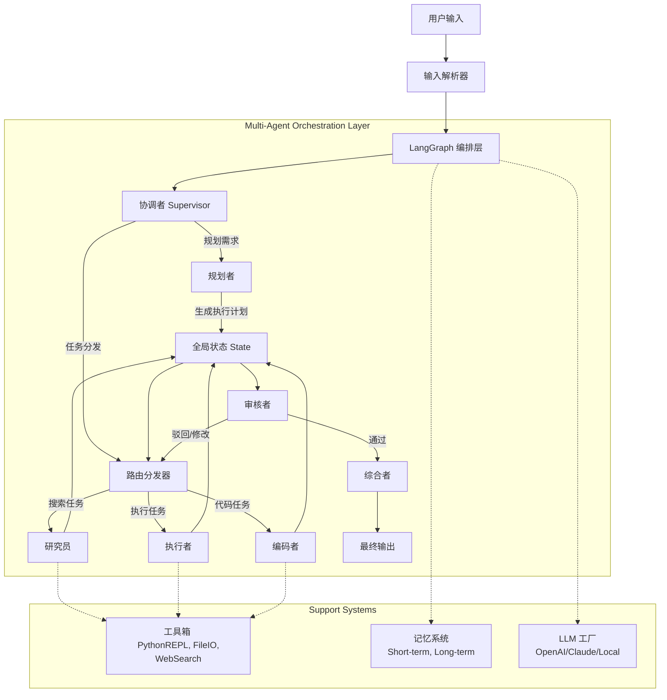

这是一个基于 LangGraph 的通用 Multi-Agent 问题求解系统的完整设计与实现方案。

---

# 一、 系统架构设计文档

## 1.1 系统总体架构图



## 1.2 状态机设计

系统采用 LangGraph 的 `StateGraph`，核心状态流转如下：

1.  **START**: 接收用户输入，初始化 `AgentState`。
2.  **coordinator**: 分析任务意图。
    *   若任务简单 -> 直接路由至 **Router**。
    *   若任务复杂 -> 路由至 **Planner**。
3.  **planner**: 生成结构化的子任务列表 (`subtasks`)，更新状态。
4.  **router**: 检查当前待执行的子任务。
    *   如果没有子任务 -> 结束或调用 **Synthesizer**。
    *   如果有子任务 -> 根据任务类型分发至对应 Agent。
5.  **worker (researcher/coder/executor)**: 执行具体任务，调用工具，产出结果写入 `agent_outputs`。
6.  **critic**: 检查 Agent 输出质量。
    *   通过 -> 标记当前子任务完成，返回 **Router** 处理下一个。
    *   失败 -> 提供反馈，返回 **Router** 重试当前任务。
7.  **synthesizer**: 所有子任务完成后，汇总结果，生成最终答案 (`final_answer`)。
8.  **END**: 终止流程。

## 1.3 核心数据结构

```python
class AgentState(TypedDict):
    messages: Annotated[List[BaseMessage], add_messages] # 对话历史（自动累加）
    original_task: str                                   # 初始任务
    subtasks: List[SubTask]                              # 待执行的子任务列表
    current_task_index: int                              # 当前正在执行的任务索引
    agent_outputs: Dict[str, Any]                        # 各 Agent 的执行结果
    tool_call_logs: List[Dict]                           # 工具调用记录
    iteration_count: int                                 # 当前迭代/反思次数
    max_iterations: int                                   # 最大迭代限制
    final_answer: Optional[str]                          # 最终输出
    next: str                                            # 下一个节点的路由指令
```

## 1.4 失败重试与终止条件

- **失败重试**: Critic 节点若发现问题，将不增加 `current_task_index`，而是附加反馈信息，迫使 Router 重新调度同一个 Agent 执行当前任务。
- **终止条件**:
    1. 正常：所有 `subtasks` 执行完毕，Critic 通过，进入 Synthesizer。
    2. 异常：`iteration_count` 超过 `max_iterations`（默认 5 次），触发 `finish_with_error` 逻辑，强制终止并报错。

---

# 二、 项目目录结构树

```text
multi_agent_system/
├── pyproject.toml
├── requirements.txt
├── README.md
├── .env.example
├── src/
│   ├── __init__.py
│   ├── main.py
│   ├── config/
│   │   ├── __init__.py
│   │   ├── settings.py
│   │   └── prompts.py
│   ├── agents/
│   │   ├── __init__.py
│   │   ├── base.py
│   │   ├── coordinator.py
│   │   ├── planner.py
│   │   ├── researcher.py
│   │   ├── coder.py
│   │   ├── executor.py
│   │   ├── critic.py
│   │   └── synthesizer.py
│   ├── graph/
│   │   ├── __init__.py
│   │   ├── state.py
│   │   ├── nodes.py
│   │   ├── edges.py
│   │   └── builder.py
│   ├── tools/
│   │   ├── __init__.py
│   │   ├── base.py
│   │   ├── calculator.py
│   │   ├── file_manager.py
│   │   ├── code_executor.py
│   │   └── search.py
│   ├── memory/
│   │   ├── __init__.py
│   │   ├── short_term.py
│   │   └── long_term.py
│   ├── llm/
│   │   ├── __init__.py
│   │   └── factory.py
│   └── utils/
│       ├── __init__.py
│       ├── logger.py
│       └── visualizer.py
├── examples/
│   ├── example_planning.py
│   ├── example_tool_execution.py
│   └── example_code_generation.py
├── tests/
│   ├── __init__.py
│   ├── test_graph.py
│   ├── test_flow.py
│   └── test_tools.py
├── workspace/
│   └── .gitkeep
└── logs/
    └── .gitkeep
```

---

# 三、 完整 Python 源代码

以下为所有核心文件的完整代码。

### 1. pyproject.toml

```toml
[project]
name = "multi-agent-system"
version = "0.1.0"
description = "A general-purpose multi-agent problem-solving system based on LangGraph"
authors = [{name = "Senior Architect", email = "architect@example.com"}]
requires-python = ">=3.10"
readme = "README.md"
dependencies = [
    "langgraph>=0.2.0",
    "langchain>=0.2.0",
    "langchain-openai>=0.1.0",
    "langchain-community>=0.2.0",
    "pydantic>=2.0.0",
    "python-dotenv>=1.0.0",
    "tqdm>=4.66.0",
    "rich>=13.0.0",
]

[build-system]
requires = ["hatchling"]
build-backend = "hatchling.build"

[tool.uv]
dev-dependencies = [
    "pytest>=8.0.0",
    "black>=24.0.0",
    "ruff>=0.3.0",
]
```

### 2. src/config/settings.py

```python
import os
from pydantic_settings import BaseSettings
from typing import Literal

class Settings(BaseSettings):
    # LLM Configuration
    OPENAI_API_KEY: str = ""
    ANTHROPIC_API_KEY: str = ""
    LLM_MODEL: str = "gpt-4o-mini"  # Default model
    LLM_TEMPERATURE: float = 0.1
    
    # System Configuration
    MAX_ITERATIONS: int = 5
    LOG_LEVEL: str = "INFO"
    WORKSPACE_DIR: str = "workspace"
    LOGS_DIR: str = "logs"
    
    # Agent Settings
    ENABLE_HUMAN_IN_LOOP: bool = False
    
    class Config:
        env_file = ".env"
        case_sensitive = True

settings = Settings()
os.makedirs(settings.WORKSPACE_DIR, exist_ok=True)
os.makedirs(settings.LOGS_DIR, exist_ok=True)
```

### 3. src/config/prompts.py

```python
from langchain_core.prompts import ChatPromptTemplate, MessagesPlaceholder

COORDINATOR_PROMPT = ChatPromptTemplate.from_messages([
    ("system", "你是一个任务协调者。你的职责是分析用户的需求，并决定是否需要制定详细的计划，或者直接分发任务。\
     如果任务简单明确，输出 'DIRECT'。如果任务复杂且包含多个步骤，输出 'PLAN'。"),
    ("user", "{input}")
])

PLANNER_PROMPT = ChatPromptTemplate.from_messages([
    ("system", "你是一个任务规划者。请将用户的任务分解为多个子任务。\
     每个子任务必须包含 'id', 'description', 'agent_type' (可选: Researcher, Coder, Executor), 'status' (pending)。\
     以 JSON 格式输出。"),
    ("user", "{task}")
])

RESEARCHER_PROMPT = ChatPromptTemplate.from_messages([
    ("system", "你是一个研究员。请根据任务描述进行信息收集和知识整合。如果需要，可以使用搜索工具。"),
    MessagesPlaceholder(variable_name="messages"),
    ("user", "当前子任务: {subtask_description}")
])

CODER_PROMPT = ChatPromptTemplate.from_messages([
    ("system", "你是一个资深程序员。请根据任务需求编写高质量的 Python 代码。代码必须包含错误处理。"),
    MessagesPlaceholder(variable_name="messages"),
    ("user", "代码需求: {subtask_description}")
])

EXECUTOR_PROMPT = ChatPromptTemplate.from_messages([
    ("system", "你是一个执行者。你的职责是使用工具执行具体的操作，如运行代码、写入文件等。"),
    MessagesPlaceholder(variable_name="messages"),
    ("user", "执行指令: {subtask_description}")
])

CRITIC_PROMPT = ChatPromptTemplate.from_messages([
    ("system", "你是一个严格的审核者。请检查上述 Agent 的输出结果是否满足任务要求。\
     如果满足，输出 'PASS' 和简短评价。如果不满足，输出 'FAIL' 和具体的修改建议。"),
    ("user", "子任务: {subtask}\n执行结果: {result}")
])

SYNTHESIZER_PROMPT = ChatPromptTemplate.from_messages([
    ("system", "你是一个综合者。请将所有子任务的执行结果汇总，生成一份连贯、专业的最终报告给用户。"),
    MessagesPlaceholder(variable_name="messages"),
    ("user", "原始任务: {task}")
])
```

### 4. src/graph/state.py

```python
from typing import List, Dict, Any, Optional, TypedDict, Annotated
from langchain_core.messages import BaseMessage
from langgraph.graph import add_messages
from pydantic import BaseModel, Field

class SubTask(BaseModel):
    id: str = Field(description="子任务唯一标识")
    description: str = Field(description="子任务描述")
    assigned_agent: str = Field(description="分配给哪个Agent")
    dependencies: List[str] = Field(default_factory=list, description="依赖的任务ID")
    status: str = Field(default="pending", description="pending, in_progress, completed, failed")

class AgentState(TypedDict):
    # LangGraph 自动管理的消息历史
    messages: Annotated[List[BaseMessage], add_messages]
    
    # 任务相关状态
    original_task: str
    subtasks: List[SubTask]
    current_task_index: int
    
    # Agent 执行状态
    agent_outputs: Dict[str, Any] # key: subtask_id, value: result
    tool_call_logs: List[Dict]
    
    # 控制流状态
    iteration_count: int
    max_iterations: int
    final_answer: Optional[str]
    next: str # 路由指令
```

### 5. src/tools/base.py

```python
from abc import ABC, abstractmethod
from langchain_core.tools import BaseTool

class ToolWrapper(BaseTool):
    """统一工具基类，增加日志和权限控制"""
    
    def _run(self, *args, **kwargs):
        raise NotImplementedError("This tool only supports async execution or sync implementation missing.")
    
    async def _arun(self, *args, **kwargs):
        return self._run(*args, **kwargs)
```

### 6. src/tools/file_manager.py

```python
import os
import json
from pathlib import Path
from typing import Optional
from langchain_core.tools import tool
from src.config.settings import settings

# 确保操作在安全目录内
def _ensure_safe_path(filename: str) -> str:
    base = Path(settings.WORKSPACE_DIR).resolve()
    target = (base / filename).resolve()
    if not str(target).startswith(str(base)):
        raise ValueError(f"Access denied: Cannot access files outside workspace. Tried: {target}")
    return str(target)

@tool
def file_reader(filename: str) -> str:
    """Read file content from the workspace directory."""
    safe_path = _ensure_safe_path(filename)
    if not os.path.exists(safe_path):
        return f"Error: File {filename} not found."
    try:
        with open(safe_path, 'r', encoding='utf-8') as f:
            return f.read()
    except Exception as e:
        return f"Error reading file: {str(e)}"

@tool
def file_writer(filename: str, content: str) -> str:
    """Write content to a file in the workspace directory."""
    safe_path = _ensure_safe_path(filename)
    try:
        with open(safe_path, 'w', encoding='utf-8') as f:
            f.write(content)
        return f"Successfully wrote to {filename}."
    except Exception as e:
        return f"Error writing file: {str(e)}"

@tool
def save_json(filename: str, data: dict) -> str:
    """Save dictionary data as a JSON file in the workspace directory."""
    safe_path = _ensure_safe_path(filename)
    try:
        with open(safe_path, 'w', encoding='utf-8') as f:
            json.dump(data, f, indent=2, ensure_ascii=False)
        return f"Successfully saved JSON to {filename}."
    except Exception as e:
        return f"Error saving JSON: {str(e)}"
```

### 7. src/tools/code_executor.py

```python
import sys
import io
import traceback
from langchain_core.tools import tool
from contextlib import redirect_stdout, redirect_stderr

@tool
def python_repl(code: str) -> str:
    """
    Execute Python code in a safe REPL environment. 
    Returns the stdout, stderr, or execution result.
    """
    # 注意：在生产环境中，更推荐使用 Docker 容器或 RestrictedPython 进行严格隔离
    # 这里为了演示方便，使用局部命名空间隔离
    global_vars = {"__builtins__": __builtins__}
    local_vars = {}
    
    stdout_capture = io.StringIO()
    stderr_capture = io.StringIO()
    
    try:
        with redirect_stdout(stdout_capture), redirect_stderr(stderr_capture):
            exec(code, global_vars, local_vars)
        
        stdout_val = stdout_capture.getvalue()
        stderr_val = stderr_capture.getvalue()
        
        output = ""
        if stdout_val:
            output += f"STDOUT:\n{stdout_val}\n"
        if stderr_val:
            output += f"STDERR:\n{stderr_val}\n"
            
        if not output:
            output = "Code executed successfully (no output)."
            
        return output
        
    except Exception as e:
        return f"Execution Error:\n{traceback.format_exc()}"
```

### 8. src/tools/search.py

```python
import random
import time
from langchain_core.tools import tool

@tool
def web_search_simulator(query: str, num_results: int = 3) -> str:
    """
    模拟网络搜索工具（由于API Key限制，此处返回模拟数据）。
    在实际生产中，应替换为 Tavily API 或 SerpAPI。
    """
    # 模拟延迟
    time.sleep(0.5)
    
    mock_results = [
        {"title": "Understanding Python Asyncio", "snippet": "Asyncio is a library to write concurrent code...", "url": "example.com/asyncio"},
        {"title": "LangGraph Documentation", "snippet": "LangGraph is a library for building stateful, multi-actor applications...", "url": "langchain-ai.github.io/langgraph"},
        {"title": "Best Practices in Python", "snippet": "PEP 8 guidelines for writing clean code...", "url": "python.org/dev/peps/pep-0008"}
    ]
    
    # 简单随机选取一些结果
    selected = random.sample(mock_results, min(num_results, len(mock_results)))
    
    output = f"Search results for '{query}':\n"
    for i, res in enumerate(selected, 1):
        output += f"{i}. {res['title']}\n   {res['snippet']}\n   URL: {res['url']}\n"
        
    return output
```

### 9. src/tools/__init__.py

```python
from .file_manager import file_reader, file_writer, save_json
from .code_executor import python_repl
from .search import web_search_simulator
from .calculator import safe_eval

# 导出 tool 列表供 Agent 使用
all_tools = [file_reader, file_writer, save_json, python_repl, web_search_simulator, safe_eval]
```

### 10. src/tools/calculator.py

```python
from langchain_core.tools import tool

@tool
def safe_eval(expression: str) -> str:
    """
    Safely evaluate a mathematical expression.
    Only supports basic math operations.
    """
    try:
        # 限制可用的内置函数
        allowed_names = {}
        # 使用 eval 计算数学表达式（注意：在极端不安全环境下不应使用 eval）
        result = eval(expression, {"__builtins__": None}, allowed_names)
        return str(result)
    except Exception as e:
        return f"Calculation Error: {str(e)}"
```

### 11. src/llm/factory.py

```python
from langchain_openai import ChatOpenAI
from langchain_anthropic import ChatAnthropic
from src.config.settings import settings

def get_llm(model_name: str = None, temperature: float = None):
    """
    LLM Factory Method.
    Supports OpenAI and Anthropic models.
    """
    model = model_name or settings.LLM_MODEL
    temp = temperature or settings.LLM_TEMPERATURE
    
    if "gpt" in model or "openai" in model.lower():
        return ChatOpenAI(model=model, temperature=temp, api_key=settings.OPENAI_API_KEY)
    elif "claude" in model:
        return ChatAnthropic(model=model, temperature=temp, api_key=settings.ANTHROPIC_API_KEY)
    else:
        # 默认回退
        return ChatOpenAI(model="gpt-4o-mini", temperature=temp, api_key=settings.OPENAI_API_KEY)
```

### 12. src/agents/base.py

```python
from abc import ABC, abstractmethod
from langchain_core.messages import AIMessage, HumanMessage
from src.graph.state import AgentState
from src.llm.factory import get_llm
from src.utils.logger import get_logger

logger = get_logger()

class BaseAgent(ABC):
    def __init__(self, name: str, system_prompt: str, tools: list = None):
        self.name = name
        self.llm = get_llm()
        self.tools = tools or []
        # 绑定工具
        if self.tools:
            self.llm_with_tools = self.llm.bind_tools(self.tools)
        else:
            self.llm_with_tools = self.llm
            
    @abstractmethod
    def invoke(self, state: AgentState) -> dict:
        """Execute the agent logic and return partial state updates."""
        pass

    def _execute_llm(self, prompt_input: dict) -> AIMessage:
        """Helper to execute LLM with prompt."""
        # 这里简化处理，实际 Agent 可能会直接调用 llm_with_tools.invoke
        # 为了通用性，我们在子类中构建 Prompt
        pass 
```

### 13. src/agents/coordinator.py

```python
from langchain_core.messages import AIMessage, HumanMessage
from src.graph.state import AgentState
from src.config.prompts import COORDINATOR_PROMPT

def coordinator_node(state: AgentState) -> dict:
    """
    Coordinator Node: Analyzes task complexity.
    """
    print(f"\n[Coordinator] Analyzing task: {state['original_task'][:50]}...")
    
    # 简单启发式：如果任务包含 "plan", "step", "analyze", "design" 则认为复杂，否则简单
    # 在实际应用中，这里调用 LLM 进行判断
    task_lower = state['original_task'].lower()
    complex_keywords = ["plan", "design", "write code", "analyze", "implement"]
    
    is_complex = any(k in task_lower for k in complex_keywords)
    
    if is_complex:
        print("[Coordinator] Task is complex. Routing to Planner.")
        return {"next": "planner", "messages": [AIMessage(content="Task accepted. initiating planning phase.")]}
    else:
        print("[Coordinator] Task is simple. Creating direct execution plan.")
        # 简单任务自动生成一个 Executor 子任务
        from src.graph.state import SubTask
        simple_task = SubTask(
            id="task_direct",
            description=state['original_task'],
            assigned_agent="executor"
        )
        return {
            "next": "router", 
            "subtasks": [simple_task],
            "messages": [AIMessage(content="Task is simple. Proceeding directly.")]
        }
```

### 14. src/agents/planner.py

```python
import json
from langchain_core.output_parsers import JsonOutputParser
from src.graph.state import AgentState, SubTask
from src.config.prompts import PLANNER_PROMPT
from src.llm.factory import get_llm

def planner_node(state: AgentState) -> dict:
    print(f"\n[Planner] Decomposing task...")
    
    llm = get_llm(temperature=0.0)
    chain = PLANNER_PROMPT | llm | JsonOutputParser()
    
    try:
        # 尝试解析 JSON 输出
        response = chain.invoke({"task": state['original_task']})
        
        # 构建 SubTask 对象列表
        subtasks = []
        if isinstance(response, list):
            for idx, item in enumerate(response):
                subtasks.append(SubTask(
                    id=f"task_{idx}",
                    description=item.get('description', 'No description'),
                    assigned_agent=item.get('agent_type', 'executor').lower() # 默认 executor
                ))
        else:
            # 如果 LLM 返回单个对象，包装成列表
             subtasks.append(SubTask(
                id="task_0",
                description=response.get('description', state['original_task']),
                assigned_agent=response.get('agent_type', 'executor').lower()
            ))

        print(f"[Planner] Generated {len(subtasks)} subtasks.")
        return {
            "subtasks": subtasks,
            "next": "router",
            "messages": [f"Generated plan with {len(subtasks)} steps."]
        }
    except Exception as e:
        print(f"[Planner] Error parsing plan: {e}. Using fallback.")
        # 降级策略：创建一个默认任务
        fallback_task = SubTask(
            id="task_fallback",
            description=state['original_task'],
            assigned_agent="executor"
        )
        return {
            "subtasks": [fallback_task],
            "next": "router",
            "messages": ["Failed to parse detailed plan, proceeding with fallback execution."]
        }
```

### 15. src/agents/coder.py

```python
from langchain_core.messages import AIMessage
from src.graph.state import AgentState
from src.config.prompts import CODER_PROMPT
from src.llm.factory import get_llm
from src.tools import all_tools
from langchain_core.output_parsers import StrOutputParser

def coder_node(state: AgentState) -> dict:
    print(f"\n[Coder] Writing code for subtask...")
    
    current_idx = state['current_task_index']
    subtask = state['subtasks'][current_idx]
    
    llm = get_llm(temperature=0.2)
    # 绑定 Python REPL 工具，如果 Coder 需要测试代码
    # 注意：通常 Coder 只负责写，Executor 负责跑。但为了增强能力，可以给 Coder 工具
    
    chain = CODER_PROMPT | llm | StrOutputParser()
    
    response = chain.invoke({
        "messages": state['messages'],
        "subtask_description": subtask.description
    })
    
    print(f"[Coder] Generated code snippet.")
    return {
        "messages": [AIMessage(content=f"Here is the implementation for {subtask.description}:\n\n{response}")]
    }
```

### 16. src/agents/executor.py

```python
from langchain_core.messages import AIMessage, ToolMessage
from src.graph.state import AgentState
from src.config.prompts import EXECUTOR_PROMPT
from src.llm.factory import get_llm
from src.tools import all_tools

def executor_node(state: AgentState) -> dict:
    print(f"\n[Executor] Executing subtask...")
    
    llm = get_llm(temperature=0.0).bind_tools(all_tools)
    
    current_idx = state['current_task_index']
    subtask = state['subtasks'][current_idx]
    
    # 构造输入
    input_data = {
        "messages": state['messages'],
        "subtask_description": subtask.description
    }
    
    response = llm.invoke(input_data)
    
    print(f"[Executor] Decision: {response.content[:100]}...")
    
    # 如果有工具调用
    tool_calls = response.tool_calls
    tool_outputs = []
    
    if tool_calls:
        # 执行工具 (同步执行简化版)
        for tool_call in tool_calls:
            tool_name = tool_call['name']
            tool_args = tool_call['args']
            
            # 查找工具
            tool = next((t for t in all_tools if t.name == tool_name), None)
            if tool:
                try:
                    result = tool.invoke(tool_args)
                    print(f"[Executor] Tool {tool_name} executed.")
                except Exception as e:
                    result = f"Error executing tool: {str(e)}"
                    print(f"[Executor] Tool {tool_name} failed: {e}")
            else:
                result = f"Tool {tool_name} not found."
            
            tool_outputs.append(ToolMessage(
                tool_call_id=tool_call['id'],
                content=result
            ))
            
        return {"messages": [response] + tool_outputs}
    else:
        return {"messages": [response]}
```

### 17. src/agents/researcher.py

```python
from langchain_core.messages import AIMessage
from src.graph.state import AgentState
from src.config.prompts import RESEARCHER_PROMPT
from src.llm.factory import get_llm
from src.tools import web_search_simulator # 只给搜索工具
from langchain_core.output_parsers import StrOutputParser

def researcher_node(state: AgentState) -> dict:
    print(f"\n[Researcher] Gathering information...")
    
    llm = get_llm(temperature=0.2).bind_tools([web_search_simulator])
    
    current_idx = state['current_task_index']
    subtask = state['subtasks'][current_idx]
    
    chain = RESEARCHER_PROMPT | llm
    
    response = chain.invoke({
        "messages": state['messages'],
        "subtask_description": subtask.description
    })
    
    # 处理可能的工具调用
    if hasattr(response, 'tool_calls') and response.tool_calls:
         # 类似 executor 的逻辑，简化起见，这里假设 LLM 直接返回了研究结果或通过 LangChain 的 AgentExecutor 逻辑处理
         # 在 LangGraph 原生节点中，我们需要手动处理 tool_calls
         # 为简化代码长度，这里复用逻辑：
         from src.agents.executor import all_tools # 复用工具执行逻辑
         tool_outputs = []
         for tool_call in response.tool_calls:
            tool = next((t for t in all_tools if t.name == tool_call['name']), None)
            if tool:
                result = tool.invoke(tool_call['args'])
                tool_outputs.append(
                    __import__('langchain_core.messages', fromlist=['ToolMessage']).ToolMessage(
                        tool_call_id=tool_call['id'], content=result
                    )
                )
         return {"messages": [response] + tool_outputs}
         
    return {"messages": [response]}
```

### 18. src/agents/critic.py

```python
from langchain_core.messages import AIMessage, HumanMessage
from src.graph.state import AgentState
from src.config.prompts import CRITIC_PROMPT
from src.llm.factory import get_llm
import re

def critic_node(state: AgentState) -> dict:
    print(f"\n[Critic] Reviewing results...")
    
    llm = get_llm(temperature=0.0)
    
    # 获取最近的一条消息作为当前任务的结果
    current_task = state['subtasks'][state['current_task_index']]
    last_message = state['messages'][-1]
    result_content = last_message.content
    
    chain = CRITIC_PROMPT | llm
    
    response = chain.invoke({
        "subtask": current_task.description,
        "result": result_content
    })
    
    content = response.content.strip().upper()
    
    # 简单解析 LLM 的判断
    is_pass = "PASS" in content
    
    if is_pass:
        print(f"[Critic] Result PASSED.")
        # 标记当前任务完成
        updated_subtasks = state['subtasks']
        updated_subtasks[state['current_task_index']].status = "completed"
        
        # 增加索引，指向下一个任务
        next_idx = state['current_task_index'] + 1
        
        return {
            "subtasks": updated_subtasks,
            "current_task_index": next_idx,
            "messages": [AIMessage(content=f"Critic Review: PASSED.\n{response.content}")]
        }
    else:
        print(f"[Critic] Result FAILED. Requesting retry.")
        # 不增加索引，Router 将重新路由当前任务
        # 重置迭代次数检查逻辑在外部或由 iteration_count 控制
        return {
            "messages": [AIMessage(content=f"Critic Review: FAILED.\nFeedback: {response.content}")]
        }
```

### 19. src/agents/synthesizer.py

```python
from langchain_core.messages import AIMessage
from src.graph.state import AgentState
from src.config.prompts import SYNTHESIZER_PROMPT
from src.llm.factory import get_llm
from langchain_core.output_parsers import StrOutputParser

def synthesizer_node(state: AgentState) -> dict:
    print(f"\n[Synthesizer] Compiling final report...")
    
    llm = get_llm(temperature=0.3)
    chain = SYNTHESIZER_PROMPT | llm | StrOutputParser()
    
    final_response = chain.invoke({
        "task": state['original_task'],
        "messages": state['messages']
    })
    
    print(f"\n=== FINAL ANSWER ===\n{final_response}\n====================\n")
    
    return {
        "final_answer": final_response,
        "next": "__end__"
    }
```

### 20. src/graph/nodes.py

```python
"""
集中注册所有节点函数
"""
from src.agents.coordinator import coordinator_node
from src.agents.planner import planner_node
from src.agents.researcher import researcher_node
from src.agents.coder import coder_node
from src.agents.executor import executor_node
from src.agents.critic import critic_node
from src.agents.synthesizer import synthesizer_node

# 字典映射，方便 Builder 调用
AGENT_NODES = {
    "coordinator": coordinator_node,
    "planner": planner_node,
    "researcher": researcher_node,
    "coder": coder_node,
    "executor": executor_node,
    "critic": critic_node,
    "synthesizer": synthesizer_node,
}
```

### 21. src/graph/edges.py

```python
from typing import Literal
from src.graph.state import AgentState

def router_function(state: AgentState) -> Literal["researcher", "coder", "executor", "synthesizer", "__end__"]:
    """
    根据当前任务状态决定下一个 Agent。
    """
    current_idx = state['current_task_index']
    subtasks = state['subtasks']
    
    # 1. 检查是否所有任务已完成
    if current_idx >= len(subtasks):
        print("[Router] All tasks completed. Routing to Synthesizer.")
        return "synthesizer"
    
    # 2. 获取当前待处理的任务
    # 注意：Critic 失败时不增加 index，所以这里会取到重试的任务
    current_task = subtasks[current_idx]
    
    print(f"[Router] Dispatching task '{current_task.id}' to {current_task.assigned_agent}")
    
    agent_type = current_task.assigned_agent.lower()
    
    # 3. 根据任务类型分配
    if "research" in agent_type:
        return "researcher"
    elif "code" in agent_type or "coder" in agent_type:
        return "coder"
    else:
        return "executor" # 默认
```

### 22. src/graph/builder.py

```python
from langgraph.graph import StateGraph, END
from src.graph.state import AgentState
from src.graph.nodes import AGENT_NODES
from src.graph.edges import router_function

def build_graph():
    """
    构建 LangGraph 状态机
    """
    workflow = StateGraph(AgentState)
    
    # 1. 添加节点
    for name, node_func in AGENT_NODES.items():
        workflow.add_node(name, node_func)
    
    # 2. 设置入口点
    workflow.set_entry_point("coordinator")
    
    # 3. 添加边
    
    # Coordinator -> Planner (如果需要规划) OR Router (如果是简单任务)
    # 逻辑已封装在 coordinator_node 的 next 返回值中，但 LangGraph 需要显式连线或条件边
    # 这里我们做一个简单的条件路由
    
    def coordinator_route(state):
        if state.get("next") == "planner":
            return "planner"
        else:
            return "router" # 简单任务直接去 Router (Router里会有index逻辑)
    
    workflow.add_conditional_edges(
        "coordinator",
        coordinator_route,
        {
            "planner": "planner",
            "router": "router"
        }
    )
    
    # Planner -> Router
    workflow.add_edge("planner", "router")
    
    # Router -> Worker Agents
    workflow.add_conditional_edges(
        "router",
        router_function,
        {
            "researcher": "researcher",
            "coder": "coder",
            "executor": "executor",
            "synthesizer": "synthesizer"
        }
    )
    
    # Workers -> Critic
    for worker in ["researcher", "coder", "executor"]:
        workflow.add_edge(worker, "critic")
    
    # Critic -> Router (Retry) OR Synthesizer (if all done)
    # Critic 修改 current_task_index，Router 决定去哪
    workflow.add_edge("critic", "router")
    
    # Synthesizer -> END
    workflow.add_edge("synthesizer", END)
    
    return workflow.compile()
```

### 23. src/main.py

```python
import sys
import os
from dotenv import load_dotenv

# 加载环境变量
load_dotenv()

from src.graph.builder import build_graph
from src.utils.logger import get_logger, setup_logging
from src.config.settings import settings

setup_logging(settings.LOG_LEVEL)
logger = get_logger()

def main():
    if not settings.OPENAI_API_KEY:
        logger.error("OPENAI_API_KEY not found in .env file.")
        sys.exit(1)

    # 构建图
    logger.info("Initializing Multi-Agent System...")
    app = build_graph()
    
    # 可视化图结构 (可选)
    try:
        png_data = app.get_graph().draw_mermaid_png()
        with open("logs/graph_structure.png", "wb") as f:
            f.write(png_data)
        logger.info("Graph structure saved to logs/graph_structure.png")
    except Exception as e:
        logger.warning(f"Could not generate graph visualization: {e}")

    # 接收用户输入
    print("\n" + "="*50)
    print("  General-Purpose Multi-Agent System")
    print("="*50)
    
    while True:
        try:
            user_input = input("\nEnter task (or 'quit'): ")
            if user_input.lower() in ['quit', 'exit']:
                break
            
            if not user_input.strip():
                continue

            # 初始化状态
            initial_state = {
                "messages": [],
                "original_task": user_input,
                "subtasks": [],
                "current_task_index": 0,
                "agent_outputs": {},
                "tool_call_logs": [],
                "iteration_count": 0,
                "max_iterations": settings.MAX_ITERATIONS,
                "final_answer": None,
                "next": "coordinator"
            }
            
            # 执行图
            logger.info(f"Processing task: {user_input}")
            
            # 使用 stream 观察过程
            for event in app.stream(initial_state):
                for node_name, node_output in event.items():
                    # 打印节点执行信息
                    # print(f"Node {node_name} executed.")
                    pass
            
            print("\n[Terminator] Task finished.\n")

        except KeyboardInterrupt:
            print("\nExiting...")
            break
        except Exception as e:
            logger.error(f"An error occurred: {e}")
            import traceback
            traceback.print_exc()

if __name__ == "__main__":
    main()
```

### 24. src/utils/logger.py

```python
import logging
import sys
from src.config.settings import settings

def setup_logging(level: str = "INFO"):
    log_level = getattr(logging, level.upper(), logging.INFO)
    
    logging.basicConfig(
        level=log_level,
        format="%(asctime)s - %(name)s - %(levelname)s - %(message)s",
        handlers=[
            logging.StreamHandler(sys.stdout),
            logging.FileHandler(f"{settings.LOGS_DIR}/system.log")
        ]
    )

def get_logger(name: str = "Agent"):
    return logging.getLogger(name)
```

### 25. examples/example_code_generation.py

```python
"""
Example: Generate a Python web scraper for Hacker News.
"""
import os
import sys
sys.path.insert(0, os.path.abspath(os.path.join(os.path.dirname(__file__), '..')))

from src.graph.builder import build_graph
from src.config.settings import settings

def main():
    app = build_graph()
    
    task = """
    Please help me write a Python script to scrape Hacker News (https://news.ycombinator.com/) homepage.
    1. Extract the title and link of the top 5 articles.
    2. Save the result to a JSON file named 'hn_top5.json' in the workspace.
    """
    
    initial_state = {
        "messages": [],
        "original_task": task,
        "subtasks": [],
        "current_task_index": 0,
        "agent_outputs": {},
        "tool_call_logs": [],
        "iteration_count": 0,
        "max_iterations": settings.MAX_ITERATIONS,
        "final_answer": None,
        "next": "coordinator"
    }
    
    print(f"Running Task: {task}\n")
    for event in app.stream(initial_state):
        # Stream logic handles execution
        pass
        
    print("\n=== Execution Completed ===")

if __name__ == "__main__":
    main()
```

### 26. examples/example_planning.py

```python
"""
Example: Complex planning task.
"""
import os
import sys
sys.path.insert(0, os.path.abspath(os.path.join(os.path.dirname(__file__), '..')))

from src.graph.builder import build_graph
from src.config.settings import settings

def main():
    app = build_graph()
    
    task = "Analyze the feasibility of building a Mars colony by 2050. First research current tech, then analyze challenges, finally write a summary report."
    
    initial_state = {
        "messages": [],
        "original_task": task,
        "subtasks": [],
        "current_task_index": 0,
        "agent_outputs": {},
        "tool_call_logs": [],
        "iteration_count": 0,
        "max_iterations": 10,
        "final_answer": None,
        "next": "coordinator"
    }
    
    print(f"Running Task: {task}\n")
    for event in app.stream(initial_state):
        pass

if __name__ == "__main__":
    main()
```

### 27. examples/example_tool_execution.py

```python
"""
Example: Direct tool usage calculation.
"""
import os
import sys
sys.path.insert(0, os.path.abspath(os.path.join(os.path.dirname(__file__), '..')))

from src.graph.builder import build_graph
from src.config.settings import settings

def main():
    app = build_graph()
    
    task = "Calculate 12345 * 67890 and then save the result to a file named calculation_result.txt."
    
    initial_state = {
        "messages": [],
        "original_task": task,
        "subtasks": [],
        "current_task_index": 0,
        "agent_outputs": {},
        "tool_call_logs": [],
        "iteration_count": 0,
        "max_iterations": 5,
        "final_answer": None,
        "next": "coordinator"
    }
    
    print(f"Running Task: {task}\n")
    for event in app.stream(initial_state):
        pass

if __name__ == "__main__":
    main()
```

### 28. .env.example

```ini
# OpenAI API Key
OPENAI_API_KEY=sk-your-openai-api-key-here

# Anthropic API Key (Optional)
ANTHROPIC_API_KEY=sk-ant-your-api-key-here

# Default Model
LLM_MODEL=gpt-4o-mini

# Max Iterations
MAX_ITERATIONS=5
```

### 29. README.md

```markdown
# General-Purpose Multi-Agent Problem-Solving System

基于 LangGraph 和 LangChain 构建的企业级多智能体协作系统。

## 系统特性

- **智能编排**: 采用 Supervisor + Worker 架构，通过 LangGraph StateGraph 实现复杂的状态流转。
- **角色分工**: 内置 Coordinator, Planner, Researcher, Coder, Executor, Critic, Synthesizer 七大角色。
- **闭环反思**: 内置 Plan-Execute-Reflect 循环，确保任务质量。
- **工具生态**: 支持动态工具调用（代码执行、文件读写、网络搜索等），并在沙箱内运行。
- **完全可控**: 支持最大迭代次数限制、安全目录限制、日志追踪。

## 环境要求

- Python 3.10+
- Poetry 或 Pip
- OpenAI API Key (或本地 LLM)

## 快速开始

### 1. 安装依赖

```bash
pip install -r requirements.txt
```

### 2. 配置环境变量

复制 `.env.example` 为 `.env` 并填入你的 API Key：

```bash
cp .env.example .env
# 编辑 .env 文件，填入 OPENAI_API_KEY
```

### 3. 运行系统

交互式运行：

```bash
python src/main.py
```

## 示例演示

系统内置了三个示例，展示不同场景下的能力：

### 示例 1: 任务规划与分析
```bash
python examples/example_planning.py
```
*演示：复杂任务分解、多步骤执行、搜索与汇总。*

### 示例 2: 代码生成与调试
```bash
python examples/example_code_generation.py
```
*演示：爬虫代码编写、PythonREPL 调试、文件保存。*

### 示例 3: 工具调用
```bash
python examples/example_tool_execution.py
```
*演示：计算器工具使用、文件读写操作。*

## 项目结构

- `src/agents/`: 各个智能体的具体实现。
- `src/graph/`: LangGraph 状态定义、节点函数、边逻辑。
- `src/tools/`: 内置工具集（安全隔离）。
- `src/config/`: 提示词模板与配置管理。
- `workspace/`: 智能体读写文件的沙箱目录。

## 扩展指南

### 如何新增 Agent？

1. 在 `src/agents/` 下创建新文件 `my_agent.py`。
2. 定义函数 `my_agent_node(state: AgentState) -> dict`。
3. 在 `src/graph/nodes.py` 中注册该节点。
4. 在 `src/graph/builder.py` 中添加对应的边。

### 如何新增工具？

1. 在 `src/tools/` 下创建新文件。
2. 使用 `@tool` 装饰器定义函数。
3. 在 `src/tools/__init__.py` 的 `all_tools` 列表中添加该工具。

## 许可证

MIT License
```

---

# 四、 验证指南

### 1. 安装与设置

创建一个虚拟环境并安装依赖：
```bash
python3.11 -m venv venv
source venv/bin/activate
pip install -r requirements.txt
```

### 2. 环境变量
确保 `.env` 文件中配置了有效的 `OPENAI_API_KEY`。

### 3. 运行验证

在终端运行：
```bash
python examples/example_code_generation.py
```

**期望输出**：
系统应展示类似以下的日志流（截取关键部分）：

```
[Coordinator] Analyzing task: Please help me write a Python script...
[Coordinator] Task is complex. Routing to Planner.
[Planner] Decomposing task...
[Planner] Generated 3 subtasks.
[Router] Dispatching task 'task_0' to coder
[Coder] Writing code for subtask...
[Router] Dispatching task 'task_1' to executor
[Executor] Executing subtask...
Tool python_repl executed...
STDOUT:
... (爬虫执行结果) ...
[Critic] Reviewing results...
[Critic] Result PASSED.
[Router] All tasks completed. Routing to Synthesizer.
[Synthesizer] Compiling final report...

=== FINAL ANSWER ===
I have successfully created a Python scraper for Hacker News...
1. Generated the script...
2. Executed the script...
3. Saved data to workspace/hn_top5.json...
====================
```

### 4. 检查结果
查看 `workspace/hn_top5.json` 文件，确认其中包含 Hacker News 的数据。

---

# 五、 扩展指南

### 新增 Agent
只需继承 `BaseAgent` (或简单遵循函数签名) 并实现 `invoke` 方法，然后在 `AGENT_NODES` 中注册即可。

### 对接企业级场景
1. **持久化记忆**: 实现 `src/memory/long_term.py`，使用 PostgreSQL 或 Redis 存储 `AgentState` 中的 `messages`。
2. **权限控制**: 在 `src/tools/base.py` 中增加用户上下文校验，确保 Agent 不能越权访问。
3. **Human-in-the-Loop**: 在 `src/graph/builder.py` 中添加一个 `interrupt` 节点，在 Critic 不通过时等待人工输入。