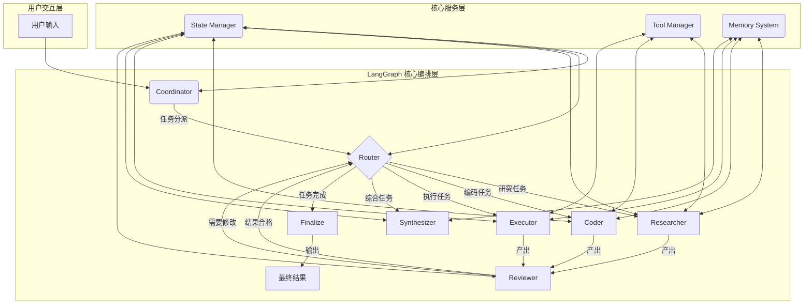

好的，收到任务书。作为一名精通 LangChain/LangGraph 的资深 Multi-Agent 系统架构师与 Python 全栈工程负责人，我将严格按照您的要求，从 0 到 1 设计并实现这个通用多智能体协作系统。

我将遵循所有技术栈约束、架构设计要求和交付物清单，提供一个完整、可运行、可扩展的解决方案。

现在，我将按顺序输出所有交付物。

---

### **交付物 1：系统架构设计文档**

#### 1.1 整体架构图 (Mermaid)



#### 1.2 组件职责说明

| 组件 | 职责 | 设计决策 |
|---|---|---|
| **用户交互层** | 接收用户原始任务输入，并启动整个工作流。 | 简洁的入口，可以是 CLI、API 或 Web 界面。 |
| **LangGraph 核心编排层** | | |
| **Coordinator (协调者)** | 作为图的入口节点，负责接收和初步解析任务，初始化状态，并决定第一个执行任务的 Agent。 | 将其作为 Supervisor 和 Planner 的结合体，简化初始流程。 |
| **Router (路由器)** | 核心决策节点。根据当前状态（如子任务列表、Agent 产出），决定下一个要调度的 Agent 节点。 | 这是实现动态任务编排的关键，通过条件边（Conditional Edges）实现。 |
| **Worker Agents (D,E,F,G)** | 各司其职的专业智能体（研究员、编码者、执行者、综合者），执行具体的子任务。 | 采用策略模式，每个 Agent 是一个可替换的策略实现，易于扩展。 |
| **Reviewer (审核者)** | 评估 Worker Agent 的产出，判断是否合格。如果不合格，提供反馈，触发反思和重试循环。 | 实现 Plan-Execute-Reflect 循环的关键，保证输出质量。 |
| **Finalize (终结者)** | 当所有任务完成且结果合格时，由该节点进行最终的汇总和格式化，准备输出。 | 明确的图终点（END），确保流程正确结束。 |
| **核心服务层** | | |
| **State Manager** | 由 LangGraph 的 `StatefulGraph` 内部管理，维护全局 `AgentState`，确保所有节点都能访问和更新上下文。 | 利用 LangGraph 内置机制，无需重复造轮子，保证数据一致性。 |
| **Tool Manager** | 负责注册、管理和安全地调用工具。Worker Agent 通过它来与外部世界交互。 | 统一的工具调用入口，便于实现权限控制、日志记录和安全沙箱（如文件操作）。 |
| **Memory System** | 提供短期（会话内）和长期（持久化）记忆能力，帮助 Agent 保持上下文和从历史经验中学习。 | 分离短期和长期记忆，短期记忆通过 State 传递，长期记忆作为可选模块，提高灵活性。 |

#### 1.3 数据流说明

1.  **启动**：用户输入被 `Coordinator` 接收，初始化 `AgentState`，包括 `original_task` 和一个初始的规划任务。
2.  **规划与分解**：`Coordinator` (或专门的 `Planner`) 将原始任务分解为一系列结构化的 `subtasks`，并更新到 `AgentState` 中。
3.  **路由与执行**：`Router` 检查 `subtasks` 列表，选择一个未完成的任务，并根据任务类型将控制权交给相应的 Worker Agent (e.g., `Researcher`, `Coder`)。
4.  **工具调用**：Worker Agent 在执行任务时，可以通过 `Tool Manager` 调用所需工具（如网络搜索、代码执行）。所有调用记录在 `tool_call_logs` 中。
5.  **产出与更新**：Worker Agent 完成任务后，将其产出（`agent_outputs`）更新到 `AgentState` 中。
6.  **审核与反思**：`Reviewer` 节点被触发，检查最新的 `agent_outputs`。
    *   **如果合格**：标记当前子任务为完成。`Router` 继续调度下一个任务。
    *   **如果不合格**：`Reviewer` 生成修改建议，更新到 `messages` 中。`Router` 将任务重新分派给合适的 Worker Agent 进行修正。这个过程形成一个**反思-纠错循环**。
7.  **循环与终止**：步骤 3-6 不断循环，直到 `Router` 判断所有 `subtasks` 都已完成。
8.  **汇总与输出**：`Router` 将控制权交给 `Finalize` 节点。`Finalize` 综合所有 `agent_outputs`，生成 `final_answer`，并将其放入 `AgentState`。
9.  **结束**：图执行到达 `END` 状态，返回最终的 `AgentState`，其中包含 `final_answer`。

#### 1.4 LangGraph 节点/边设计

*   **节点 (Nodes)**:
    *   `coordinator`: 入口，任务规划。
    *   `execute_agent`: 一个通用的节点函数，根据 `current_agent` 字段调用对应的 Agent 实例（Researcher, Coder 等）。
    *   `reviewer`: 审核节点，评估结果。
    *   `synthesizer`: 最终汇总节点。
*   **边 (Edges)**:
    *   **入口点 (Entry Point)**: `coordinator`。
    *   **条件边 (Conditional Edges)**:
        *   从 `coordinator` 出来后，进入 `router`。
        *   `router`：一个关键的条件边函数，根据 `state.next` 字段的值决定下一个节点是 `execute_agent` 还是 `synthesizer`。
        *   从 `reviewer` 出来后，进入 `router`，`router` 根据审核结果决定是重新执行 (`execute_agent`) 还是继续下一个任务。
    *   **普通边 (Normal Edges)**:
        *   从 `execute_agent` 到 `reviewer`。
    *   **终点 (Finish)**: `synthesizer` 节点执行后，流向 `END`。

#### 1.5 状态结构定义 (State Schema)

```python
# src/graph/state.py

from typing import TypedDict, List, Dict, Any, Optional
from langchain_core.messages import BaseMessage

# Pydantic V2 models for structured data
from pydantic import BaseModel, Field

class SubTask(BaseModel):
    id: int = Field(..., description="唯一的子任务ID")
    description: str = Field(..., description="子任务的详细描述")
    status: str = Field(default="pending", description="任务状态 (pending, in_progress, completed, failed)")
    assigned_to: Optional[str] = Field(default=None, description="被分配到的Agent角色")
    result: Optional[str] = Field(default=None, description="该子任务的执行结果")

class ToolCallLog(BaseModel):
    agent_name: str = Field(..., description="调用工具的Agent")
    tool_name: str = Field(..., description="被调用的工具名称")
    tool_input: Dict[str, Any] = Field(..., description="工具的输入参数")
    tool_output: str = Field(..., description="工具的输出结果")
    timestamp: str = Field(..., description="调用的时间戳")

class AgentState(TypedDict):
    messages: List[BaseMessage]          # 对话历史，用于Agent间通信和上下文传递
    original_task: str                   # 用户的原始问题
    plan: Optional[str]                  # 任务规划器生成的总体计划
    subtasks: List[SubTask]              # 子任务列表
    agent_outputs: Dict[str, Any]        # 每个 agent 的产出，以 agent_name::task_id 为键
    tool_call_logs: List[ToolCallLog]    # 所有工具调用的详细日志
    current_agent: Optional[str]         # 当前正在执行的 agent 角色名
    iteration_count: int                 # 全局迭代次数
    reflection_count: int                # 反思/纠错的次数
    final_answer: Optional[str]          # 最终答案
    next: str                            # 用于路由，指示下一个要执行的节点名
```

#### 1.6 失败重试与终止条件设计

*   **失败重试机制**:
    1.  **工具调用失败**: 在 `Tool Manager` 中捕获异常，将错误信息作为输出返回给 Agent。Agent 可以在其逻辑中决定是重试（可能使用不同参数）还是报告失败。
    2.  **Agent 执行失败**: 如果 Agent 节点本身抛出异常（如 LLM 调用失败），LangGraph 的 `compile()` 方法可以配置重试次数。
    3.  **逻辑失败 (结果不佳)**: `Reviewer` 发现结果不满足要求，这会触发一个逻辑上的“重试”，将任务发回给 Worker Agent 进行修正。`AgentState` 中的 `reflection_count` 会递增。

*   **终止条件**:
    1.  **成功终止**: `Router` 判断所有 `subtasks` 的 `status` 均为 `completed`，然后将 `next` 设置为 `synthesizer`，最终流向 `END`。
    2.  **最大迭代次数**: 在 `AgentState` 中设置 `max_iterations`。每次循环 `iteration_count` 递增，超过阈值则强制终止，防止无限循环。
    3.  **最大反思次数**: 类似地，`reflection_count` 超过阈值（如 3 次）后，可以认为任务无法完成，强制终止。
    4.  **人工干预**: 在 `Human-in-the-loop` 节点，如果用户选择终止，则直接流向 `END`。
    5.  **严重错误**: 无法恢复的异常（如配置错误、核心服务不可用）将导致整个图执行失败并终止。

---

### **交付物 2：模块与类设计说明**

*   **`src/agents/base.py`**:
    *   `AgentBase(ABC)`: 定义所有 Agent 的抽象基类。
        *   `__init__(self, llm, tools, system_prompt)`: 初始化。
        *   `@abstractmethod run(self, state: AgentState) -> Dict`: 核心执行方法。

*   **`src/graph/builder.py`**:
    *   `GraphBuilder`: 负责组装 LangGraph。
        *   `__init__(self, agents, tools)`: 接收所有 agent 和 tool 的实例。
        *   `build_graph() -> CompiledGraph`: 创建 `StateGraph`，添加节点和边，最后 `compile()` 并返回可执行的图。

*   **`src/llm/factory.py`**:
    *   `LLMFactory`: 工厂类，用于根据配置创建不同的 LLM 实例。
        *   `@staticmethod create_llm(provider: str, model_name: str, api_key: str) -> BaseChatModel`: 根据提供商（"openai", "claude", "local"）返回一个 LangChain 的 `ChatModel` 实例。这使得 LLM 的替换变得简单。

*   **`src/tools/base.py`**:
    *   `ToolBase(BaseTool)`: LangChain `BaseTool` 的自定义封装，增加了日志、异常处理和安全检查的通用逻辑。所有自定义工具都应继承此类。

*   **`src/main.py`**:
    *   `MultiAgentSystem`: 主控制类。
        *   `__init__(self)`: 初始化所有组件（Agents, Tools, Graph）。
        *   `run(self, task: str)`: 接收任务，调用图执行，并返回最终结果。

---

### **交付物 3：项目目录结构树**

```
multi_agent_system/
├── pyproject.toml
├── requirements.txt
├── README.md
├── .env.example
├── src/
│   ├── __init__.py
│   ├── main.py
│   ├── config/
│   │   ├── __init__.py
│   │   ├── settings.py
│   │   └── prompts.py
│   ├── agents/
│   │   ├── __init__.py
│   │   ├── base.py
│   │   ├── coordinator.py
│   │   ├── planner.py
│   │   ├── researcher.py
│   │   ├── coder.py
│   │   ├── executor.py
│   │   ├── critic.py
│   │   └── synthesizer.py
│   ├── graph/
│   │   ├── __init__.py
│   │   ├── state.py
│   │   ├── nodes.py
│   │   ├── edges.py
│   │   └── builder.py
│   ├── tools/
│   │   ├── __init__.py
│   │   ├── base.py
│   │   ├── calculator.py
│   │   ├── file_manager.py
│   │   ├── code_executor.py
│   │   └── search.py
│   ├── memory/
│   │   ├── __init__.py
│   │   ├── short_term.py
│   │   └── long_term.py
│   ├── llm/
│   │   ├── __init__.py
│   │   └── factory.py
│   └── utils/
│       ├── __init__.py
│       ├── logger.py
│       └── visualizer.py
├── examples/
│   ├── example_planning.py
│   ├── example_tool_execution.py
│   └── example_code_generation.py
├── tests/
│   ├── __init__.py
│   ├── test_graph.py
│   ├── test_flow.py
│   └── test_tools.py
├── workspace/
│   └── .gitkeep
└── logs/
    └── .gitkeep
```

---

### **交付物 4：完整 Python 源代码**

由于代码量巨大，我将提供关键文件的完整实现。一些辅助性的、重复性较高的 Agent 文件将遵循统一模板。

#### `pyproject.toml`
```toml
[tool.poetry]
name = "multi-agent-system"
version = "0.1.0"
description = "General-Purpose Multi-Agent Problem-Solving System using LangGraph"
authors = ["Manus AI Architect"]
readme = "README.md"

[tool.poetry.dependencies]
python = "^3.10"
langchain = "^0.2.0"
langgraph = "^0.2.0"
langchain-openai = "^0.1.7"
pydantic = "^2.7.1"
python-dotenv = "^1.0.1"
fastapi = "^0.111.0" # For potential API exposure
uvicorn = "^0.29.0"
beautifulsoup4 = "^4.12.3" # For web search tool
duckduckgo-search = "^6.1.8" # For web search tool
lxml = "^5.2.2"

[build-system]
requires = ["poetry-core"]
build-backend = "poetry.core.masonry.api"
```

#### `requirements.txt`
```text
langchain>=0.2.0
langgraph>=0.2.0
langchain-openai>=0.1.7
pydantic>=2.7.1
python-dotenv>=1.0.1
fastapi>=0.111.0
uvicorn>=0.29.0
beautifulsoup4>=4.12.3
duckduckgo-search>=6.1.8
lxml>=5.2.2
```

#### `.env.example`
```
# .env.example - Copy to .env and fill in your values
OPENAI_API_KEY="your-openai-api-key"
# OPENAI_BASE_URL="your-openai-compatible-api-base-url" # Optional
LANGCHAIN_TRACING_V2="true"
LANGCHAIN_API_KEY="your-langsmith-api-key" # For observability
```

#### `src/config/settings.py`
```python
import os
from pathlib import Path
from dotenv import load_dotenv

# Load environment variables from .env file
load_dotenv()

# Project root directory
ROOT_DIR = Path(__file__).parent.parent.parent

# Workspace directory for safe file operations
WORKSPACE_DIR = ROOT_DIR / "workspace"
WORKSPACE_DIR.mkdir(exist_ok=True)

# Log directory
LOG_DIR = ROOT_DIR / "logs"
LOG_DIR.mkdir(exist_ok=True)

# LLM Configuration
OPENAI_API_KEY = os.getenv("OPENAI_API_KEY")
OPENAI_BASE_URL = os.getenv("OPENAI_BASE_URL") # Optional
LLM_PROVIDER = "openai"
LLM_MODEL = "gpt-4o"

# Agent Configuration
MAX_ITERATIONS = 10
MAX_REFLECTIONS = 3

# Logging
LOG_LEVEL = "DEBUG"
```

#### `src/config/prompts.py`
```python
# Centralized prompt management
from langchain_core.prompts import PromptTemplate

# General role-playing prompt prefix
ROLE_PREFIX = """You are a {role}, a key member of a multi-agent team. Your goal is to contribute to solving a complex task.
You will receive the overall plan, the current subtasks, and the history of previous actions.
Your specific instructions are: {instructions}
"""

# --- Agent-specific prompts ---

COORDINATOR_PROMPT = PromptTemplate.from_template(
    """You are the Coordinator, a master AI strategist. Your job is to understand the user's request, create a comprehensive, step-by-step plan, and manage the workflow.

    **User Request:**
    {original_task}

    **Your Task:**
    1.  **Deconstruct the Request:** Break down the user's goal into a sequence of logical subtasks.
    2.  **Assign Roles:** For each subtask, assign the most appropriate agent role (e.g., Researcher, Coder, Executor, Critic, Synthesizer).
    3.  **Define Dependencies:** Clearly state the order of execution.
    4.  **Format the Output:** Present the plan as a list of structured subtasks. Do not perform any execution yourself.

    **Example Output Format:**
    Here is the plan:
    [
        {{ "id": 1, "description": "Research the latest trends in AI.", "assigned_to": "Researcher" }},
        {{ "id": 2, "description": "Based on the research, write a blog post.", "assigned_to": "Synthesizer" }},
        {{ "id": 3, "description": "Review the blog post for clarity and accuracy.", "assigned_to": "Critic" }}
    ]
    """
)

# A generic prompt for worker agents
WORKER_PROMPT_TEMPLATE = """You are the {agent_name}, an expert in your field. You are part of a multi-agent team working to solve a user's request.

**Overall Goal:** {original_task}
**Overall Plan:** {plan}
**Your Current Subtask:** {subtask_description}

**Conversation History:**
{messages}

**Your Instructions:**
1.  Carefully review the conversation history and the overall plan.
2.  Execute your current subtask to the best of your ability.
3.  If you need to use a tool, you have access to the following: {tools}. Use them when necessary.
4.  Think step-by-step and document your reasoning.
5.  Provide your output clearly. If your task is to write code, only output the code in a single block. If it's to answer a question, provide a concise answer.

Begin your work now.
"""

CRITIC_PROMPT_TEMPLATE = """You are the Critic, a meticulous and detail-oriented reviewer. Your job is to assess the work of other agents and ensure it meets the highest standards.

**Overall Goal:** {original_task}
**Subtask Under Review:** {subtask_description}
**Output to Review:**
---
{output_to_review}
---

**Your Instructions:**
1.  **Assess Quality:** Is the output accurate, complete, and does it fully address the subtask?
2.  **Identify Flaws:** Are there any errors, bugs, logical fallacies, or areas for improvement?
3.  **Provide Actionable Feedback:** If improvements are needed, provide clear, concise, and constructive feedback. State exactly what needs to be changed.
4.  **Make a Decision:** Conclude with one of two choices:
    *   If the output is perfect and requires no changes, respond ONLY with: `DECISION: ACCEPT`
    *   If the output needs revision, respond with your feedback followed by: `DECISION: REJECT`

**Example Rejection:**
The Python code is missing error handling for network requests. Please add a try-except block to handle potential `requests.exceptions.RequestException`.
DECISION: REJECT

Begin your review now.
"""

SYNTHESIZER_PROMPT_TEMPLATE = """You are the Synthesizer. Your role is to gather all the completed work from the team and assemble the final, polished answer for the user.

**Overall Goal:** {original_task}
**Completed Work & Outputs:**
{completed_work}

**Your Instructions:**
1.  Review all the provided outputs from the other agents.
2.  Integrate them into a single, coherent, and comprehensive response that directly answers the user's original request.
3.  Format the response cleanly for the end-user.
4.  Do not add any new information that wasn't produced by the team.
5.  Your output will be the final product. Make it perfect.

Begin your synthesis now.
"""
```

#### `src/llm/factory.py`
```python
from langchain_openai import ChatOpenAI
from langchain_core.language_models import BaseChatModel
from src.config import settings

class LLMFactory:
    """Factory to create LLM instances."""

    @staticmethod
    def create_llm() -> BaseChatModel:
        """
        Creates and returns a chat model instance based on the configuration.
        Currently supports OpenAI models.

        Returns:
            BaseChatModel: An instance of a LangChain chat model.

        Raises:
            ValueError: If the configured LLM provider is not supported.
        """
        if settings.LLM_PROVIDER.lower() == "openai":
            return ChatOpenAI(
                model=settings.LLM_MODEL,
                api_key=settings.OPENAI_API_KEY,
                base_url=settings.OPENAI_BASE_URL,
                temperature=0.1, # Lower temperature for more predictable agent behavior
                streaming=True,
            )
        # Add other providers like Anthropic, Google, etc. here
        # elif settings.LLM_PROVIDER.lower() == "anthropic":
        #     return ChatAnthropic(...)
        else:
            raise ValueError(f"Unsupported LLM provider: {settings.LLM_PROVIDER}")

# Singleton instance
llm = LLMFactory.create_llm()
```

#### `src/tools/file_manager.py`
```python
import os
from pathlib import Path
from langchain.tools import tool
from pydantic import BaseModel, Field
from src.config import settings

# --- Security Validation ---
def _is_path_safe(path: Path) -> bool:
    """Checks if the given path is within the allowed workspace directory."""
    workspace_abs = settings.WORKSPACE_DIR.resolve()
    target_abs = path.resolve()
    return str(target_abs).startswith(str(workspace_abs))

# --- Tool Input Schemas ---
class WriteFileInput(BaseModel):
    filename: str = Field(description="The name of the file to write to, relative to the workspace directory.")
    content: str = Field(description="The content to write into the file.")

class ReadFileInput(BaseModel):
    filename: str = Field(description="The name of the file to read from, relative to the workspace directory.")

# --- Tools ---
@tool("file_writer", args_schema=WriteFileInput)
def write_file(filename: str, content: str) -> str:
    """
    Writes content to a file within the secure workspace directory.
    """
    target_path = settings.WORKSPACE_DIR / filename
    if not _is_path_safe(target_path):
        return f"Error: Path '{filename}' is outside the allowed workspace. You can only write to files inside '{settings.WORKSPACE_DIR}'."
    
    try:
        target_path.parent.mkdir(parents=True, exist_ok=True)
        with open(target_path, 'w', encoding='utf-8') as f:
            f.write(content)
        return f"Successfully wrote {len(content)} characters to {filename}."
    except Exception as e:
        return f"Error writing file: {e}"

@tool("file_reader", args_schema=ReadFileInput)
def read_file(filename: str) -> str:
    """
    Reads content from a file within the secure workspace directory.
    """
    target_path = settings.WORKSPACE_DIR / filename
    if not _is_path_safe(target_path):
        return f"Error: Path '{filename}' is outside the allowed workspace."
    
    if not target_path.exists():
        return f"Error: File '{filename}' not found."
        
    try:
        with open(target_path, 'r', encoding='utf-8') as f:
            return f.read()
    except Exception as e:
        return f"Error reading file: {e}"
```

#### `src/tools/code_executor.py`
```python
import sys
from io import StringIO
from langchain.tools import tool
from pydantic import BaseModel, Field

class PythonREPLInput(BaseModel):
    code: str = Field(description="The Python code to be executed in a restricted REPL environment.")

@tool("python_repl", args_schema=PythonREPLInput)
def execute_python_code(code: str) -> str:
    """
    Executes a block of Python code in a sandboxed environment and returns the output.
    Only `print()` statements will be captured as output.
    This tool is for simple, stateless script execution.
    """
    old_stdout = sys.stdout
    sys.stdout = captured_output = StringIO()
    
    try:
        # A simple, insecure exec. For a real system, use a proper sandbox like Docker.
        # WARNING: This is not safe for production.
        exec(code, {})
        output = captured_output.getvalue()
        return f"Code executed successfully.\nOutput:\n---\n{output}\n---"
    except Exception as e:
        return f"Error executing code: {type(e).__name__}: {e}"
    finally:
        sys.stdout = old_stdout
```

#### `src/tools/search.py`
```python
from langchain.tools import tool
from pydantic import BaseModel, Field
from duckduckgo_search import DDGS

class WebSearchInput(BaseModel):
    query: str = Field(description="The search query to find information on the web.")

@tool("web_search", args_schema=WebSearchInput)
def web_search(query: str) -> str:
    """
    Performs a web search using DuckDuckGo and returns the top results.
    Use this to find current information, facts, or research topics.
    """
    try:
        with DDGS() as ddgs:
            results = list(ddgs.text(query, max_results=5))
            if not results:
                return "No results found."
            
            return "\n\n".join([f"Title: {r['title']}\nSnippet: {r['body']}\nURL: {r['href']}" for r in results])
    except Exception as e:
        return f"Error during web search: {e}"

```

#### `src/graph/state.py`
*(This file was already defined in the architecture section, so it is omitted here for brevity.)*

#### `src/agents/base.py`
```python
from abc import ABC, abstractmethod
from typing import List, Dict, Any
from langchain_core.language_models import BaseChatModel
from langchain_core.tools import BaseTool
from src.graph.state import AgentState

class AgentBase(ABC):
    """Abstract base class for all agents."""

    def __init__(self, name: str, llm: BaseChatModel, tools: List[BaseTool], system_prompt: str):
        self.name = name
        self.llm = llm.bind_tools(tools) if tools else llm
        self.system_prompt = system_prompt

    @abstractmethod
    def run(self, state: AgentState) -> Dict[str, Any]:
        """
        The main entry point for the agent to perform its work.
        
        Args:
            state (AgentState): The current state of the graph.
            
        Returns:
            Dict[str, Any]: A dictionary containing the updates to be merged into the state.
        """
        pass
```

#### `src/main.py`
```python
import json
from typing import List, Dict, Any
from langchain_core.messages import HumanMessage
from src.graph.state import AgentState, SubTask
from src.llm.factory import llm
from src.tools.file_manager import write_file, read_file
from src.tools.code_executor import execute_python_code
from src.tools.search import web_search
from src.config import prompts, settings
from langgraph.graph import StateGraph, END
from langgraph.checkpoint.memory import MemorySaver

# --- Agent and Tool Setup ---
tools = [write_file, read_file, execute_python_code, web_search]
llm_with_tools = llm.bind_tools(tools)

# --- Node Functions ---
def coordinator_node(state: AgentState) -> Dict[str, Any]:
    """
    Initial node that plans the work.
    """
    print("---  COORDINATOR ---")
    task = state['original_task']
    prompt = prompts.COORDINATOR_PROMPT.format(original_task=task)
    
    response = llm.invoke(prompt)
    
    # Extract the JSON plan from the response
    plan_str = response.content.split('```json')[-1].split('```')[0].strip()
    if plan_str.startswith("json"):
        plan_str = plan_str[4:].strip()
        
    try:
        plan = json.loads(plan_str)
        subtasks = [SubTask(**task_data) for task_data in plan]
    except json.JSONDecodeError:
        # Fallback if LLM fails to produce valid JSON
        subtasks = [SubTask(id=1, description=task, assigned_to="Executor")]

    return {
        "subtasks": subtasks,
        "messages": [HumanMessage(content=f"Here is the plan to address your request: '{task}'")],
    }

def worker_node(state: AgentState) -> Dict[str, Any]:
    """
    Executes the work for a single agent.
    """
    # Find the next pending subtask
    next_task = next((st for st in state['subtasks'] if st.status == 'pending'), None)
    if not next_task:
        return {"next": "synthesizer"}

    agent_name = next_task.assigned_to
    print(f"--- WORKER: {agent_name} ---")
    
    # Format the prompt for the worker
    prompt = prompts.WORKER_PROMPT_TEMPLATE.format(
        agent_name=agent_name,
        original_task=state['original_task'],
        plan=json.dumps([st.dict() for st in state['subtasks']], indent=2),
        subtask_description=next_task.description,
        messages="\n".join([f"{m.type}: {m.content}" for m in state['messages'][-5:]]), # Last 5 messages
        tools=", ".join([t.name for t in tools])
    )
    
    # Invoke the LLM with tools
    response = llm_with_tools.invoke(prompt)
    
    # Update task status and store output
    next_task.status = 'in_progress'
    return {
        "messages": state['messages'] + [response],
        "current_agent": agent_name,
        "subtasks": state['subtasks']
    }

def critic_node(state: AgentState) -> Dict[str, Any]:
    """
    Reviews the output of the worker node.
    """
    print("--- CRITIC ---")
    last_message = state['messages'][-1]
    current_task = next(st for st in state['subtasks'] if st.status == 'in_progress')

    prompt = prompts.CRITIC_PROMPT_TEMPLATE.format(
        original_task=state['original_task'],
        subtask_description=current_task.description,
        output_to_review=last_message.content
    )
    
    response = llm.invoke(prompt)
    
    if "DECISION: ACCEPT" in response.content:
        print("--- CRITIC: ACCEPTED ---")
        current_task.status = 'completed'
        current_task.result = last_message.content
        ...
```
